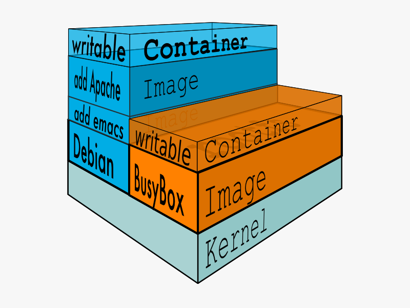

# Docker
## Manual simples
#### Revisão - Versão: 0.1.0

___

### Agradecimentos

Esse simples manual foi gerado como um compilado de várias fontes com o intuído de ser um guia e uma referência ao tema, não tomando o escrito como minha própria autoria e sim algo formado como uma junção para a comunidade.

___

### Introdução

Este manual visa:
* Demonstrar o que é o Docker; 
* Diferença do docker e máquinas virtuais;
* Porque da utilização do Docker;
* Demonstrar de forma introdutória e menos formal a plataforma e seu uso;

___

### Atenção

Para todos que desejam um conteúdo mais rico do que o apresentado neste manual, recomendo o **DOCS** do próprio Docker, Link: https://docs.docker.com/.

___

### Link para o manual:

Link: https://github.com/guilhermeG23/Manual_Simples_Docker

___

### Antes de tudo, um pouco de história

De forma rasa a virtualização surgiu como um método de compartilhar o tempo de processamento de forma a se obter mais resultados com o custo de mesmo tempo, exemplo:

Exemplo:
* **Sem virtualização** eram necessários 2 horas para duas tarefas;
* **Com virtualização** isso e tornou apenas 1 hora para as duas tarefas;

O motivo desse menor tempo, claro, foi a implementação da virtualização, onde duas máquinas "distintas" executaram tarefas independentes e entregaram seus resultados da mesma forma que uma única máquina faria.

A virtualização começou a ser realmente implementada no anos 2000, mesmo que seu conceito já existisse desde 1960, o hardware não era capacitado o suficiente, em 2000, o hardware teve grandes avanços de várias formas, melhores tecnologias, preço menor e diversos outros, além de que os próprios softwares tiveram grande evolução após o fim da "crise do software", possibilitando novos empreendimentos na tecnologia, sendo um destes a própria virtualização que ganhou o mercado por vários benefícios.

___

#### Qual a graça da virtualização?

A graça é a criação de um novo sistema operacional lógicos, separados do sistema base do **HOST**, onde essa máquina será servida por um **POOL** de hardware instanciado e controlado por uma tecnologia virtualização hiper visor.

___

#### Então... e o Docker?

Tecnologias de containers não são novas, a LXC já era um veterano de guerra quando surgiu o Docker, não sendo o foco más um mínimo comparativo o LXC é implementado pelo Kernel Linux é permite o provisionamento de containers a nível 1 do Hyper Visor, isso é, criar um **POOL** de hardware gerenciando demais máquina desse **POOL**.

O Docker diferente do LXC é um Hyper Visior de nível 2, onde ele opera por cima de um sistema operacional base, seu nome atualmente é famoso por N motivos, más os principais são:

* Densevolvido em GO (Linguagem da Google);
* Facilidade de crescimento, instancias e demais;

Há, sabe é legal ler mais um pouco sobre isso, então eu recomendo esse link: https://linuxcontainers.org/, ele fala tanto sobre o **LXC** quanto demais métodos de conteinerização, demais tecnologias como o **LXD** que é o sucessor do **LXC**, introdução sobre ambas a tecnologias e demais informações realmente interessantes... recomendo se tiverem tempo, paciência ou vontade.

___

#### Falou, falou, falou, más não falou nada

Containers e V.M são diferentes em constituição, porém podem ser implementados pelos mesmos propósitos, más os resultados podem ser variados por N motivos, primeiramente deve se ter um cenário para saber qual de ambos é a melhor solução.

___

#### Diferença de uma V.M para um Container

Essa é uma excelente pergunta e é um dos pontos chave sobre a ambos, uma V.M (Virtual machine ou máquina virtual) simula um ambiente completo sobre o atual sistema operacional, já um container se utiliza de uma base , tomemos como exemplo o próprio Docker, ele se utiliza do Kernel do S.O atual para fazer sua base e então somente importa as Libs necessárias para funcionar corretamente, agora, isso faz alguma ? Não de? A resposta é: **Claro, uma V.M é um novo S.O sobre o sistema base, trazendo todo o seu funcionamento, características e demais, coisa que um container não é, um container somente é parte de um S.O sendo executado para o funcionamento especifico**

Sobre isso, será comentado mais afrente, más pense nisso "Preciso de uma bazuca para caçar coelhos? ou uma pistola de pressão já serve?"

##### **Título:** Demonstração da diferença em níveis de uma VM e Contianers
[](https://www.weave.works/blog/a-practical-guide-to-choosing-between-docker-containers-and-vms)
###### **Fonte:** Weave Works, Um guia prático para escolher entre contêineres Docker e VMs

Um exemplo que é sempre visto pela comunidade é "porque vou instalar tudo se só quero um software N", está ai o porquê de uma bazuca ou pistola, essa é uma das sacadas do container em relação a virtualização, ambientes mais enxutos e menores a qual são criados para propósitos únicos, que possam ser reconstruídos a vontade e com agilidade.

___

### Motivos da virtualização e container

O uso de ambos é por N motivos, sendo comumente:

* Montagem de ambientes de testes;
* Montagem de ambientes de produção;
* Escalabilidade;
* Flexibilidade;
* Black-Friday (verdade!);


O uso de ambos facilita a vida do gerente, ambientes do tipo virtualização quando contabilização são mais facilmente gerenciados por haver rotinas para seu controle e por não afeterem diretamente a base a qual estão funcionando.

Alguns outros motivos para seus uso:

* Aplicações tentando sair pela mesma por ao mesmo tempo (deadlock);
* Se uma aplicação travar o HOST virtual ou container não afeta os demais ou ao HOST hospedero;
* Criar ambientes com multiplas versões de softwares necessários;
* Melhor uso do custo por tempo de processamento;

Claro que ambos não são soluções finais para todos os problemas, porém são apoiadores de ambientes flexiveis, com seu uso a criação de cluster de máquinas, subir ambientes e demais se tornam mais simples e rápidos;

___

#### Container VS V.M(Virtual Machine)

Aqui entra o motivo de se utilizar container em vez da virtualização, de forma exemplificada, uma V.M virtualiza um S.O interno dentro do sistema atual **(Isso já foi dito, más é bom repetir)**, assim pode resultar em consumos de recursos não desejados, digamos que precisamos somente de um interpretador BASH dentro da V.M e foi instalado o Ubuntu inteiro com o GNOME, sabe aquele container que funcionaria com 256MB de RAM, essa V.M precisaria de uns 2GB de RAM além de mais espaço em disco;

| Hardware | Ubuntu VM | Ubuntu Container | 
| --- | --- | --- |
| Núcleos de CPU | 4 | 1 |
| Memória | 4GB | 512MB |
| Armazenamento | 20GB | 300MB |

**ATENÇÃO:** A tabela demonstra um Ubuntu GNOME com todos os seus requisitos sendo atendidos durante a criação da V.M.

Enquanto a V.M tem todo o consumo necessário para virtualizar o S.O inteiro o container somente irá trazer o mínimo para funcionamento, lembrando que o docker gerência dinamicamente recursos da máquina **HOST** para o container, porém é possível travar valores fixos máximos, como o exemplo demonstra acima.

Além de demais vantagens do container sobre a virtualização são:
* Crianção de ambientes minimalitas;
* Baixo consumo de recursos como um todo;

Agora colocando o Docker + container's tem mais algumas razões e motivos, como:
* Facilidade de migração de sistemas de uma S.O para outro;
* Repositório online de imagens para uso;
* Idempotência das ações realizadas com o tempo ou em demais hosts;

___

### Sobre o Docker

#### Falou, falou e falou, más não falou, o que é Docker?

O que tanto queriam, o motivo, como já mencionado o container é somente parte de um S.O sendo executado para uma determinada função, agora qual o motivos de se utilizar o Docker em especifico.

Docker é uma ferramenta que fora criado com o propósito de facilitar a criação de ambientes, em 2012-13 ocorreu o ***BUM*** da tecnologia, que mesmo não sendo novidade forá algo pegou no gosto da comunidade pela práticidade oferecida, a empresa DotCloud que criou essa ferramenta se renomeou-se para Docker Inc e disponibilizou a ferramenta para o mercado, além de iniciar uma nova empreitada, ela se tornou mantenedora do Docker-Hub, uma das peças chave da ferramenta Docker, inicialmente o Docker foi um conjunto das tecnologias LXC e Linguagem GO, após várias atualizações a Docker Inc largou a base do LXC e migrou para um modelo de própria autoria, a libcontainer.

#### Más como ele surgiu?

Inicialente DotCloud era uma empresa que tinha como regra de negócio ***facilitar migrações de clientes para a nuvem***, para realizar esssa função eles utilizavam o AWS da Amazon para contratar as máquinas necessárias e instanciar os recursos.

Como forma de automatizar esse processo forá criado o Docker para tornar o processo mais simples e rápido dentro da empresa, a práticidade de automatizar o processo de criação de containers leveou a ganho de vida dentro da equipe, o fato do mesmo ser escrito em linguagem GO é por motivos da mesma ser multiplataforma e possuir desempenho e facilidade de manutenção segundo a própria equipe de desenvolvimento.

#### Atualmente

A empresa se renomeou depois do ***BUM*** e atualmente é a mantenedora principal do Docker e do Docker HUB, a qual possui serviços e recebe de investimentos e doações para continuar as atividades, alterando sua regra de negócio e tomando o Docker como seu produto principal.

#### Tecnologia

O Docker é um conjunto de ferramentas, sendo essas:

* **Docker engine:** Intermédio entre o sistema **HOST** e os containers;
* **Docker compose:** Facilitar a manipulações de múltiplos containers de uma vez;
* **Docker swarm:** Múltiplos container's docker para criação de clusters;
* **Docker hub:** Repositório com mais de 250 mil imagens de conteiners prontas;
* **Docker machine:** Instala e gerência hosts virtuais;

___

#### Requisitos:

Para se utilizar o Docker é necessário:

* Ativar a virtualização na BIOS ou no S.O caso necessário;
* Instalar o programa do Docker na máquina;

#### Sacada

O Docker pegou o gosto da comunidade não só pela práticidade que trouxe para a criação de container's, más também pelos requisitos mínimos para seu funcionamento, sendo de forma genérica e necessário em sua maioria um sistema operacinal 64 bits e capacidade de virtualização **(Basicamente quase todo o computador doméstico possui essa técnologia)**.

___

#### Instalação:

O Docker está disponível para os principais sistemas do mercado como Windows, Mac, Linux e BSD, dessa forma recomendo seguir o link abaixo que é o manual de instalação da ferramenta, se possível e caso queira, já veja também sobre uma conta no Docker-Hub **(Este será explicado mais a frente)**:

* https://docs.docker.com/get-docker/


___

### Ambiente de testes utilizado:

#### Debian

* Versão do S.O utilizado: ``` Linux version 4.19.0-10-amd64 (debian-kernel@lists.debian.org) (gcc version 8.3.0 (Debian 8.3.0-6)) #1 SMP Debian 4.19.132-1 (2020-07-24)```
* Versão do Docker utilizado: ```Docker version 18.09.1, build 4c52b90```

#### Windows 10

* Versão do S.O utilizado: 
    * ```Nome do sistema operacional:               Microsoft Windows 10 Home Single```
    * ```Language Versão do sistema operacional:             10.0.19041 N/A compilação 19041```
* Versão do Docker utilizado: ```Docker version 19.03.12, build 48a66213fe```

___

### Dica para quem usa Windows sem Hypervisor

Caso esteja usando o Docker Docker Windows Home (Sim, tem dois dockers no nome), você provavelmente não vai ter uma opção de configuração do **POOL** de hardware da sua máquina, e isso é ruim dependente as configs que você tenha, você vai notar que tem um processo chamado **VMMEM** tolando uns minimos 1G a 2G de ram seu, caso queira configurar um limite para essa máquina, faça isso:

* Crie um arquivo chamado **wslconfig** sem qualquer extensão;
* Coloque ele no seu **PROFILE** (Pasta do usuário que normalmente fica em C:\Users\Usuario);
* Digite dentro desse arquivo:

```
[wsl2]
memory=512M
```

* Salve e reinicie o serviço do Docker;

No caso eu só coloquei um **POOL** de 512 de RAM, más é possível configurar demais coisas, como quantidade de processadores, espaço em disco e outras;
___

### Ajuda

Com certeza essa é o comando mais amigo que você vai achar:

```
docker --help
docker-compose --help
```

Há, se você quer saber como tal comando funciona, você só precisa colocar um ```--help``` na frente dele, exemplo:

```
docker run --help
```

O resultado vai ser a tela de instruções e parâmetros do comando, exemplo a sáida do comando acima é:

```
root@debian:~# docker run --help

Usage:  docker run [OPTIONS] IMAGE [COMMAND] [ARG...]

Run a command in a new container

Options:
      --add-host list                  Add a custom host-to-IP mapping (host:ip)
  -a, --attach list                    Attach to STDIN, STDOUT or STDERR
      --blkio-weight uint16            Block IO (relative weight), between 10 and 1000, or 0 to disable (default 0)
      --blkio-weight-device list       Block IO weight (relative device weight) (default [])
      --cap-add list                   Add Linux capabilities
      --cap-drop list                  Drop Linux capabilities
      --cgroup-parent string           Optional parent cgroup for the container
      --cidfile string                 Write the container ID to the file
      --cpu-period int                 Limit CPU CFS (Completely Fair Scheduler) period
      --cpu-quota int                  Limit CPU CFS (Completely Fair Scheduler) quota
      --cpu-rt-period int              Limit CPU real-time period in microseconds
      --cpu-rt-runtime int             Limit CPU real-time runtime in microseconds
  -c, --cpu-shares int                 CPU shares (relative weight)
      --cpus decimal                   Number of CPUs
      --cpuset-cpus string             CPUs in which to allow execution (0-3, 0,1)
      --cpuset-mems string             MEMs in which to allow execution (0-3, 0,1)
  -d, --detach                         Run container in background and print container ID
      --detach-keys string             Override the key sequence for detaching a container
      --device list                    Add a host device to the container
      --device-cgroup-rule list        Add a rule to the cgroup allowed devices list
      --device-read-bps list           Limit read rate (bytes per second) from a device (default [])
      --device-read-iops list          Limit read rate (IO per second) from a device (default [])
      --device-write-bps list          Limit write rate (bytes per second) to a device (default [])
      --device-write-iops list         Limit write rate (IO per second) to a device (default [])
      --disable-content-trust          Skip image verification (default true)
      --dns list                       Set custom DNS servers
      --dns-option list                Set DNS options
      --dns-search list                Set custom DNS search domains
      --entrypoint string              Overwrite the default ENTRYPOINT of the image
  -e, --env list                       Set environment variables
      --env-file list                  Read in a file of environment variables
      --expose list                    Expose a port or a range of ports
      --group-add list                 Add additional groups to join
      --health-cmd string              Command to run to check health
      --health-interval duration       Time between running the check (ms|s|m|h) (default 0s)
      --health-retries int             Consecutive failures needed to report unhealthy
      --health-start-period duration   Start period for the container to initialize before starting
                                       health-retries countdown (ms|s|m|h) (default 0s)
      --health-timeout duration        Maximum time to allow one check to run (ms|s|m|h) (default 0s)
      --help                           Print usage
  -h, --hostname string                Container host name
      --init                           Run an init inside the container that forwards signals and reaps processes
  -i, --interactive                    Keep STDIN open even if not attached
      --ip string                      IPv4 address (e.g., 172.30.100.104)
      --ip6 string                     IPv6 address (e.g., 2001:db8::33)
      --ipc string                     IPC mode to use
      --isolation string               Container isolation technology
      --kernel-memory bytes            Kernel memory limit
  -l, --label list                     Set meta data on a container
      --label-file list                Read in a line delimited file of labels
      --link list                      Add link to another container
      --link-local-ip list             Container IPv4/IPv6 link-local addresses
      --log-driver string              Logging driver for the container
      --log-opt list                   Log driver options
      --mac-address string             Container MAC address (e.g., 92:d0:c6:0a:29:33)
  -m, --memory bytes                   Memory limit
      --memory-reservation bytes       Memory soft limit
      --memory-swap bytes              Swap limit equal to memory plus swap: '-1' to enable unlimited swap
      --memory-swappiness int          Tune container memory swappiness (0 to 100) (default -1)
      --mount mount                    Attach a filesystem mount to the container
      --name string                    Assign a name to the container
      --network string                 Connect a container to a network (default "default")
      --network-alias list             Add network-scoped alias for the container
      --no-healthcheck                 Disable any container-specified HEALTHCHECK
      --oom-kill-disable               Disable OOM Killer
      --oom-score-adj int              Tune host's OOM preferences (-1000 to 1000)
      --pid string                     PID namespace to use
      --pids-limit int                 Tune container pids limit (set -1 for unlimited)
      --privileged                     Give extended privileges to this container
  -p, --publish list                   Publish a container's port(s) to the host
  -P, --publish-all                    Publish all exposed ports to random ports
      --read-only                      Mount the container's root filesystem as read only
      --restart string                 Restart policy to apply when a container exits (default "no")
      --rm                             Automatically remove the container when it exits
      --runtime string                 Runtime to use for this container
      --security-opt list              Security Options
      --shm-size bytes                 Size of /dev/shm
      --sig-proxy                      Proxy received signals to the process (default true)
      --stop-signal string             Signal to stop a container (default "SIGTERM")
      --stop-timeout int               Timeout (in seconds) to stop a container
      --storage-opt list               Storage driver options for the container
      --sysctl map                     Sysctl options (default map[])
      --tmpfs list                     Mount a tmpfs directory
  -t, --tty                            Allocate a pseudo-TTY
      --ulimit ulimit                  Ulimit options (default [])
  -u, --user string                    Username or UID (format: <name|uid>[:<group|gid>])
      --userns string                  User namespace to use
      --uts string                     UTS namespace to use
  -v, --volume list                    Bind mount a volume
      --volume-driver string           Optional volume driver for the container
      --volumes-from list              Mount volumes from the specified container(s)
  -w, --workdir string                 Working directory inside the container
```

___

### root@debian: docker

Abaixo está a saída de parâmentros para ações no Docker, digitar ```docker``` ou ```docker --help```, ambos geram a mesma saída, veja:

**Original:**
```
root@debian:~# docker

Usage:  docker [OPTIONS] COMMAND

A self-sufficient runtime for containers

Options:
      --config string      Location of client config files (default "/root/.docker")
  -D, --debug              Enable debug mode
  -H, --host list          Daemon socket(s) to connect to
  -l, --log-level string   Set the logging level ("debug"|"info"|"warn"|"error"|"fatal") (default "info")
      --tls                Use TLS; implied by --tlsverify
      --tlscacert string   Trust certs signed only by this CA (default "/root/.docker/ca.pem")
      --tlscert string     Path to TLS certificate file (default "/root/.docker/cert.pem")
      --tlskey string      Path to TLS key file (default "/root/.docker/key.pem")
      --tlsverify          Use TLS and verify the remote
  -v, --version            Print version information and quit

Management Commands:
  builder     Manage builds
  config      Manage Docker configs
  container   Manage containers
  engine      Manage the docker engine
  image       Manage images
  network     Manage networks
  node        Manage Swarm nodes
  plugin      Manage plugins
  secret      Manage Docker secrets
  service     Manage services
  stack       Manage Docker stacks
  swarm       Manage Swarm
  system      Manage Docker
  trust       Manage trust on Docker images
  volume      Manage volumes

Commands:
  attach      Attach local standard input, output, and error streams to a running container
  build       Build an image from a Dockerfile
  commit      Create a new image from a container's changes
  cp          Copy files/folders between a container and the local filesystem
  create      Create a new container
  diff        Inspect changes to files or directories on a container's filesystem
  events      Get real time events from the server
  exec        Run a command in a running container
  export      Export a container's filesystem as a tar archive
  history     Show the history of an image
  images      List images
  import      Import the contents from a tarball to create a filesystem image
  info        Display system-wide information
  inspect     Return low-level information on Docker objects
  kill        Kill one or more running containers
  load        Load an image from a tar archive or STDIN
  login       Log in to a Docker registry
  logout      Log out from a Docker registry
  logs        Fetch the logs of a container
  pause       Pause all processes within one or more containers
  port        List port mappings or a specific mapping for the container
  ps          List containers
  pull        Pull an image or a repository from a registry
  push        Push an image or a repository to a registry
  rename      Rename a container
  restart     Restart one or more containers
  rm          Remove one or more containers
  rmi         Remove one or more images
  run         Run a command in a new container
  save        Save one or more images to a tar archive (streamed to STDOUT by default)
  search      Search the Docker Hub for images
  start       Start one or more stopped containers
  stats       Display a live stream of container(s) resource usage statistics
  stop        Stop one or more running containers
  tag         Create a tag TARGET_IMAGE that refers to SOURCE_IMAGE
  top         Display the running processes of a container
  unpause     Unpause all processes within one or more containers
  update      Update configuration of one or more containers
  version     Show the Docker version information
  wait        Block until one or more containers stop, then print their exit codes

Run 'docker COMMAND --help' for more information on a command.
```

**Tradução:**
```
root@debian:~# docker

Usage:  docker [OPTIONS] COMMAND

A self-sufficient runtime for containers

Options:
      --config string      Location of client config files (default "/root/.docker")
  -D, --debug              Enable debug mode
  -H, --host list          Daemon socket(s) to connect to
  -l, --log-level string   Set the logging level ("debug"|"info"|"warn"|"error"|"fatal") (default "info")
      --tls                Use TLS; implied by --tlsverify
      --tlscacert string   Trust certs signed only by this CA (default "/root/.docker/ca.pem")
      --tlscert string     Path to TLS certificate file (default "/root/.docker/cert.pem")
      --tlskey string      Path to TLS key file (default "/root/.docker/key.pem")
      --tlsverify          Use TLS and verify the remote
  -v, --version            Print version information and quit

Management Commands:
  builder     Gerenciar compilações
  config      Gerenciar configs Docker
  container   Gerenciar contêineres
  engine      Gerencie o motor docker
  image       Gerenciar imagens
  network     Gerenciar redes
  node        Gerenciar nódulos enxame
  plugin      Gerenciar plugins
  secret      Gerenciar segredos do Docker
  service     Gerenciar serviços
  stack       Gerenciar pilhas de Docker
  swarm       Gerenciar enxame
  system      Gerenciar docker
  trust       Gerencie a confiança nas imagens do Docker
  volume      Gerenciar volumes

Commands:
  attach      Conecte fluxos de entrada, saída e erro padrão locais a um recipiente em execução
  build       Construa uma imagem a partir de um Dockerfile
  commit      Crie uma nova imagem a partir das alterações de um contêiner
  cp          Copiar arquivos/pastas entre um contêiner e o sistema de arquivos local
  create      Crie um novo contêiner
  diff        Inspecione alterações em arquivos ou diretórios no sistema de arquivos de um contêiner
  events      Obtenha eventos em tempo real do servidor
  exec        Execute um comando em um contêiner em execução
  export      Exporte o sistema de arquivos de um contêiner como um arquivo de piche
  history     Mostre a história de uma imagem
  images      Liste imagens
  import      Importe o conteúdo de uma tarball para criar uma imagem do sistema de arquivos
  info        Exibir informações em todo o sistema
  inspect     Retornar informações de baixo nível sobre objetos Docker
  kill        Mate um ou mais contêineres em execução
  load        Carregue uma imagem de um arquivo de piche ou STDIN
  login       Faça login em um registro do Docker
  logout      Sair de um registro do Docker
  logs        Buscar os troncos de um contêiner
  pause       Pausar todos os processos dentro de um ou mais contêineres
  port        Liste mapeamentos de portas ou um mapeamento específico para o contêiner
  ps          Listar contêineres
  pull        Puxe uma imagem ou um repositório de um registro
  push        Empurre uma imagem ou um repositório para um registro
  rename      Renomeie um contêiner
  restart     Reinicie um ou mais contêineres
  rm          Remova um ou mais recipientes
  rmi         Remova uma ou mais imagens
  run         Execute um comando em um novo contêiner
  save        Salvar uma ou mais imagens em um arquivo de piche (transmitido para STDOUT por padrão)
  search      Pesquise imagens no Docker Hub
  start       Inicie um ou mais contêineres parados
  stats       Exibir uma transmissão ao vivo das estatísticas de uso de recursos de contêineres
  stop        Pare um ou mais recipientes de corrida
  tag         Crie uma tag TARGET_IMAGE que se refere a SOURCE_IMAGE
  top         Exibir os processos de execução de um contêiner
  unpause     Descompuser todos os processos dentro de um ou mais contêineres
  update      Atualizar configuração de um ou mais contêineres
  version     Mostre as informações da versão do Docker
  wait        Bloqueie até que um ou mais contêineres parem e imprima seus códigos de saída

Run 'docker COMMAND --help' for more information on a command.
```

**AVISO:** Bem não sei se vou listar todos, vou listar aqueles que mais uso e conheco, forá estes, somente será listados os demais futuramente após alguns estudos.
___

#### Informação do Docker

Informações sobre o Docker que está sendo utilizado são extremamente importantes para dois tipos de casos principais:
* Aquele erro chato no Docker caso aconteça e necessita da ajuda da comunidade para resolver;
* Saber se determinada versão do Docker possui ferramentas desejada, Exemplo deste foi quando o Docker começou a implementar gêrenciamento do **POOL** de hardware que requisititava de determinada mínima versão.

Listar a versão do docker:
```
root@debian:~# docker version
Client:
 Version:           18.09.1
 API version:       1.39
 Go version:        go1.11.6
 Git commit:        4c52b90
 Built:             Sun, 14 Jun 2020 22:12:29 +0200
 OS/Arch:           linux/amd64
 Experimental:      false

Server:
 Engine:
  Version:          18.09.1
  API version:      1.39 (minimum version 1.12)
  Go version:       go1.11.6
  Git commit:       4c52b90
  Built:            Sun Jun 14 20:12:29 2020
  OS/Arch:          linux/amd64
  Experimental:     false
```

Ou de forma resumida:

```
root@debian:~# docker --version
Docker version 18.09.1, build 4c52b90
```

O comando ```docker info``` é um comando que lista as caracteristicas do docker instalado no **HOST**:
```
root@debian:~# docker info
Containers: 1
 Running: 0
 Paused: 0
 Stopped: 1
Images: 3
Server Version: 18.09.1
Storage Driver: overlay2
 Backing Filesystem: extfs
 Supports d_type: true
 Native Overlay Diff: true
Logging Driver: json-file
Cgroup Driver: cgroupfs
Plugins:
 Volume: local
 Network: bridge host macvlan null overlay
 Log: awslogs fluentd gcplogs gelf journald json-file local logentries splunk syslog
Swarm: inactive
Runtimes: runc
Default Runtime: runc
Init Binary: docker-init
containerd version: 9754871865f7fe2f4e74d43e2fc7ccd237edcbce
runc version: 1.0.0~rc6+dfsg1-3
init version: v0.18.0 (expected: fec3683b971d9c3ef73f284f176672c44b448662)
Security Options:
 apparmor
 seccomp
  Profile: default
Kernel Version: 4.19.0-10-amd64
Operating System: Debian GNU/Linux 10 (buster)
OSType: linux
Architecture: x86_64
CPUs: 1
Total Memory: 987.4MiB
Name: debian
ID: SS4R:AJ7J:TSTN:6AJL:UD2I:6P6Y:WDWA:V6T3:7UXA:G3UU:L7P4:7P4P
Docker Root Dir: /var/lib/docker
Debug Mode (client): false
Debug Mode (server): false
Registry: https://index.docker.io/v1/
Labels:
Experimental: false
Insecure Registries:
 127.0.0.0/8
Live Restore Enabled: false
WARNING: No swap limit support
```

De forma simples o  ```info``` literalmente traz informações do Docker sobre o **HOST**, como:
* Versão do S.O em ```Kernel Version e Operating System```;
* Hardware em ```Architecture, CPUs e Total Memory```;
* Quantidade de Imagens que o **HOST** possui em ```Images```;
* Quantidade de containers totais do **HOST** como ```Containers```;
* Diretório Root do Docker (Onde o Docker e as imagens ficam dentro do **HOST**) em ```Docker Root Dir```;

Além de outras mais informações que podem ser importantes ou não dependente do desejo do dono do **HOST**.

___
### Iniciando no Docker

Aqui se inicia a demonstração mais prática do Docker.

___

#### Olha o hello world

Vamos ao famoso "Executando hello world"... Não, Docker não é uma linguagem de programação, o que será feito é, será requisitada o container que traga justamente o "hello-world" a nós, veja:

```
docker run hello-world
```

**Explicando o comando:**

| docker | run | hello-world | 
| --- | --- | --- |
| Chamando o programa | Parâmetro para ação, no caso um executar | Imagem que quero executar |

**OBS:** Quando você executar o docker run, ele vai procurar se existe imagens dentro do **HOST** para a criação do container, caso não achar, ele baixa o container automaticamente do Docker-Hub.

Outra coisa, podemos decidir que versão baixar de determinado container(claro o mesmo deve ter disponivel no HUB, confira no site do mesmo caso tenha dúvidas, olha o link aqui: https://hub.docker.com/).

Veja agora um pouco sobre versionamento de containers:

**Ultima versão do Ubuntu:**
```
docker run ubuntu
```

Esse comando é basicamente o mesmo que:

```
docker run ubuntu:latest
```

Más o que é isso? Bem, quando executado o ```run``` se a versão de uma imagem na frente do desejado, ele traz o ```latest``` da versão, a qual é a ultima versão do container, más se queremos outra versão, temos que fazer isso:

```
docker run ubuntu:xenial
```

Quando se usado os ```:``` na frente da imagem do container, você pode escolher a versão da imagem, contanto que exista a versão do Hub ou de uma imagem compartilhada.

A decisão da versão a se trabalhar como base é a cargo da pessoa que decide montar o ambiente, o HUb possui algumas versões de determinados S.O prontas que podem ser ou não de distros oficiais, no caso do Ubuntu, é uma distro mantida pela própria Canonical.

____

#### Voltando ao hello-world

Quando executado o ```hello-world``` ou ```hello-world:latest``` a saída inicial será esta:

```
root@teste-teste:/home/teste# docker run hello-world
Unable to find image 'hello-world:latest' locally
latest: Pulling from library/hello-world
1b930d010525: Pull complete 
Digest: sha256:2557e3c07ed1e38f26e389462d03ed943586f744621577a99efb77324b0fe535
Status: Downloaded newer image for hello-world:latest
```

**Explicando:**

O que está sendo realizado é o **PULL** das camadas do container **hello-world**, após essa parte terminar, será executado o container em si, más o que é tudo isso? Veja:

* **Comando** -> root@teste-teste:/home/teste# docker run hello-world
* **Procura interna** -> Unable to find image 'hello-world:latest' locally
* **Achando no docker hub** -> latest: Pulling from library/hello-world
* **Download no hello-word** -> 
    * 1b930d010525: Pull complete 
    * Digest: sha256:2557e3c07ed1e38f26e389462d03ed943586f744621577a99efb77324b0fe535
* **Status** -> Status: Downloaded newer image for hello-world:latest

Agora vem a real saída do container:

```
Hello from Docker!
This message shows that your installation appears to be working correctly.

To generate this message, Docker took the following steps:
 1. The Docker client contacted the Docker daemon.
 2. The Docker daemon pulled the "hello-world" image from the Docker Hub.
    (amd64)
 3. The Docker daemon created a new container from that image which runs the
    executable that produces the output you are currently reading.
 4. The Docker daemon streamed that output to the Docker client, which sent it
    to your terminal.

To try something more ambitious, you can run an Ubuntu container with:
 $ docker run -it ubuntu bash

Share images, automate workflows, and more with a free Docker ID:
 https://hub.docker.com/

For more examples and ideas, visit:
 https://docs.docker.com/get-started/
```

Agora é hora de mostrar o **MAIS e MÁS** dessa operação.
___

#### Status

Agora está na hora do **MAIS!**

Depois de executar um **RUN** e ter sua saída, o que irá acontecer depois? Para se ter uma idéia execute este comando:

```
docker ps
```

Agora veja a saída do mesmo e não entenda nada:

```
root@debian:~# docker ps
CONTAINER ID        IMAGE               COMMAND             CREATED             STATUS              PORTS               NAMES

```

Antes de tudo deixei eu dizer, está vazio, não tem nada ai, más o que isso significa?

Quando se utilizado o comando ```docker ps```, nós é listados todos os containers em ativo no momento atual, isso é, sabe o ```hello-world``` que você acabou de executar, ele já não está mais ativo, para então conseguirmos encontrar ele precisamos executar:

```
docker ps -a
````

A saída desse comando deve gerar algo parecido com isso:

```
root@debian:~# docker ps -a
CONTAINER ID        IMAGE               COMMAND             CREATED             STATUS                      PORTS               NAMES
06ea4331b9d9        hello-world         "/hello"            14 minutes ago      Exited (0) 14 minutes ago                       optimistic_tharp
```

Agora está na hora do **MÁS!**

Antes de tudo vamores explicar este menu para que não aja confusão, veja:

```
root@debian:~# docker ps
CONTAINER ID        IMAGE               COMMAND             CREATED             STATUS              PORTS               NAMES
```

* **CONTAINER ID** -> Número do container, sua identificação ID;
* **IMAGE** -> Container é baseado a qual imagem;
* **COMMAND** -> Comando que inicia o container;
* **CREATED** -> A que horas foi criado o container;
* **STATUS** -> O estado do container;
* **PORTS** -> Portas que o container está utilizando para saída;
* **NAMES** -> Nome RANDOM que o Docker dá para o container criado;
____

#### docker ps
##### Você vai enjoar de tanto que vai usar ou ver!

Docker ps é um comando para listar os container's, o mesmo possui parâmetros para se realizar filtros e demais, Ex:

* ```docker ps``` -> Somente lista os containers em funcionamento;
* ```docker ps -a``` -> Lista todos os containers existentes nos host, não importando seus status;

Agora temos mais algums opções que podemos ver com o ```docker ps --help```:


**Original:**
```

root@debian:~# docker ps --help

Usage:  docker ps [OPTIONS]

List containers

Options:
  -a, --all             Show all containers (default shows just running)
  -f, --filter filter   Filter output based on conditions provided
      --format string   Pretty-print containers using a Go template
  -n, --last int        Show n last created containers (includes all states) (default -1)
  -l, --latest          Show the latest created container (includes all states)
      --no-trunc        Don't truncate output
  -q, --quiet           Only display numeric IDs
  -s, --size            Display total file sizes
```

**Traduzido:**
```
root@debian:~# docker ps --ajuda

Uso: docker ps [OPÇÕES]

Listar contêineres

Opções:
  -a, --all Mostrar todos os recipientes (o padrão mostra apenas a execução)
  -f, -filtro filtrar saída do filtro com base nas condições fornecidas
      --sequência de formato Recipientes de impressão bonita usando um modelo Go
  -n, --última int Mostrar n últimos recipientes criados (inclui todos os estados) (padrão -1)
  -l, --mais recente Mostre o último contêiner criado (inclui todos os estados)
      --no-trunc Não truncate saída
  -q, --silencioso Apenas exibir IDs numéricos
  -s, tamanho -tamanho Exibir tamanhos totais de arquivos
```

O **PS** é uma caixinha de ferramentas que será muito bem usada, aqui listamos todos os containers, seus status, tamanho dos mesmo e demais, isso pode ser aproveitado futuramente e vai ser... vai por mim.

___

### Agora, executando um novo container

Para se executar um novo container, pode-se utilizar o mesmo ```docker run hello-world```, a imagem utilizada fica dentro do host entao é possível utilizar a mesma a qualquer momento.

No caso de executar novamente esse imagem, ela vai seguir o seguinte ciclo:
* Requisita;
* Liga o container;
* Printa a mensagem;
* Fecha o container;

Agora vou criar um novo container só porque eu quero, olha um "Hello world" defirenciado sendo apresentado:

```
docker run ubuntu echo "hello world"
```

Veja a saída dele no terminal:

```
root@debian:~# docker run ubuntu echo "hello world"
Unable to find image 'ubuntu:latest' locally
latest: Pulling from library/ubuntu
54ee1f796a1e: Pull complete
f7bfea53ad12: Pull complete
46d371e02073: Pull complete
b66c17bbf772: Pull complete
Digest: sha256:31dfb10d52ce76c5ca0aa19d10b3e6424b830729e32a89a7c6eee2cda2be67a5
Status: Downloaded newer image for ubuntu:latest
hello world
```

**Atenção:** Se você der um ```ps``` neste cara ele simplesmente não vai aparecer por motivos que ele já fez seu ciclo, então de um ```ps -a``` para conseguir ver ele.

Agora a algo que precisa ser explicado para se entender um dos melhores conceitos do docker que fica neste exato ponto.

```
54ee1f796a1e: Pull complete
f7bfea53ad12: Pull complete
46d371e02073: Pull complete
b66c17bbf772: Pull complete
```
Este ponto é o conceito de camadas e **POR QUÊ EU NÃO EXPLIQUEI ISSO ANTES!!!**

Siga abaixo para toda a explicação teórica sobre o conceito de camadas e que com certeza você vai achar legal... É necessário esse entendimento para saber gerênciar melhor os containers em disposição.
___

#### O conceito de camadas

Os containers docker funcionam sobre camadas de imagens, alimentadas por um sistema de **PULL**, quanto mais completa for a imagem mais **PULL'S** se precisa ter, um exemplo disso é a imagem **UBUNTU** que forá executado acima, ela precisou de 4 pull's para seu funcionamento, já o **hello-world** necessitou de somente 1 pull.

Cada pull é uma camada, essa uma camada é parte do funcionamento de uma imagem container e a mesma pode se variar, por exemplo, posso baixar uma camada de web server e demais outros, agora um exemplo legal de como o Docker trata cada container como isolado, más não as camadas que foram as imagens.

**Exemplo:**

**1° Container:**
* Precisou baixar o container que possue 5 camadas, isso é 5 pulls;

**2º Container:**
* Agora por certos motivos preciso subir outro container para a demanda XYZ, eu dou o comando e é outras 5 camadas, más só foram realizados 2 pulls, porquê?

Esse é o conceito de imagens e pulls do Docker, todas as imagens compartilham suas camadas umas com as outros dentro do HOST, isso faz que não seja necessário fazer o download novamente de uma camada, já que a mesma já existe no HOST.

___

#### Aviso aos leitores:
**Leitor: Nossa, sério, só isso, esse textão todo só prá isso?**
**Eu: Calma, ainda tem mais uma coisinha interessante que é necessário para se trabalhar com o Docker e seus containers.**

___

#### Somente leitura

Como dito o Docker trabalha sobre um sistema de download de camadas para montar uma imagem, quando o mesmo existe, ele não realiza o download para evitar "gastos" denecessários para ambos os lados, porém a forma de manter a integridade dessas camadas é as travando, isso é, elas são só para leitura e não para a escrita, quando o docker precisar realizar alterações, ele cria uma camada acima das atuais e inicia as alterações nela.

##### **Título:** Demonstração sobre as camadas de leitura e escrita do Docker Container
[](https://www.mundodocker.com.br/como-funciona-filesystem-docker/)
###### **Fonte:** Mundo Docker, Como funciona o FileSystem do Docker container

&nbsp;

#### Más o que isso afeta?

Bem, vamos supor que você subiu um container, fez todas as alterações e depois você saiu do container ou ele parou de funcionar... **VOCÊ PERDEU TUDO O QUE FEZ!!!!**... Sério, você se deu muito mal, o motivo disso é que ele cria uma camada para escrita sobre as de leitura, porém, ele não salva essa camada, assim é necessário executar um ```build``` sobre a imagem atual para criar a imagem com essas alterações **personalizadas**, resultando em:

* **Base** -> Camada de leitura;
* **Alterar** -> Camada de escrita;

De forma resumida as camadas funcionam **Read/write**, um container é formado de pulls que são camadas **READ** e quando executados como um container **RUN**, se cria uma camada **WRITE** para o usuário se trabalhar.

##### Ultimas coisinha sobre as camadas

Como explicado, um container é a construção de várias camadas em funcionamento, más o que acontece se alteramos uma camada? Para ser mais exato, pense que uma camada é manipulavel, assim sua entrada ou estado nunca será sempre igual, o que acontece com as demais camadas do container? Simples, elas teram que se ajustar a essa nova camada, pois a contrução do container é linear... como assim?

Veja vem, se temos uma imagem que precisa de 5 camadas para ser construida e necessitamos alterar a 3° camada, a 4° e a 5° tambem sofreram de um processo de verificação e construção, pois uma camada abaixa sofreu alterações.

___

#### Dentro de um container

Para executar um container já vimos que é simples:
```
docker run <imagem>
```

Más e se queremos interagir com ela? Podemos fazer tambem de uma forma simples, Exemplo:

```
docker run <imagem> <comando>
```

OU

```
docker run ubuntu echo "teste"
```

Com a saída:

```
root@debian:~# docker run ubuntu echo "teste"
teste
```

Incrivél!!!! Não, ata, sei, quer mais interação, então vá para dentro do container, só que antes de tudo **NÃO SE DESESPERE!!! NÃO DE UM EXIT OU SHUTDOWN PARA SAIR DO CONTAINER!!!** só continue a ler.

Como interagir com o container:
```
docker run -it <container>
```

Exemplo:
```
root@debian:~# docker run -it ubuntu
root@5d4a35d4e367:/#
```

Já estou dentro do container, acredita não, pera:

**Debian HOST:**
```
root@debian:~# ls /
bin  boot  dev  etc  home  initrd.img  initrd.img.old  lib  lib32  lib64  libx32  lost+found  media  mnt  opt  proc  root  run  sbin  srv  sys  tmp  usr  var  vmlinuz  vmlinuz.old
```

**Ubuntu CONTAINER:**
```
root@2b839d07bfab:/# ls /
bin  boot  dev  etc  home  lib  lib32  lib64  libx32  media  mnt  opt  proc  root  run  sbin  srv  sys  tmp  usr  var
```

Vê alguma diferença?
&nbsp;
Com isso podemos notar que ambos os ambientes são separados, isso traz segurança a você, pois sabe que um não afeta o outro, pelo menos não nessa fase inicial.

___

#### Não consegue sair né?

Como todas as pessoas que usaram **VI** ou **VIM** pela primeira vez na vida, você não sabe como sair desse container, **BEM NÃO FAÇA ISSO AQUI NÃO**:

```
root@2b839d07bfab:/# exit
exit
root@debian:~# docker ps
CONTAINER ID        IMAGE               COMMAND             CREATED             STATUS              PORTS               NAMES
```

Não entendeu o que acabou de acontecer, bem, como explicado em imagens, você acabou de matar seu container, por esse motivo ele não mostra no ```docker ps```, exemplo, se você tem um container funcionando, a saída desse ```docker ps``` será assim:

```
root@debian:~# docker ps
CONTAINER ID        IMAGE               COMMAND             CREATED             STATUS              PORTS               NAMES
5d4a35d4e367        ubuntu              "/bin/bash"         18 minutes ago      Up 39 seconds                           competent_robinson

```

#### Pera, voltando ao problema

Para sair do container a qual você está interagindo por dentro, aperte:

```
ctrl + p + q
```

Dessa forma, você saiu do container, más ele ainda está executando, se você quiser retornar para dentro dele, faça:

```
root@debian:~# docker ps
CONTAINER ID        IMAGE               COMMAND             CREATED             STATUS              PORTS               NAMES
5d4a35d4e367        ubuntu              "/bin/bash"         21 minutes ago      Up 3 minutes                            competent_robinson
root@debian:~# docker attach 5d4a35d4e367
root@5d4a35d4e367:/#
```

Más o que foi isso tudo:

* ```ctrl + p + q``` deixa você sair do container atual e voltar para seu HOST;
* ```docker attach``` é se atrelar a determinado container em execução;

Com essas duas opções você consegue entrar e sair de um container sem afetar o funcionamento do mesmo.

Há, de você der o ```ctrl + d```, você mata o container tá, veja:

```
root@debian:~# docker ps
CONTAINER ID        IMAGE               COMMAND             CREATED             STATUS              PORTS               NAMES
67265a9e5a62        ubuntu              "/bin/bash"         6 seconds ago       Up 5 seconds                            peaceful_rosalind
root@debian:~# docker attach 67265a9e5a62
root@67265a9e5a62:/# exit
root@debian:~# docker ps
CONTAINER ID        IMAGE               COMMAND             CREATED             STATUS              PORTS               NAMES
```

### Aviso

Se estiver usando o o Windows, você com certeza deve estar xingando agora por notar que o ```ctrl+p+q``` não desatacha o container, alguns atalhos no windows para o Docker são diferentes, para conseguir sair do contaienr use:

* ```ctrl+z```
* ```ctrl+z+c```

Se não funcionar nenhum desses... bem... boa sorte, pai google em ação.

____

#### Attach

O ```attach``` acabou de ser usado e como dito, ele atacha o terminal dentro do terminal do container e como já foi visto o ```ps```, vamos dar um ```--help``` no ```attach```, veja:

**Original:**
```
root@debian:~# docker attach --help

Usage:  docker attach [OPTIONS] CONTAINER

Attach local standard input, output, and error streams to a running container

Options:
      --detach-keys string   Override the key sequence for detaching a container
      --no-stdin             Do not attach STDIN
      --sig-proxy            Proxy all received signals to the process (default true)
```

**Tradução:**
```
root@debian:~# docker attach --help

Uso: docker attach [OPÇÕES] CONTAINER

Conecte fluxos de entrada, saída e erro padrão locais a um recipiente em execução

Opções:
      --desprender-teclas sequência Anular a sequência de teclas para desapegar um recipiente
      --no-stdin Não anexe STDIN
      --sig-proxy Proxy todos receberam sinais para o processo (padrão verdadeiro)
```

Sinceramente nunca usei os demais do ```attach```, então irei parar neste ponto.

___

#### Pulo do gato no RUN

Existe formas de manter um container executando, sem precisar se atrelar ao mesmo, esse é o ```-d``` ou modo **detached**, o container ainda continua funcionado, porém você se mantém no seu terminal;

Agora para dar um pequeno susto, olhe o ```--help``` de um ```docker run```:

**Original:**
```
root@debian:~# docker run --help

Usage:  docker run [OPTIONS] IMAGE [COMMAND] [ARG...]

Run a command in a new container

Options:
      --add-host list                  Add a custom host-to-IP mapping (host:ip)
  -a, --attach list                    Attach to STDIN, STDOUT or STDERR
      --blkio-weight uint16            Block IO (relative weight), between 10 and 1000, or 0 to disable (default 0)
      --blkio-weight-device list       Block IO weight (relative device weight) (default [])
      --cap-add list                   Add Linux capabilities
      --cap-drop list                  Drop Linux capabilities
      --cgroup-parent string           Optional parent cgroup for the container
      --cidfile string                 Write the container ID to the file
      --cpu-period int                 Limit CPU CFS (Completely Fair Scheduler) period
      --cpu-quota int                  Limit CPU CFS (Completely Fair Scheduler) quota
      --cpu-rt-period int              Limit CPU real-time period in microseconds
      --cpu-rt-runtime int             Limit CPU real-time runtime in microseconds
  -c, --cpu-shares int                 CPU shares (relative weight)
      --cpus decimal                   Number of CPUs
      --cpuset-cpus string             CPUs in which to allow execution (0-3, 0,1)
      --cpuset-mems string             MEMs in which to allow execution (0-3, 0,1)
  -d, --detach                         Run container in background and print container ID
      --detach-keys string             Override the key sequence for detaching a container
      --device list                    Add a host device to the container
      --device-cgroup-rule list        Add a rule to the cgroup allowed devices list
      --device-read-bps list           Limit read rate (bytes per second) from a device (default [])
      --device-read-iops list          Limit read rate (IO per second) from a device (default [])
      --device-write-bps list          Limit write rate (bytes per second) to a device (default [])
      --device-write-iops list         Limit write rate (IO per second) to a device (default [])
      --disable-content-trust          Skip image verification (default true)
      --dns list                       Set custom DNS servers
      --dns-option list                Set DNS options
      --dns-search list                Set custom DNS search domains
      --entrypoint string              Overwrite the default ENTRYPOINT of the image
  -e, --env list                       Set environment variables
      --env-file list                  Read in a file of environment variables
      --expose list                    Expose a port or a range of ports
      --group-add list                 Add additional groups to join
      --health-cmd string              Command to run to check health
      --health-interval duration       Time between running the check (ms|s|m|h) (default 0s)
      --health-retries int             Consecutive failures needed to report unhealthy
      --health-start-period duration   Start period for the container to initialize before starting health-retries countdown (ms|s|m|h) (default 0s)
      --health-timeout duration        Maximum time to allow one check to run (ms|s|m|h) (default 0s)
      --help                           Print usage
  -h, --hostname string                Container host name
      --init                           Run an init inside the container that forwards signals and reaps processes
  -i, --interactive                    Keep STDIN open even if not attached
      --ip string                      IPv4 address (e.g., 172.30.100.104)
      --ip6 string                     IPv6 address (e.g., 2001:db8::33)
      --ipc string                     IPC mode to use
      --isolation string               Container isolation technology
      --kernel-memory bytes            Kernel memory limit
  -l, --label list                     Set meta data on a container
      --label-file list                Read in a line delimited file of labels
      --link list                      Add link to another container
      --link-local-ip list             Container IPv4/IPv6 link-local addresses
      --log-driver string              Logging driver for the container
      --log-opt list                   Log driver options
      --mac-address string             Container MAC address (e.g., 92:d0:c6:0a:29:33)
  -m, --memory bytes                   Memory limit
      --memory-reservation bytes       Memory soft limit
      --memory-swap bytes              Swap limit equal to memory plus swap: '-1' to enable unlimited swap
      --memory-swappiness int          Tune container memory swappiness (0 to 100) (default -1)
      --mount mount                    Attach a filesystem mount to the container
      --name string                    Assign a name to the container
      --network string                 Connect a container to a network (default "default")
      --network-alias list             Add network-scoped alias for the container
      --no-healthcheck                 Disable any container-specified HEALTHCHECK
      --oom-kill-disable               Disable OOM Killer
      --oom-score-adj int              Tune host's OOM preferences (-1000 to 1000)
      --pid string                     PID namespace to use
      --pids-limit int                 Tune container pids limit (set -1 for unlimited)
      --privileged                     Give extended privileges to this container
  -p, --publish list                   Publish a container's port(s) to the host
  -P, --publish-all                    Publish all exposed ports to random ports
      --read-only                      Mount the container's root filesystem as read only
      --restart string                 Restart policy to apply when a container exits (default "no")
      --rm                             Automatically remove the container when it exits
      --runtime string                 Runtime to use for this container
      --security-opt list              Security Options
      --shm-size bytes                 Size of /dev/shm
      --sig-proxy                      Proxy received signals to the process (default true)
      --stop-signal string             Signal to stop a container (default "SIGTERM")
      --stop-timeout int               Timeout (in seconds) to stop a container
      --storage-opt list               Storage driver options for the container
      --sysctl map                     Sysctl options (default map[])
      --tmpfs list                     Mount a tmpfs directory
  -t, --tty                            Allocate a pseudo-TTY
      --ulimit ulimit                  Ulimit options (default [])
  -u, --user string                    Username or UID (format: <name|uid>[:<group|gid>])
      --userns string                  User namespace to use
      --uts string                     UTS namespace to use
  -v, --volume list                    Bind mount a volume
      --volume-driver string           Optional volume driver for the container
      --volumes-from list              Mount volumes from the specified container(s)
  -w, --workdir string                 Working directory inside the container

```

**Traduzido:**

``` 
root@debian:~# docker run --help

Uso: docker executar [OPÇÕES] IMAGEM [COMANDO] [ARG...]

Execute um comando em um novo contêiner

Opções:
      -lista de host adicionais Adicione um mapeamento personalizado de host-to-IP (host:ip)
  -a, --anexar lista Anexar a STDIN, STDOUT ou STDERR
      --blkio-peso uint16 Bloco IO (peso relativo), entre 10 e 1000, ou 0 para desativar (padrão 0)
      --blkio-peso-dispositivo lista Peso de IO de bloco (peso relativo do dispositivo) (padrão [])
      --lista de adicionar tampas Adicionar recursos do Linux
      --lista de drop-drop recursos do Drop Linux
      --cgroup-parent cgroup Cgroup Optional parent cgroup for the container
      --string de cidfile Escreva o ID do contêiner para o arquivo
      Período de CPU limite do período -cpu int (Agendar completamente justo) período
      --cpu-cota int limitar a cota CFS (Completely Fair Scheduler)
      --cpu-rt-period int Período de tempo real da CPU em microsegundos
      --cpu-rt-runtime int Limitar o tempo de execução da CPU em tempo real em microsegundos
  -c, --cpu-ações int CPU ações (peso relativo)
      --cpus número decimal de CPUs
      --cpuset-cpus cpus cpus em que permitir a execução (0-3, 0,1)
      --cpuset-mems string MEMs em que permitir a execução (0-3, 0,1)
  --desprender-desprender Recipiente de execução em fundo e imprimir iD do recipiente
      --desprender-teclas sequência Anular a sequência de teclas para desapegar um recipiente
      -lista de dispositivos Adicione um dispositivo host ao contêiner
      -lista de regras de cgroup-dispositivo Adicionar uma regra à lista de dispositivos permitidos pelo cgroup
      --lista de leitura de dispositivos-bps Taxa de leitura limite (bytes por segundo) de um dispositivo (padrão [])
      --lista de leitura de dispositivos-iops Taxa de leitura limite (IO por segundo) de um dispositivo (padrão [])
      -lista de gravação-gravação-bps -Taxa de gravação limite (bytes por segundo) para um dispositivo (padrão [])
      --lista de gravação-iops do dispositivo -taxa de gravação limite (IO por segundo) para um dispositivo (padrão [])
      -desativar-desativar-confiança de conteúdo Pular verificação de imagem (padrão verdadeiro)
      Lista -dns Definir servidores DNS personalizados
      Lista de opções -dns Definir opções DNS
      --dns-lista de pesquisa Definir domínios de pesquisa DNS personalizados
      --entrada string Substitua o ENTRYPOINT padrão da imagem
  -e, --env lista Definir variáveis de ambiente
      --lista de arquivos env Leia em um arquivo de variáveis de ambiente
      -expor lista Expor uma porta ou uma gama de portas
      -lista de adoção de grupo Adicione grupos adicionais para participar
      --comando de cordas de cmd de saúde para executar para verificar a saúde
      --duração do intervalo de saúde Tempo entre executar a verificação (ms|s|m|h) (padrão 0s)
      --problemas de saúde int Falhas consecutivas necessárias para relatar insalubridade
      --duração do início da saúde-período de início para que o recipiente seja inicializado antes de iniciar a contagem regressiva de reexame de saúde (ms|s|m|h) (padrão 0s)
      --duração do tempo limite de saúde Tempo máximo para permitir que uma verificação seja executada (ms|s|m|h) (padrão 0s)
      --ajudar o uso da impressão
  -h, --hostname string Container nome do host
      --init Executar um init dentro do recipiente que encaminha sinais e colhe processos
  -i, --interativo Manter STDIN aberto mesmo que não anexado
      Endereço IPv4 de string ip (por exemplo, 172.30.100.104)
      --ip6 string IPv6 (por exemplo, 2001:db8::33)
      --modo IPC string IPC para usar
      --isolar a tecnologia de isolamento de contêineres
      --kernel-memória bytes Limite de memória kernel
  -l, --lista de rótulos Definir meta dados em um contêiner
      -lista de arquivos de rótulos Leia em uma linha de arquivo delimitado de rótulos
      Lista de links -Adicionar link a outro contêiner
      -link-local-ip lista Contêiner IPv4/IPv6 endereços locais de link
      --driver de sequência de driver de registro driver para o contêiner
      --log-opt-opt list Registre opções de driver
      Endereço MAC-end string Container MAC (por exemplo, 92:d0:c6:0a:29:33)
  -m, --memória bytes limite de memória
      --memória-reserva bytes Limite suave de memória
      --troca de memória Limite de troca igual à memória mais swap: '-1' para ativar swap ilimitado
      --troca de memória int Sintonize a troca de memória do recipiente (0 a 100) (padrão -1)
      -Montaria Anexar um suporte de sistema de arquivos ao recipiente
      --string nome Atribuir um nome ao recipiente
      --cadeia de rede Conecte um contêiner a uma rede (padrão "padrão")
      --lista de alias de rede Adicionar alias com escopo de rede para o contêiner
      --verificação sem saúde Desativar qualquer HEALTHCHECK especificado por contêiner
      -oom-kill-desativar Disable OOM Killer
      -oom-score-adj int Tune preferências OOM do host (-1000 a 1000)
      --pid string PID namespace para usar
      --pids-limit int Tune container pids limite (definir -1 para ilimitado)
      --privilegiado Dar privilégios estendidos a este contêiner
  -p, --publicar lista Publicar porta(s) de um contêiner para o host
  -P, --publicar todas publica todas as portas expostas em portas aleatórias
      -leia-somente montar o sistema de arquivos raiz do recipiente como lido apenas
      -Reiniciar a política de reinicialização da sequência de sequências para aplicar quando um contêiner sair (padrão "não")
      -rm Remova automaticamente o recipiente quando ele sair
      --tempo de execução Tempo de execução Tempo de execução Tempo para usar para este recipiente
      -Opções de segurança optam por segurança
      --shm-size bytes Tamanho de /dev/shm
      --sig-proxy Proxy recebeu sinais para o processo (padrão verdadeiro)
      Sinal de sequência de sinal de parada para parar um contêiner (padrão "SIGTERM")
      --stop-timeout int Timeout (em segundos) para parar um contêiner
      Lista de armazenamento opção Opções de driver de armazenamento para o contêiner
      --opções sysctl map Sysctl (mapa padrão[])
      --lista tmpfs Montar um diretório tmpfs
  -t, --tty Alocar um pseudo-TTY
      --opções ulimit ulimit Ulimit Ulimit (padrão [])
  -u, --string de usuário Nome de usuário ou UID (formato: <nome|uid>[:<group|gid>])
      --usuários string Namespace de usuário para usar
      -uts string UTS namespace para usar
  -v, --lista de volumes Vincular montar um volume
      --cadeia de driver de volume Driver opcional para o contêiner
      -volumes -da lista Volumes de montagem do contêiner especificado(s)
  -w, --workdir string Diretório de trabalho dentro do contêiner
```

Notemos que existem vários parâmetros que permitem configurações personalizadas para os mesmo, alguns destes são explicados e usados ao longo do manual, partiu!

___

#### Variaveis de ambiente dentro de um container

A imagens de containers que necessitam de entradas/váriaveis para subir corretamente, como exemplo abaixo.

```
C:\Users\guilhermerb\Desktop>docker run -e TESTE="teste" -ti ubuntu:latest
root@55b22396c70f:/# echo $TESTE
teste
```

O Comando:
```
docker run -e 
```

A opção ```-e``` é para setar uma váriavel de ambiente dentro do container, como demonstrado, o mesmo respondeu a uma váriavel que normalmente não existe dentro de seu sistema após ser iniciado. 

___

#### Lembra do ps -a?

Então, se você der o comando ```docker ps -a```, ele vai listar todos os containers que você já criou, más com qual finalidade isso? Bem, você pode subir esses antigos denovo, exemplo:

```
root@debian:~# docker ps -a
CONTAINER ID        IMAGE               COMMAND             CREATED             STATUS                       PORTS               NAMES
c7acf3635420        4e2eef94cd6b        "/bin/bash"         3 minutes ago       Exited (0) 7 seconds ago                         dreamy_archimedes
1f2c62f99928        4e2eef94cd6b        "echo teste"        4 minutes ago       Exited (0) 3 minutes ago                         nostalgic_ardinghelli
21e8388f42a6        4e2eef94cd6b        "echo teste"        4 minutes ago       Exited (0) 4 minutes ago                         nervous_boyd
b52f131632dc        4e2eef94cd6b        "/bin/bash"         5 minutes ago       Exited (127) 5 minutes ago                       adoring_saha
778125f73d75        4e2eef94cd6b        "/bin/bash"         5 minutes ago       Exited (0) 5 minutes ago                         hungry_blackwell
```

Para fazer um desses container's voltar a funcionar, faça:
```
docker start <CONTAINER ID>
```

O **START** vai fazer o container voltar a funcionar, más depende muito do tipo do container também, exemplo:

```
root@debian:~# docker ps
CONTAINER ID        IMAGE               COMMAND             CREATED             STATUS              PORTS               NAMES
root@debian:~# docker ps -a
CONTAINER ID        IMAGE               COMMAND             CREATED             STATUS                       PORTS               NAMES
c7acf3635420        4e2eef94cd6b        "/bin/bash"         7 minutes ago       Exited (0) 3 minutes ago                         dreamy_archimedes
1f2c62f99928        4e2eef94cd6b        "echo teste"        7 minutes ago       Exited (0) 6 minutes ago                         nostalgic_ardinghelli
21e8388f42a6        4e2eef94cd6b        "echo teste"        8 minutes ago       Exited (0) 8 minutes ago                         nervous_boyd
b52f131632dc        4e2eef94cd6b        "/bin/bash"         8 minutes ago       Exited (127) 8 minutes ago                       adoring_saha
778125f73d75        4e2eef94cd6b        "/bin/bash"         8 minutes ago       Exited (0) 8 minutes ago                         hungry_blackwell
root@debian:~# docker start 1f2c62f99928
1f2c62f99928
root@debian:~# docker ps
CONTAINER ID        IMAGE               COMMAND             CREATED             STATUS              PORTS               NAMES
root@debian:~# docker ps -a
CONTAINER ID        IMAGE               COMMAND             CREATED             STATUS                       PORTS               NAMES
c7acf3635420        4e2eef94cd6b        "/bin/bash"         7 minutes ago       Exited (0) 3 minutes ago                         dreamy_archimedes
1f2c62f99928        4e2eef94cd6b        "echo teste"        7 minutes ago       Exited (0) 8 seconds ago                         nostalgic_ardinghelli
21e8388f42a6        4e2eef94cd6b        "echo teste"        8 minutes ago       Exited (0) 8 minutes ago                         nervous_boyd
b52f131632dc        4e2eef94cd6b        "/bin/bash"         8 minutes ago       Exited (127) 8 minutes ago                       adoring_saha
778125f73d75        4e2eef94cd6b        "/bin/bash"         9 minutes ago       Exited (0) 9 minutes ago                         hungry_blackwell

```

O que aconteceu? Eu mandei executar um container que que estava parado, o **1f2c62f99928**, o resultado foi que ele realmente foi executado, podemos ver pelo **STATUS** dele que a ultima vez que ele iniciou foi a 8 segundos atrás, más ele não mostrou nada né, tem um motivo, não pedimos para ele fazer isso, quer ver, da uma olhada no ```--help``` e entende do por que não ouve uma saída:


**Original:**
```
root@debian:~# docker start --help

Usage:  docker start [OPTIONS] CONTAINER [CONTAINER...]

Start one or more stopped containers

Options:
  -a, --attach               Attach STDOUT/STDERR and forward signals
      --detach-keys string   Override the key sequence for detaching a container
  -i, --interactive          Attach container's STDIN
```

**Traduzido:**
```
root @ debian: ~ # docker start --help

Uso: docker start [OPÇÕES] CONTAINER [CONTAINER ...]

Inicie um ou mais contêineres parados

Opções:
  -a, --attach Anexar STDOUT / STDERR e sinais de encaminhamento
      --detach-keys string Substitui a sequência de teclas para desanexar um contêiner
  -i, --interactive Anexar STDIN do contêiner

```

Se usarmos a opção ```-a``` durante o start, podemos ter a saída em terminal do comando echo ordenado ao container, veja:

```
root@debian:~# docker ps -a
CONTAINER ID        IMAGE               COMMAND             CREATED             STATUS                        PORTS               NAMES
c7acf3635420        4e2eef94cd6b        "/bin/bash"         19 minutes ago      Exited (0) 15 minutes ago                         dreamy_archimedes
1f2c62f99928        4e2eef94cd6b        "echo teste"        19 minutes ago      Exited (0) 12 minutes ago                         nostalgic_ardinghelli
21e8388f42a6        4e2eef94cd6b        "echo teste"        20 minutes ago      Exited (0) 20 minutes ago                         nervous_boyd
b52f131632dc        4e2eef94cd6b        "/bin/bash"         21 minutes ago      Exited (127) 20 minutes ago                       adoring_saha
778125f73d75        4e2eef94cd6b        "/bin/bash"         21 minutes ago      Exited (0) 21 minutes ago                         hungry_blackwell
root@debian:~# docker start -a 1f2c62f99928
teste
```

Ou podemos usar a opção ```-i``` para entrar de modo interativo num container como o **c7acf3635420**, veja:

```
root@debian:~# docker ps -a
CONTAINER ID        IMAGE               COMMAND             CREATED             STATUS                        PORTS               NAMES
c7acf3635420        4e2eef94cd6b        "/bin/bash"         23 minutes ago      Exited (130) 3 seconds ago                        dreamy_archimedes
1f2c62f99928        4e2eef94cd6b        "echo teste"        23 minutes ago      Exited (0) 3 minutes ago                          nostalgic_ardinghelli
21e8388f42a6        4e2eef94cd6b        "echo teste"        23 minutes ago      Exited (0) 23 minutes ago                         nervous_boyd
b52f131632dc        4e2eef94cd6b        "/bin/bash"         24 minutes ago      Exited (127) 24 minutes ago                       adoring_saha
778125f73d75        4e2eef94cd6b        "/bin/bash"         24 minutes ago      Exited (0) 24 minutes ago                         hungry_blackwell
root@debian:~# docker start -i c7acf3635420
root@c7acf3635420:/#
```

Más agora que foi falado no **START**, acho que devo comentar sobre comandos o **PAUSE** e **STOP**, notemos pelo exemplo a seguir a diferença de um **STOP** para um **PAUSE**:

```
root@debian:~# docker ps
CONTAINER ID        IMAGE               COMMAND             CREATED             STATUS              PORTS               NAMES
19490514cfd1        4e2eef94cd6b        "/bin/bash"         4 seconds ago       Up 3 seconds                            objective_easley
root@debian:~# docker pause 19490514cfd1
19490514cfd1
root@debian:~# docker ps
CONTAINER ID        IMAGE               COMMAND             CREATED             STATUS                       PORTS               NAMES
19490514cfd1        4e2eef94cd6b        "/bin/bash"         2 minutes ago       Up About a minute (Paused)                       objective_easley
root@debian:~# docker unpause 19490514cfd1
19490514cfd1
root@debian:~# docker ps
CONTAINER ID        IMAGE               COMMAND             CREATED             STATUS              PORTS               NAMES
19490514cfd1        4e2eef94cd6b        "/bin/bash"         2 minutes ago       Up 2 minutes                            objective_easley
root@debian:~# docker stop 19490514cfd1
19490514cfd1
root@debian:~# docker ps
CONTAINER ID        IMAGE               COMMAND             CREATED             STATUS              PORTS               NAMES
root@debian:~# docker ps -a
CONTAINER ID        IMAGE               COMMAND             CREATED             STATUS                      PORTS               NAMES
19490514cfd1        4e2eef94cd6b        "/bin/bash"         2 minutes ago       Exited (0) 4 seconds ago                        objective_easley
e3299d35d1c6        4e2eef94cd6b        "/bin/bash"         3 minutes ago       Exited (0) 3 minutes ago                        condescending_hodgkin
6e1a9c33eed1        ubuntu:xenial       "/bin/bash"         13 minutes ago      Exited (0) 13 minutes ago                       awesome_panini
362828e0cead        ubuntu:latest       "/bin/bash"         17 minutes ago      Exited (0) 17 minutes ago                       admiring_nightingale
```

Quando executamos os **PAUSE** ele para o container e permite sua reativação pelo ```UNPAUSE```, já o **STOP** para o mesmo, mandando-o para os containers em inativo e neste caso, tem que dar um **START** para ele voltar.

Note a diferença:

**STOP:**
```
root@debian:~# docker stop
"docker stop" requires at least 1 argument.
See 'docker stop --help'.

Usage:  docker stop [OPTIONS] CONTAINER [CONTAINER...]

Stop one or more running containers
````
* Pare a execução de um ou mais containers;

O **HELP** no **STOP** resulta em:
```
root@debian:~# docker stop --help

Usage:  docker stop [OPTIONS] CONTAINER [CONTAINER...]

Stop one or more running containers

Options:
-t, --time int   Seconds to wait for stop before killing it (default 10)
```
* Basicamente lhe permite definir um tempo em segundo antes de matar o container, exemplo disso é:

```
root@debian:~# docker ps
CONTAINER ID        IMAGE               COMMAND             CREATED             STATUS              PORTS               NAMES
7c26f32bcb5d        ubuntu              "/bin/bash"         44 seconds ago      Up 43 seconds                           zealous_bardeen
root@debian:~# docker stop -t 10 7c26f32bcb5d
7c26f32bcb5d
root@debian:~# docker ps -a
CONTAINER ID        IMAGE               COMMAND             CREATED              STATUS                          PORTS               NAMES
7c26f32bcb5d        ubuntu              "/bin/bash"         About a minute ago   Exited (0) 17 seconds ago                           zealous_bardeen
```

**PAUSE:**
```
root@debian:~# docker pause
"docker pause" requires at least 1 argument.
See 'docker pause --help'.

Usage:  docker pause CONTAINER [CONTAINER...]

Pause all processes within one or more containers
```
* Pause todos os processos de um ou mais containers

O **HELP** em **PAUSE** não resulta em nada diferente, porém é valido completar que quando um container está em pause, as formas de retormar o mesmo são feitas por:

**UNPAUSE:**
```
docker unpause <ID container>
```
Há, só pra avisar, não funciona dar um **START** e/ou **ATTACH** em um container pausado, ele manda dar um **UNPAUSE** para assim o container voltar a executar, veja:

```
root@debian:~# docker ps
CONTAINER ID        IMAGE               COMMAND             CREATED             STATUS              PORTS               NAMES
7c26f32bcb5d        ubuntu              "/bin/bash"         5 minutes ago       Up 3 minutes                            zealous_bardeen
root@debian:~# docker pause 7c26f32bcb5d
7c26f32bcb5d
root@debian:~# docker ps
CONTAINER ID        IMAGE               COMMAND             CREATED             STATUS                  PORTS               NAMES
7c26f32bcb5d        ubuntu              "/bin/bash"         6 minutes ago       Up 3 minutes (Paused)                       zealous_bardeen
root@debian:~# docker start 7c26f32bcb5d
Error response from daemon: cannot start a paused container, try unpause instead
Error: failed to start containers: 7c26f32bcb5d
root@debian:~# docker attach 7c26f32bcb5d
You cannot attach to a paused container, unpause it first
root@debian:~# docker unpause 7c26f32bcb5d
7c26f32bcb5d
root@debian:~# docker ps
CONTAINER ID        IMAGE               COMMAND             CREATED             STATUS              PORTS               NAMES
7c26f32bcb5d        ubuntu              "/bin/bash"         6 minutes ago       Up 3 minutes                            zealous_bardeen

```


___

#### Ordenar sem interagir diretamente

O comando ```exec``` permite executar funções dentro de um container sem necessitar interagir diretamente com ele, como mostrado antes, podemos entrar dentro do container pelo modo interativo para executar comandos, o ```exec``` evita esse trabalho:

```
root@debian:~# docker ps
CONTAINER ID        IMAGE               COMMAND             CREATED             STATUS              PORTS               NAMES
19490514cfd1        4e2eef94cd6b        "/bin/bash"         23 minutes ago      Up 13 minutes                           objective_easley
root@debian:~# docker exec 19490514cfd1 echo "teste"
teste
```

O que o **HELP** desse cara nos diz:

**Original:**
```
root@debian:~# docker exec --help

Usage:  docker exec [OPTIONS] CONTAINER COMMAND [ARG...]

Run a command in a running container

Options:
  -d, --detach               Detached mode: run command in the background
      --detach-keys string   Override the key sequence for detaching a container
  -e, --env list             Set environment variables
  -i, --interactive          Keep STDIN open even if not attached
      --privileged           Give extended privileges to the command
  -t, --tty                  Allocate a pseudo-TTY
  -u, --user string          Username or UID (format: <name|uid>[:<group|gid>])
  -w, --workdir string       Working directory inside the container
```

**Traduzido:**
```
root @ debian: ~ # docker exec --help

Uso: docker exec [OPÇÕES] COMANDO DE CONTAINER [ARG ...]

Execute um comando em um contêiner em execução

Opções:
  -d, --detach Modo separado: executa o comando em segundo plano
      --detach-keys string Substitui a sequência de teclas para desanexar um contêiner
  -e, --env list Definir variáveis ​​de ambiente
  -i, --interactive Mantém STDIN aberto mesmo se não estiver conectado
      --privileged Concede privilégios estendidos ao comando
  -t, --tty Aloca um pseudo-TTY
  -u, --user string Nome de usuário ou UID (formato: <nome | uid> [: <grupo | gid>])
  -w, --workdir string Diretório de trabalho dentro do contêiner
```

___

#### Como deletar as coisas

Para ser mais preciso, o que pode ser deletado? O que é possível deletar? Melhor ainda, e você der um ```docker ps -a``` você deva estar vendo muitos containers parados e que possívemente você não vai mais usar, além de mais coisas, vamos detalhar esse ponto:


Para deletar um container que não está mais em uso, podemos executar:
```
docker rm <CONTAINER ID>
```
Exemplo:
```
root@debian:~# docker ps -a
CONTAINER ID        IMAGE               COMMAND             CREATED             STATUS                         PORTS               NAMES
19490514cfd1        4e2eef94cd6b        "/bin/bash"         About an hour ago   Up About an hour                                   objective_easley
e3299d35d1c6        4e2eef94cd6b        "/bin/bash"         About an hour ago   Exited (0) About an hour ago                       condescending_hodgkin
6e1a9c33eed1        ubuntu:xenial       "/bin/bash"         About an hour ago   Exited (0) About an hour ago                       awesome_panini
362828e0cead        ubuntu:latest       "/bin/bash"         About an hour ago   Exited (0) About an hour ago                       admiring_nightingale
root@debian:~# docker rm 362828e0cead
362828e0cead
root@debian:~# docker ps -a
CONTAINER ID        IMAGE               COMMAND             CREATED             STATUS                         PORTS               NAMES
19490514cfd1        4e2eef94cd6b        "/bin/bash"         About an hour ago   Up About an hour                                   objective_easley
e3299d35d1c6        4e2eef94cd6b        "/bin/bash"         About an hour ago   Exited (0) About an hour ago                       condescending_hodgkin
6e1a9c33eed1        ubuntu:xenial       "/bin/bash"         About an hour ago   Exited (0) About an hour ago                       awesome_panini
```

Tambem se pode usar o delete para um ID container resumido, exemplo:
```
root@debian:~# docker ps -a
CONTAINER ID        IMAGE               COMMAND             CREATED             STATUS              PORTS               NAMES
bb72e2b64cd5        ubuntu              "/bin/bash"         11 minutes ago      Up 11 minutes                           tender_hofstadter
root@debian:~# docker rm -f bb72
bb72
```

De qualquer forma, notemos que o container alvo foi eliminado, más e se tentar-mos com um em execução:
```
root@debian:~# docker ps
CONTAINER ID        IMAGE               COMMAND             CREATED             STATUS              PORTS               NAMES
bb72e2b64cd5        ubuntu              "/bin/bash"         9 minutes ago       Up 9 minutes                            tender_hofstadter
root@debian:~# docker rm bb72e2b64cd5
Error response from daemon: You cannot remove a running container bb72e2b64cd56340204de475d8c5b1d6b1cc2f75e0f28f7ce7a088b164d3d99f. Stop the container before attempting removal or force remove
```

Ele vai responder de forma negativa, a ação não pode ser realizada dessa forma, para se ter maior idéia, vamos ver o que **HELP** desse cara nos diz?

**Original:**
```
root@debian:~# docker rm --help

Usage:  docker rm [OPTIONS] CONTAINER [CONTAINER...]

Remove one or more containers

Options:
  -f, --force     Force the removal of a running container (uses SIGKILL)
  -l, --link      Remove the specified link
  -v, --volumes   Remove the volumes associated with the container
```

**Traduzido:**
```
root @ debian: ~ # docker rm --help

Uso: docker rm [OPÇÕES] CONTAINER [CONTAINER ...]

Remova um ou mais recipientes

Opções:
  -f, --force Força a remoção de um contêiner em execução (usa SIGKILL)
  -l, --link Remove o link especificado
  -v, --volumes Remove os volumes associados ao contêiner
```

Bem, pelo que podemos notar, podemos manipular certas propriedades com o **RM**, forçar o delete de containers mesmo em execução, demonstrar volumes sendo utilizados por esses containers ou mesmo remover o link entre containers.

Vamos ver um ```-f``` em ação para se ter uma idéia da utilidade da ferramenta:
```
root@debian:~# docker run -ti ubuntu
root@debian:~# docker ps
CONTAINER ID        IMAGE               COMMAND             CREATED             STATUS              PORTS               NAMES
ecd255b49ca8        ubuntu              "/bin/bash"         5 seconds ago       Up 3 seconds                            focused_jones
bb72e2b64cd5        ubuntu              "/bin/bash"         7 minutes ago       Up 7 minutes                            tender_hofstadter
root@debian:~# docker rm -f ecd255b49ca8
ecd255b49ca8
root@debian:~# docker ps
CONTAINER ID        IMAGE               COMMAND             CREATED             STATUS              PORTS               NAMES
bb72e2b64cd5        ubuntu              "/bin/bash"         7 minutes ago       Up 7 minutes                            tender_hofstadter

```

Mesmo tendo o container em execução o mesmo foi deletado.


Agora, existem outros métodos de deletar containers, como exemplo o ```prune```:

```
root@debian:~# docker ps -a
CONTAINER ID        IMAGE               COMMAND             CREATED              STATUS                     PORTS               NAMES
bb72e2b64cd5        ubuntu              "/bin/bash"         About a minute ago   Up About a minute                              tender_hofstadter
88ea6ecb1446        ubuntu              "/bin/bash"         2 minutes ago        Exited (0) 2 minutes ago                       romantic_mirzakhani
532dd4809c28        ubuntu              "/bin/bash"         2 minutes ago        Exited (0) 2 minutes ago                       relaxed_roentgen
acaea6050b5e        ubuntu              "/bin/bash"         2 minutes ago        Exited (0) 2 minutes ago                       heuristic_diffie
root@debian:~#
root@debian:~# docker container prune
WARNING! This will remove all stopped containers.
Are you sure you want to continue? [y/N] y
Deleted Containers:
88ea6ecb1446c5a493d9ab834a73834ffa93071ccfa2c5a70b77eae9941e73da
532dd4809c280114b70940458974e6912253ce152741b2cad13d8d24e385d46f
acaea6050b5edc7ce66aca35dc270a2479081b47e47eed0ef9247a69694cd2ed

Total reclaimed space: 0B
root@debian:~# docker ps -a
CONTAINER ID        IMAGE               COMMAND             CREATED             STATUS              PORTS               NAMES
bb72e2b64cd5        ubuntu              "/bin/bash"         2 minutes ago       Up 2 minutes                            tender_hofstadter
```

O **PRUNE** é um comando derivado do ```docker container```, um outro conjunto de ferramentas para manusear os containers, este será dito mais a frente.

#### Pequena dica para a vida

Digamos que você tem este cenário no eu ```ps -a```:
```
root@debian:~# docker ps -a
CONTAINER ID        IMAGE               COMMAND             CREATED             STATUS                         PORTS               NAMES
19490514cfd1        4e2eef94cd6b        "/bin/bash"         About an hour ago   Up About an hour                                   objective_easley
e3299d35d1c6        4e2eef94cd6b        "/bin/bash"         About an hour ago   Exited (0) About an hour ago                       condescending_hodgkin
6e1a9c33eed1        ubuntu:xenial       "/bin/bash"         About an hour ago   Exited (0) About an hour ago                       awesome_panini
```

Más você quer limpar tudo isso e deixar sem nenhum container criado, parado ou executando, para isso podemos usar uma combinação de comandos docker e SHELL para resolver, como esse:

```
docker rm -f $(docker ps -aq)
```

Agora se for executado o ```ps -a``` novamente, qual será o resultado?

```
root@debian:~# docker ps
CONTAINER ID        IMAGE               COMMAND             CREATED             STATUS              PORTS               NAMES
19490514cfd1        4e2eef94cd6b        "/bin/bash"         About an hour ago   Up About an hour                        objective_easley
root@debian:~# docker ps -a
CONTAINER ID        IMAGE               COMMAND             CREATED             STATUS                         PORTS               NAMES
19490514cfd1        4e2eef94cd6b        "/bin/bash"         About an hour ago   Up About an hour                                   objective_easley
e3299d35d1c6        4e2eef94cd6b        "/bin/bash"         About an hour ago   Exited (0) About an hour ago                       condescending_hodgkin
6e1a9c33eed1        ubuntu:xenial       "/bin/bash"         About an hour ago   Exited (0) About an hour ago                       awesome_panini
root@debian:~# docker rm -f $(docker ps -aq)
19490514cfd1
e3299d35d1c6
6e1a9c33eed1
root@debian:~# docker ps -a
CONTAINER ID        IMAGE               COMMAND             CREATED             STATUS              PORTS               NAMES
```

Ola só o resultado devastador desse comando, ele simplemente passou por cima de tudo e deletou, até mesmo o container em execução, más há um porém, só foram deletados os containers montados, nenhum das imagens forá afetada, vamos ver um pouco sobre elas agora, há e mais para frente, tem um comando que faz o mesmo sobre as imagens.


___


### Imagens dos containers

Muito importante, más até agora não comentada a fundo, bem, aqui estamos, uma imagem como dito é um conjunto de **PULL'S**, más o que era mesmo isso? veja:

```
root@debian:~# docker run ubuntu:xenial
Unable to find image 'ubuntu:xenial' locally
xenial: Pulling from library/ubuntu
8e097b52bfb8: Pull complete
a613a9b4553c: Pull complete
acc000f01536: Pull complete
73eef93b7466: Pull complete
Digest: sha256:3dd44f7ca10f07f86add9d0dc611998a1641f501833692a2651c96defe8db940
Status: Downloaded newer image for ubuntu:xenial
```

**PULL's** são as camadas para a formação de uma imagem que pode ser usada para subir containers, más onde estão essas imagens? Bem, se estiver no Linux ou no Mac, provavelmente será neste caminho padrão:

```
/var/lib/docker/
```

Agora no Windows, o mesmo fica dentro do diretório de programas, nessa possível pasta padrão:

```
C:\program data\docker
```

**OBS:** A letra da unidade muda conforme o a instalação realizada.
___

#### Agora sobre as imagens

Execute o comando abaixo:

```
docker images
```

Ele provavelmente irá mostrar uma tela assim:
```
root@debian:~# docker images
REPOSITORY          TAG                 IMAGE ID            CREATED             SIZE
ubuntu              xenial              4b22027ede29        2 weeks ago         127MB
ubuntu              latest              4e2eef94cd6b        2 weeks ago         73.9MB
hello-world         latest              bf756fb1ae65        8 months ago        13.3kB
```

Más o que é cada um desses campos? Veja:

| REPOSITORY | TAG | IMAGE ID | CREATED | SIZE |
| - | - | - | - | - |
| Repositório é a imagem sendo utilizada | Versão da imagem | ID da imagem dentro do HOST, pode ser usada para dar um **RUN** | Quando a imagem foi criada, no caso quando autor de **BUILD** na imagem baixada | Espaço em disco da imagem |

Se der um **HELP** aqui, olha o que sai:

**Original:**
```
root@debian:~# docker images --help

Usage:  docker images [OPTIONS] [REPOSITORY[:TAG]]

List images

Options:
  -a, --all             Show all images (default hides intermediate images)
      --digests         Show digests
  -f, --filter filter   Filter output based on conditions provided
      --format string   Pretty-print images using a Go template
      --no-trunc        Don't truncate output
  -q, --quiet           Only show numeric IDs
```

**Traduzido:**
```
root @ debian: ~ # docker images --help

Uso: imagens do docker [OPÇÕES] [REPOSITÓRIO [: TAG]]

Listar imagens

Opções:
  -a, --all Mostra todas as imagens (o padrão oculta as imagens intermediárias)
      --digests Mostra resumos
  -f, --filter filter Filtra a saída com base nas condições fornecidas
      --format string Imprima imagens bonitas usando um modelo Go
      --no-trunc Não truncar a saída
  -q, --quiet Mostra apenas IDs numéricos
```

Posso dizer que só o ```docker images``` é necessário para uso minimo, porém é interessante conhecer as demais opções, como o exemplo abaixo:

```
root@debian:~# docker images -aq
4b22027ede29
4e2eef94cd6b
bf756fb1ae65
```
Esse comando imprimiu todos os **IMAGES ID** que você possui no **HOST**, com eles é possível deletar todas imagens por exemplo.

Más para deletar uma imagem no **HOST** você deve ficar ciente que, como o processo funciona em PULL's, imagens compartilham os mesmo, assim se você deletar uma imagem que compartilha suas camadas com outra, a imagem que bebe de outra ficará quebrada.

Um exemplo de como remover uma imagem:
```
root@debian:~# docker images
REPOSITORY          TAG                 IMAGE ID            CREATED             SIZE
ubuntu              xenial              4b22027ede29        2 weeks ago         127MB
ubuntu              latest              4e2eef94cd6b        2 weeks ago         73.9MB
hello-world         latest              bf756fb1ae65        8 months ago        13.3kB
root@debian:~# docker rmi 4e2eef94cd6b
Untagged: ubuntu:latest
Untagged: ubuntu@sha256:31dfb10d52ce76c5ca0aa19d10b3e6424b830729e32a89a7c6eee2cda2be67a5
Deleted: sha256:4e2eef94cd6b93dd4d794c18b45c763f72edc22858e0da5b6e63a4566a54c03c
Deleted: sha256:160004bdd9a2800d0085be0315b769a9ce04c07ca175ecae89593eeee9aeb944
Deleted: sha256:9ed638911072c3379e75d2eaf7c2502220d6757446325c8d96236410b0729268
Deleted: sha256:ce7da152e578608030e9a05f9f5259b329fe5dcc5bf48b9f544e48bd69a5f630
Deleted: sha256:2ce3c188c38d7ad46d2df5e6af7e7aed846bc3321bdd89706d5262fefd6a3390
root@debian:~# docker images
REPOSITORY          TAG                 IMAGE ID            CREATED             SIZE
ubuntu              xenial              4b22027ede29        2 weeks ago         127MB
hello-world         latest              bf756fb1ae65        8 months ago        13.3kB
```

Veja que ele deleta os PULL's e como podemos ver, nenhuma imagem fazia referência a aquela que foi apagada.

Outra forma de fazer o delete de uma imagem é somente se utilizar dos 3 primeiros caracteres desta imagem, veja:

```
C:\Users\teste>docker images
REPOSITORY          TAG                 IMAGE ID            CREATED             SIZE
perlporter/apache   1.0                 9ca22cd39da9        4 days ago          243MB
ubuntu              latest              bb0eaf4eee00        4 days ago          72.9MB
debian              latest              f6dcff9b59af        11 days ago         114MB

C:\Users\teste>docker rmi 9ca
Untagged: perlporter/apache:1.0
Untagged: perlporter/apache@sha256:4a4f45b5a4cb485b5412b4914a896e3012cc3384dd3c7d0706a8648678ff054d
Deleted: sha256:9ca22cd39da9d002e7f7d333ea255d5371ac08b344f6210e3a09fd9ee71133f4
Deleted: sha256:c7b2951731c008543c69dfbc0b0ae5eaef7623e79d8422f7c7dcb6313fb5065e

C:\Users\teste>docker images
REPOSITORY          TAG                 IMAGE ID            CREATED             SIZE
ubuntu              latest              bb0eaf4eee00        4 days ago          72.9MB
debian              latest              f6dcff9b59af        11 days ago         114MB
```

Agora, voltando a parte de deletar imagens que fazer referência a outras, veja:

```
root@debian:~# docker images
REPOSITORY          TAG                 IMAGE ID            CREATED             SIZE
teste               latest              b1d74098cb41        About an hour ago   944MB
node                latest              40ce906a3734        2 days ago          944MB
root@debian:~# docker rmi 40ce906a3734
Error response from daemon: conflict: unable to delete 40ce906a3734 (cannot be forced) - image has dependent child images
root@debian:~# docker rmi -f 40ce906a3734
Error response from daemon: conflict: unable to delete 40ce906a3734 (cannot be forced) - image has dependent child images
```

Notemos que tivemos resistência mesmo usando o **-F** para forçar a operação, más ainda sim falho, o motivo é simples, uma imagem não faz referência, más sim foi gerada sobre a outra, assim se deletar essa imagem comprometeria sua **filha**, más e se deletar-mos a **filha** antes, veja:

```
root@debian:~# docker rmi -f b1d74098cb41
Untagged: teste:latest
Deleted: sha256:b1d74098cb419e8f34416342c09bfdb4eb85a0e8bdf15e32e9f3f6f1ee5d50d8
Deleted: sha256:185d8fc716087f55068f809bf861ebf4d86cdcc04a4670839443205e93075f2d
Deleted: sha256:c3f362a5e4fdaeba28d5ddab57e2bd2624d2cfe2d24551101b4396ce4b23514b
Deleted: sha256:14618cf7f0d7df0420cdfaf698e4d4b160b48ea74c0821e03b95c7a2594a1625
Deleted: sha256:82ff017d11e7ae49bf9554f6b430a6f64788cbe36044ac4fdf864187908f01af
Deleted: sha256:d35d966a4e067d40998342c8a1a98954b7ebb555fa74de93fb3b55308ad1dae1
Deleted: sha256:4bbdc20f37da07b92362a4e36144cf1e065f947840f001c3091ec760a1a3168f
Deleted: sha256:dcd702923b40e2771d602324ec24a419406c13684256faf5eb040820ea5694d9
root@debian:~# docker images
REPOSITORY          TAG                 IMAGE ID            CREATED             SIZE
node                latest              40ce906a3734        2 days ago          944MB
root@debian:~# docker rmi 40ce906a3734
Untagged: node:latest
Untagged: node@sha256:ce506ed8986a0c8a364757771679706ebd129fa466165fcc6e2c7dc449a0baac
Deleted: sha256:40ce906a37347c6f7af9c2a031bc8f3846707084cfe34d48cf1a671ff6e35bc7
Deleted: sha256:eb98c6b0b7f568e55559505c79ad70dfa1e69d7fd40bd8da64fab66e7e40d400
Deleted: sha256:cbb6354e205e7fb063e08e9ef882c57588bfd04f79b6169e5d2c617db81396f9
Deleted: sha256:78c5a8e2c9e3a97197b49c8da877e4f4212fb720e401ba6fa2a989106ed03d16
Deleted: sha256:636859e63d6275982c1e4f16d930e3df48f7cc6fd85acede66131c144813a835
Deleted: sha256:49250fa5f097bc3019d60510dc4f4e11503ad00145e68a40f76b8e42b11c48e5
Deleted: sha256:12b655ddd5543bba6d0bb263edad5c4440aa05e7bf207a17031984eb55d48fda
Deleted: sha256:ec2cbfca075a717928b072100ca1d70b7a95fe5b8ecdf9418824a44a839e255e
Deleted: sha256:438031af5d1e5a47e5edef5a986f6a6549f9f05dc067b9e39f79b05c7c10370e
Deleted: sha256:4e38024e7e09292105545a625272c47b49dbd1db721040f2e85662e0a41ad587
```

Bem... deu para entender o conceito básico de se utilizar um mesmo **PULL** para várias imagens ao mesmo tempo, más e se tentarmos deletar uma imagem que está sendo usada em um container? Olha o resultado:

```
root@debian:~# docker ps
CONTAINER ID        IMAGE               COMMAND             CREATED             STATUS              PORTS               NAMES
3f877c157a15        ubuntu:xenial       "/bin/bash"         5 seconds ago       Up 4 seconds                            youthful_lamarr
7a8a4d60e74b        ubuntu:xenial       "/bin/bash"         23 seconds ago      Up 22 seconds                           laughing_cray
root@debian:~# docker images
REPOSITORY          TAG                 IMAGE ID            CREATED             SIZE
ubuntu              xenial              4b22027ede29        2 weeks ago         127MB
hello-world         latest              bf756fb1ae65        8 months ago        13.3kB
root@debian:~# docker rmi 4b22027ede29
Error response from daemon: conflict: unable to delete 4b22027ede29 (cannot be forced) - image is being used by running container 7a8a4d60e74b
```

Ele acusa um erro que a imagem está sendo usada e até aponta quem a está usando e até mesmo aponta que não adianta dar **FORCE** ou ```-f``` para deletar a imagem, neste caso primeiramente, se deve matar o container para então fazer a operação, veja:

```
root@debian:~# docker ps
CONTAINER ID        IMAGE               COMMAND             CREATED             STATUS              PORTS               NAMES
3f877c157a15        ubuntu:xenial       "/bin/bash"         4 minutes ago       Up 4 minutes                            youthful_lamarr
7a8a4d60e74b        ubuntu:xenial       "/bin/bash"         4 minutes ago       Up 4 minutes                            laughing_cray
root@debian:~# docker stop 3f877c157a15
3f877c157a15
root@debian:~# docker stop 7a8a4d60e74b
7a8a4d60e74b
root@debian:~# docker ps -a
CONTAINER ID        IMAGE               COMMAND             CREATED             STATUS                     PORTS               NAMES
3f877c157a15        ubuntu:xenial       "/bin/bash"         4 minutes ago       Exited (0) 8 seconds ago                       youthful_lamarr
7a8a4d60e74b        ubuntu:xenial       "/bin/bash"         4 minutes ago       Exited (0) 2 seconds ago                       laughing_cray
dfd386e35947        ubuntu:xenial       "/bin/bash"         11 hours ago        Exited (0) 11 hours ago                        brave_mahavira
root@debian:~# docker ps
CONTAINER ID        IMAGE               COMMAND             CREATED             STATUS              PORTS               NAMES
root@debian:~# docker images
REPOSITORY          TAG                 IMAGE ID            CREATED             SIZE
ubuntu              xenial              4b22027ede29        2 weeks ago         127MB
hello-world         latest              bf756fb1ae65        8 months ago        13.3kB
root@debian:~# docker rmi -f 4b22027ede29
Untagged: ubuntu:xenial
Untagged: ubuntu@sha256:3dd44f7ca10f07f86add9d0dc611998a1641f501833692a2651c96defe8db940
Deleted: sha256:4b22027ede299ea02d9d6236db8767e87b67392cf81535c18f7c202294a4a208
root@debian:~# docker ps -a
CONTAINER ID        IMAGE               COMMAND             CREATED             STATUS                      PORTS               NAMES
3f877c157a15        4b22027ede29        "/bin/bash"         4 minutes ago       Exited (0) 34 seconds ago                       youthful_lamarr
7a8a4d60e74b        4b22027ede29        "/bin/bash"         5 minutes ago       Exited (0) 29 seconds ago                       laughing_cray
dfd386e35947        4b22027ede29        "/bin/bash"         11 hours ago        Exited (0) 11 hours ago                         brave_mahavira
root@debian:~# docker images
REPOSITORY          TAG                 IMAGE ID            CREATED             SIZE
hello-world         latest              bf756fb1ae65        8 months ago        13.3kB

```

Olhe, foram deixados imagens orfãs no local onde estava o nome da imagem referencia dentro do **HOST**, porém esses containers ainda estão funcionando normalmente por já estarem criados, quer ver:
```
root@debian:~# docker ps -a
CONTAINER ID        IMAGE               COMMAND             CREATED             STATUS                     PORTS               NAMES
3f877c157a15        4b22027ede29        "/bin/bash"         6 minutes ago       Exited (0) 2 minutes ago                       youthful_lamarr
7a8a4d60e74b        4b22027ede29        "/bin/bash"         7 minutes ago       Exited (0) 2 minutes ago                       laughing_cray
dfd386e35947        4b22027ede29        "/bin/bash"         11 hours ago        Exited (0) 11 hours ago                        brave_mahavira
root@debian:~# docker start 3f877c157a15
3f877c157a15
root@debian:~# docker ps -a
CONTAINER ID        IMAGE               COMMAND             CREATED             STATUS                     PORTS               NAMES
3f877c157a15        4b22027ede29        "/bin/bash"         7 minutes ago       Up 3 seconds                                   youthful_lamarr
7a8a4d60e74b        4b22027ede29        "/bin/bash"         7 minutes ago       Exited (0) 2 minutes ago                       laughing_cray
dfd386e35947        4b22027ede29        "/bin/bash"         11 hours ago        Exited (0) 11 hours ago                        brave_mahavira
root@debian:~# docker start -i 3f877c157a15
root@3f877c157a15:/# exit
```

Más e agora? E se eu quiser subir um novo container que nem os que eu já tenho, vou ter que fazer download da imagem denovo? Nops, veja isso:

```
root@debian:~# docker images
REPOSITORY          TAG                 IMAGE ID            CREATED             SIZE
ubuntu              latest              4e2eef94cd6b        2 weeks ago         73.9MB
hello-world         latest              bf756fb1ae65        8 months ago        13.3kB
root@debian:~# docker ps -a
CONTAINER ID        IMAGE               COMMAND             CREATED             STATUS                      PORTS               NAMES
39edf2f15b71        ubuntu              "/bin/bash"         2 minutes ago       Exited (0) 2 minutes ago                        unruffled_spence
8c96e7e8a7ce        ubuntu              "/bin/bash"         9 minutes ago       Exited (0) 3 minutes ago                        lucid_elgamal
3f877c157a15        4b22027ede29        "/bin/bash"         28 minutes ago      Exited (0) 20 minutes ago                       youthful_lamarr
7a8a4d60e74b        4b22027ede29        "/bin/bash"         28 minutes ago      Exited (0) 24 minutes ago                       laughing_cray
dfd386e35947        4b22027ede29        "/bin/bash"         11 hours ago        Exited (0) 11 hours ago                         brave_mahavira
root@debian:~# docker rmi -f 4e2eef94cd6b
Untagged: ubuntu:latest
Untagged: ubuntu@sha256:31dfb10d52ce76c5ca0aa19d10b3e6424b830729e32a89a7c6eee2cda2be67a5
Deleted: sha256:4e2eef94cd6b93dd4d794c18b45c763f72edc22858e0da5b6e63a4566a54c03c
root@debian:~# docker ps -a
CONTAINER ID        IMAGE               COMMAND             CREATED             STATUS                      PORTS               NAMES
39edf2f15b71        4e2eef94cd6b        "/bin/bash"         2 minutes ago       Exited (0) 2 minutes ago                        unruffled_spence
8c96e7e8a7ce        4e2eef94cd6b        "/bin/bash"         10 minutes ago      Exited (0) 3 minutes ago                        lucid_elgamal
3f877c157a15        4b22027ede29        "/bin/bash"         28 minutes ago      Exited (0) 21 minutes ago                       youthful_lamarr
7a8a4d60e74b        4b22027ede29        "/bin/bash"         29 minutes ago      Exited (0) 24 minutes ago                       laughing_cray
dfd386e35947        4b22027ede29        "/bin/bash"         11 hours ago        Exited (0) 11 hours ago                         brave_mahavira
root@debian:~# docker images
REPOSITORY          TAG                 IMAGE ID            CREATED             SIZE
hello-world         latest              bf756fb1ae65        8 months ago        13.3kB
root@debian:~# docker run ubuntu
Unable to find image 'ubuntu:latest' locally
latest: Pulling from library/ubuntu
54ee1f796a1e: Already exists
f7bfea53ad12: Already exists
46d371e02073: Already exists
b66c17bbf772: Already exists
Digest: sha256:31dfb10d52ce76c5ca0aa19d10b3e6424b830729e32a89a7c6eee2cda2be67a5
Status: Downloaded newer image for ubuntu:latest
root@debian:~# docker images
REPOSITORY          TAG                 IMAGE ID            CREATED             SIZE
ubuntu              latest              4e2eef94cd6b        2 weeks ago         73.9MB
hello-world         latest              bf756fb1ae65        8 months ago        13.3kB
root@debian:~# docker ps -a
CONTAINER ID        IMAGE               COMMAND             CREATED             STATUS                      PORTS               NAMES
1918dcca512f        ubuntu              "/bin/bash"         11 seconds ago      Exited (0) 10 seconds ago                       fervent_jackson
39edf2f15b71        ubuntu              "/bin/bash"         3 minutes ago       Exited (0) 3 minutes ago                        unruffled_spence
8c96e7e8a7ce        ubuntu              "/bin/bash"         10 minutes ago      Exited (0) 4 minutes ago                        lucid_elgamal
3f877c157a15        4b22027ede29        "/bin/bash"         29 minutes ago      Exited (0) 21 minutes ago                       youthful_lamarr
7a8a4d60e74b        4b22027ede29        "/bin/bash"         29 minutes ago      Exited (0) 24 minutes ago                       laughing_cray
dfd386e35947        4b22027ede29        "/bin/bash"         11 hours ago        Exited (0) 11 hours ago                         brave_mahavira
```

O que aconteceu aqui? Vou explicar em pontos:

* Eu tinha uma imagem ubuntu sendo utilizada em um container;
* Após deletar essa imagem, o container perdeu a refêrencia da mesma;
* Quando foi ordenada a criação de um novo container **ubuntu**, o docker falou que não encontrou a imagem, porém afirmou que os PULL's já existiam, no caso, esses PULL's vieram dos containers parados que são camadas de leitura;
* Após afirmar o download da imagem, as referências perdidas foram colocadas novamente;

____

##### Agora só faz download

Bem, vimos tudo isso más, até agora precisamos fazer o ```run``` para obtermos a imagem, vamos fazer somente o Downlaod desta imagem sem executar nenhum container, veja:

```
C:\Users\teste>docker images
REPOSITORY          TAG                 IMAGE ID            CREATED             SIZE

C:\Users\teste>docker pull debian
Using default tag: latest
latest: Pulling from library/debian
57df1a1f1ad8: Pull complete
Digest: sha256:439a6bae1ef351ba9308fc9a5e69ff7754c14516f6be8ca26975fb564cb7fb76
Status: Downloaded newer image for debian:latest
docker.io/library/debian:latest

C:\Users\teste>docker images
REPOSITORY          TAG                 IMAGE ID            CREATED             SIZE
debian              latest              f6dcff9b59af        6 days ago          114MB
```

Existe o ```--help``` deste cara, veja:

**Original:**
```
C:\Users\teste>docker pull --help

Usage:  docker pull [OPTIONS] NAME[:TAG|@DIGEST]

Pull an image or a repository from a registry

Options:
  -a, --all-tags                Download all tagged images in the repository
      --disable-content-trust   Skip image verification (default true)
      --platform string         Set platform if server is multi-platform
                                capable
  -q, --quiet                   Suppress verbose output
```

**Traduzido:**
```
C:\Usuários\teste>docker pull --help

Uso: docker pull [OPÇÕES] NOME [:TAG|@DIGEST]

Puxe uma imagem ou um repositório de um registro

Opções:
  -a, --todas as tags Baixe todas as imagens marcadas no repositório
      -desativar-desativar-confiança de conteúdo Pular verificação de imagem (padrão verdadeiro)
      --plataforma string Set plataforma se servidor for multiplataforma
                                Capaz
  -q, --tranquilo Suprimir saída verbose
```

____

##### Limpar todas as imagens

Lembra aqueles comandos que limpam todos os containers? Tem um maroto também para as imagens, só lembrando que existem outras formas como o uso de ```prune```, más isso fica mais adiante, de uma olhada neste abaixo:

```
docker rmi -f $(docker images -q)
```

Olha o resultado de quando ordenado:

```
root@debian:~# docker images
REPOSITORY          TAG                 IMAGE ID            CREATED             SIZE
ubuntu              latest              4e2eef94cd6b        2 weeks ago         73.9MB
hello-world         latest              bf756fb1ae65        8 months ago        13.3kB
root@debian:~# docker ps -a
CONTAINER ID        IMAGE               COMMAND             CREATED             STATUS                      PORTS               NAMES
1918dcca512f        ubuntu              "/bin/bash"         13 minutes ago      Exited (0) 13 minutes ago                       fervent_jackson
39edf2f15b71        ubuntu              "/bin/bash"         16 minutes ago      Exited (0) 16 minutes ago                       unruffled_spence
8c96e7e8a7ce        ubuntu              "/bin/bash"         23 minutes ago      Exited (0) 17 minutes ago                       lucid_elgamal
3f877c157a15        4b22027ede29        "/bin/bash"         42 minutes ago      Exited (0) 34 minutes ago                       youthful_lamarr
7a8a4d60e74b        4b22027ede29        "/bin/bash"         42 minutes ago      Exited (0) 38 minutes ago                       laughing_cray
dfd386e35947        4b22027ede29        "/bin/bash"         12 hours ago        Exited (0) 12 hours ago                         brave_mahavira
root@debian:~# docker rmi -f $(docker images -q)
Untagged: ubuntu:latest
Untagged: ubuntu@sha256:31dfb10d52ce76c5ca0aa19d10b3e6424b830729e32a89a7c6eee2cda2be67a5
Deleted: sha256:4e2eef94cd6b93dd4d794c18b45c763f72edc22858e0da5b6e63a4566a54c03c
Untagged: hello-world:latest
Untagged: hello-world@sha256:7f0a9f93b4aa3022c3a4c147a449bf11e0941a1fd0bf4a8e6c9408b2600777c5
Deleted: sha256:bf756fb1ae65adf866bd8c456593cd24beb6a0a061dedf42b26a993176745f6b
Deleted: sha256:9c27e219663c25e0f28493790cc0b88bc973ba3b1686355f221c38a36978ac63
root@debian:~# docker images
REPOSITORY          TAG                 IMAGE ID            CREATED             SIZE
root@debian:~# docker ps -a
CONTAINER ID        IMAGE               COMMAND             CREATED             STATUS                      PORTS               NAMES
1918dcca512f        4e2eef94cd6b        "/bin/bash"         13 minutes ago      Exited (0) 13 minutes ago                       fervent_jackson
39edf2f15b71        4e2eef94cd6b        "/bin/bash"         16 minutes ago      Exited (0) 16 minutes ago                       unruffled_spence
8c96e7e8a7ce        4e2eef94cd6b        "/bin/bash"         24 minutes ago      Exited (0) 17 minutes ago                       lucid_elgamal
3f877c157a15        4b22027ede29        "/bin/bash"         42 minutes ago      Exited (0) 35 minutes ago                       youthful_lamarr
7a8a4d60e74b        4b22027ede29        "/bin/bash"         43 minutes ago      Exited (0) 38 minutes ago                       laughing_cray
dfd386e35947        4b22027ede29        "/bin/bash"         12 hours ago        Exited (0) 12 hours ago                         brave_mahavira
```

#### Um extra

Dá para empilhar mais de uma imagem para se detelar de uma vez, exemplo:

```
root@debian:~# docker rmi 84f3208e6716 ac4ac064b064
Deleted: sha256:84f3208e6716b3ddf58b1d7d77deb8b8fb3072544f7d888aff07cf15cce3f0f6
Deleted: sha256:ac4ac064b064c78b7d65168e93b3ce3b07b2fd8d85c9a7e11d2eb96b9f92bca0
```

___

#### Por fim que deletes existem?

* **RM** é para deletar um container;
* **RMI** é para deletar uma imagem; 

___

### History de imagens  

Agora que já foi visto sobre imagens, vamos entrar um pouco mais afundo nelas, por exemplo, podemos ver os estágios que foram feitos até o estado atual da imagem com o uso do comando:

```
docker history <parametros> <imagem>
```

Veja o exemplo:

```
C:\Users\teste>docker images
REPOSITORY          TAG                 IMAGE ID            CREATED             SIZE
ubuntu              latest              bb0eaf4eee00        5 days ago          72.9MB
debian              latest              f6dcff9b59af        12 days ago         114MB

C:\Users\teste>docker history bb0eaf4eee00
IMAGE               CREATED             CREATED BY                                      SIZE                COMMENT
bb0eaf4eee00        5 days ago          /bin/sh -c #(nop)  CMD ["/bin/bash"]            0B
<missing>           5 days ago          /bin/sh -c mkdir -p /run/systemd && echo 'do…   7B
<missing>           5 days ago          /bin/sh -c [ -z "$(apt-get indextargets)" ]     0B
<missing>           5 days ago          /bin/sh -c set -xe   && echo '#!/bin/sh' > /…   811B
<missing>           5 days ago          /bin/sh -c #(nop) ADD file:1b4ec50586b9f0621…   72.9MB
```

Ele possui alguns parâmetros para fazer melhores pesquisar, porém é mais para uso avançado, dessa forma, aqui vai o ``` --help ``` só para deixar avisado:

**Original:**
```
C:\Users\teste>docker history --help

Usage:  docker history [OPTIONS] IMAGE

Show the history of an image

Options:
      --format string   Pretty-print images using a Go template
  -H, --human           Print sizes and dates in human readable format
                        (default true)
      --no-trunc        Don't truncate output
  -q, --quiet           Only show numeric IDs
```

**Traduzido:**
```
C:\Usuários\teste>docker history --help

Uso: histórico do docker [OPÇÕES] IMAGEM

Mostre a história de uma imagem

Opções:
      --sequência de formato Imagens de impressão bonita usando um modelo Go
  -H, --tamanhos de impressão humanos e datas em formato legível humano
                        (padrão verdadeiro)
      --no-trunc Não truncate saída
  -q, --tranquilo Só mostrar IDs numéricos
```
___


### Indo para um pouco mais avançado

Tudo acima foi o introdutório do Docker, tudo para ajudar a ter um controle sobre o mesmo para a realização das tarefas, a partir desse ponto, se inicia a manipulação mais avançada.

___

### Usando PRUNE

Usar o prune é o mesmo que fazer a limpeza de primaverá dentro do sistema, em alguma hora, se você tiver gosto claro, o **HOST** vai ficar cheio de imagens, containers e demais, dessa forma precisa se fazer uma limpa, por esse motivo existe o **PRUNE**, veja a limpeza de imagens:

```
C:\Users\teste>docker ps
CONTAINER ID        IMAGE               COMMAND             CREATED             STATUS              PORTS               NAMES
f2bf74394b40        ubuntu              "/bin/bash"         9 minutes ago       Up 9 minutes                            compassionate_ardinghelli

C:\Users\teste>docker ps -a
CONTAINER ID        IMAGE               COMMAND             CREATED             STATUS              PORTS               NAMES
f2bf74394b40        ubuntu              "/bin/bash"         9 minutes ago       Up 9 minutes                            compassionate_ardinghelli

C:\Users\teste>docker images
REPOSITORY          TAG                 IMAGE ID            CREATED             SIZE
ubuntu              latest              4e2eef94cd6b        3 weeks ago         73.9MB
centos              latest              0d120b6ccaa8        5 weeks ago         215MB
hello-world         latest              bf756fb1ae65        8 months ago        13.3kB

C:\Users\teste>docker image prune -a
WARNING! This will remove all images without at least one container associated to them.
Are you sure you want to continue? [y/N] y
Deleted Images:
untagged: hello-world:latest
untagged: hello-world@sha256:4cf9c47f86df71d48364001ede3a4fcd85ae80ce02ebad74156906caff5378bc
deleted: sha256:bf756fb1ae65adf866bd8c456593cd24beb6a0a061dedf42b26a993176745f6b
deleted: sha256:9c27e219663c25e0f28493790cc0b88bc973ba3b1686355f221c38a36978ac63
untagged: centos:latest
untagged: centos@sha256:76d24f3ba3317fa945743bb3746fbaf3a0b752f10b10376960de01da70685fbd
deleted: sha256:0d120b6ccaa8c5e149176798b3501d4dd1885f961922497cd0abef155c869566
deleted: sha256:291f6e44771a7b4399b0c6fb40ab4fe0331ddf76eda11080f052b003d96c7726

Total reclaimed space: 215.1MB

C:\Users\teste>docker images
REPOSITORY          TAG                 IMAGE ID            CREATED             SIZE
ubuntu              latest              4e2eef94cd6b        3 weeks ago         73.9MB
```

Agora olha o ```--help``` desse cara:

**Original:**
```
C:\Users\teste>docker image prune --help

Usage:  docker image prune [OPTIONS]

Remove unused images

Options:
  -a, --all             Remove all unused images, not just dangling ones
      --filter filter   Provide filter values (e.g. 'until=<timestamp>')
  -f, --force           Do not prompt for confirmation
```

**Traduzido:**
```
C:\Usuários\teste>pod de imagem docker --ajuda

Uso: podar imagem docker [OPÇÕES]

Remova imagens nãousadas

Opções:
  -a, --tudo Remover todas as imagens nãousadas, não apenas as pendentes
      -filtro Fornecer valores do filtro (por exemplo, 'até=<timestamp>')
  -f, --força Não solicite confirmação
```

O **PRUNE** images é para a remoção de imagens não utilizadas no momento, como pode ter visto, foi eliminadas as imagens que os atuais containers não estavam utilizando.

Podemos limpar também os containers que não estão em uso como:

```
C:\Users\teste>docker run ubuntu

C:\Users\teste>docker ps -a
CONTAINER ID        IMAGE               COMMAND             CREATED             STATUS                     PORTS               NAMES
c9a36e3b49ed        ubuntu              "/bin/bash"         4 seconds ago       Exited (0) 3 seconds ago                       determined_wu
f2bf74394b40        ubuntu              "/bin/bash"         18 minutes ago      Up 18 minutes                                  compassionate_ardinghelli

C:\Users\teste>docker ps
CONTAINER ID        IMAGE               COMMAND             CREATED             STATUS              PORTS               NAMES
f2bf74394b40        ubuntu              "/bin/bash"         18 minutes ago      Up 18 minutes                           compassionate_ardinghelli

C:\Users\teste>docker container prune -f
Deleted Containers:
c9a36e3b49ede60d60bd240dac6274c3485c18a7c4f21e0b649a55018aaf5453

Total reclaimed space: 0B

C:\Users\teste>docker ps -a
CONTAINER ID        IMAGE               COMMAND             CREATED             STATUS              PORTS               NAMES
f2bf74394b40        ubuntu              "/bin/bash"         18 minutes ago      Up 18 minutes                           compassionate_ardinghelli
```

Olha mais um ```--help``` para a conta:

**Original:**
```
C:\Users\teste>docker container prune --help

Usage:  docker container prune [OPTIONS]

Remove all stopped containers

Options:
      --filter filter   Provide filter values (e.g. 'until=<timestamp>')
  -f, --force           Do not prompt for confirmation
```

**Traduzido:**
```
C:\Usuários\teste>pod de contêiner docker --ajuda

Uso: podar o contêiner docker [OPÇÕES]

Remova todos os recipientes parados

Opções:
      -filtro Fornecer valores do filtro (por exemplo, 'até=<timestamp>')
  -f, --força Não solicite confirmação
```

Agora vem a limpeza de primavera utilizando o o **SYSTEM**, veja:

```
C:\Users\teste>docker ps
CONTAINER ID        IMAGE               COMMAND             CREATED             STATUS              PORTS               NAMES
f2bf74394b40        ubuntu              "/bin/bash"         20 minutes ago      Up 20 minutes                           compassionate_ardinghelli

C:\Users\teste>docker ps -a
CONTAINER ID        IMAGE               COMMAND             CREATED             STATUS              PORTS               NAMES
f2bf74394b40        ubuntu              "/bin/bash"         20 minutes ago      Up 20 minutes                           compassionate_ardinghelli

C:\Users\teste>docker images
REPOSITORY          TAG                 IMAGE ID            CREATED             SIZE
ubuntu              latest              4e2eef94cd6b        3 weeks ago         73.9MB

C:\Users\teste>docker run -d hello-world
Unable to find image 'hello-world:latest' locally
latest: Pulling from library/hello-world
0e03bdcc26d7: Pull complete
Digest: sha256:4cf9c47f86df71d48364001ede3a4fcd85ae80ce02ebad74156906caff5378bc
Status: Downloaded newer image for hello-world:latest
c13b82ab292e196041eaeee1f625534162d305a7c9e347745dc8b99f130592c1

C:\Users\teste>docker run ubuntu

C:\Users\teste>docker ps -a
CONTAINER ID        IMAGE               COMMAND             CREATED             STATUS                      PORTS               NAMES
9f67ca7ae4ce        ubuntu              "/bin/bash"         5 seconds ago       Exited (0) 3 seconds ago                        suspicious_haibt
c13b82ab292e        hello-world         "/hello"            17 seconds ago      Exited (0) 16 seconds ago                       inspiring_meitner
f2bf74394b40        ubuntu              "/bin/bash"         20 minutes ago      Up 20 minutes                                   compassionate_ardinghelli

C:\Users\teste>docker images
REPOSITORY          TAG                 IMAGE ID            CREATED             SIZE
ubuntu              latest              4e2eef94cd6b        3 weeks ago         73.9MB
hello-world         latest              bf756fb1ae65        8 months ago        13.3kB

C:\Users\teste>docker system prune -af
Deleted Containers:
9f67ca7ae4ce29bb357e7526946e22f881421a9c9d39c8a5284ef8b41310502f
c13b82ab292e196041eaeee1f625534162d305a7c9e347745dc8b99f130592c1

Deleted Images:
untagged: hello-world:latest
untagged: hello-world@sha256:4cf9c47f86df71d48364001ede3a4fcd85ae80ce02ebad74156906caff5378bc
deleted: sha256:bf756fb1ae65adf866bd8c456593cd24beb6a0a061dedf42b26a993176745f6b
deleted: sha256:9c27e219663c25e0f28493790cc0b88bc973ba3b1686355f221c38a36978ac63

Total reclaimed space: 13.34kB
```

Com isso foram limpas imagens e containers não utilizados no momento, veja o ```--help``` para se ter uma idéia melhor dos parâmetros:

**Original:**
```
C:\Users\teste>docker system prune --help

Usage:  docker system prune [OPTIONS]

Remove unused data

Options:
  -a, --all             Remove all unused images not just dangling ones
      --filter filter   Provide filter values (e.g. 'label=<key>=<value>')
  -f, --force           Do not prompt for confirmation
      --volumes         Prune volumes
```

**Traduzido:**
```
C:\Usuários\teste>pod do sistema docker --ajuda

Uso: podar o sistema docker [OPÇÕES]

Remover dados não usos

Opções:
  -a, --tudo Remover todas as imagens nãousadas não apenas balançando
      -filtro Fornecer valores do filtro (por exemplo, 'label=<key>=<value>')
  -f, --força Não solicite confirmação
      -volumes Volumes de ameixa
```
___

#### Rede docker

O Docker cria suas proprias redes para trabalhar, sendo as padrões:
```
root@debian:~# docker network ls
NETWORK ID          NAME                DRIVER              SCOPE
8e4a0db20c13        bridge              bridge              local
9a7d4ca72fbe        host                host                local
0c60fb4b7af7        none                null                local
```

Por padrão todo o container que não possui uma rede especificada durante sua criação, se usa do modelo **BRIDGE** para seu funcionamento, más vamos detalhar mais um pouco:


* **bridge:** Rede padrão caso não especifique uma, possui acesso externo normal e precisa que os containers redirecione as portas de saída caso necessário, são mais recomendas em aplicações Docker Host, isso é, todo o Docker em unica máquina.

* **host:** Modelo usado para quando quiser retirar as restrições da **BRIDGE**, é recomendado para quando quiser que o determinado container tome conta das portas necessárias do **HOST**, o tornando exposto a rede;

* **overlay:** Cria uma rede para comunicação entre diferentes Docker Host's, aqui tem muito o conceito de cluster, sua maior vantagem é não precisar alterar as regras de redirecionamento de rede do Docker HOST que abriga as máquinas

* **macvlan:** Faz com o Docker saia para rede com um  endereço MAC valido, simulando que ele é um equipamento físico em rede, este normalmente é aplicado em casos mais especificos;

* **none:** Somente desabilida a saída de rede do container;

#### Redes de containers

Conectando multiplos containers

**Exemplo**:
* Server web;
* aplicacao;
* Banco;
* Server de cache;

Todos interligados para criar o funcionamento, isso é cada container tem uma responsabilidade;

O docker já tem em mente o uso de redes, ele usa a **default network** que é a **brigde** para o funcionamento dos containers em geral, essa rede normalmente vai do IP 172.168.0.1 ao 254 do tipo / 24.

**Exemplo da rede de um container:**
```
"NetworkSettings": {
            "Bridge": "",
            "SandboxID": "2a1285ce33d47a100353d07b0f4c4121f5ed969b09f237aec51ca277b3d8be2c",
            "HairpinMode": false,
            "LinkLocalIPv6Address": "",
            "LinkLocalIPv6PrefixLen": 0,
            "Ports": {
                "443/tcp": null,
                "80/tcp": null
            },
            "SandboxKey": "/var/run/docker/netns/2a1285ce33d4",
            "SecondaryIPAddresses": null,
            "SecondaryIPv6Addresses": null,
            "EndpointID": "dedef995f2c691296c2901c6292be1c03b7a1e9180ad39203439c05aee197e0d",
            "Gateway": "172.17.0.1",
            "GlobalIPv6Address": "",
            "GlobalIPv6PrefixLen": 0,
            "IPAddress": "172.17.0.2",
            "IPPrefixLen": 16,
            "IPv6Gateway": "",
            "MacAddress": "02:42:ac:11:00:02",
            "Networks": {
                "bridge": {
                    "IPAMConfig": null,
                    "Links": null,
                    "Aliases": null,
                    "NetworkID": "cddc52925969a071445ffd4739bf7ee7a2d88b6d1b0a16b59efca3e7067352c7",
                    "EndpointID": "dedef995f2c691296c2901c6292be1c03b7a1e9180ad39203439c05aee197e0d",
                    "Gateway": "172.17.0.1",
                    "IPAddress": "172.17.0.2",
                    "IPPrefixLen": 16,
                    "IPv6Gateway": "",
                    "GlobalIPv6Address": "",
                    "GlobalIPv6PrefixLen": 0,
                    "MacAddress": "02:42:ac:11:00:02",
                    "DriverOpts": null
                }
            }
        }
```

Um aviso, normalmente um container é enxuto de comandos e funções desnecessários ao mesmo, assim você normalmente não vai ter aqueles ```ìfconfig```, ```ip addr``` e demais outras comandos para visualizar a rede ou mesmo configura-la, o motivo disso é que quem faz o trabalho é o Docker nesta horas.


#### Provando a rede

Para demonstrar o funcionamento das redes dentro do Docker de modo **brigde**, suba dois containers com ubuntu ou qualquer base debian só por facilidade, instale os pacotes necessarios para o ping e ifconfig em um dos dois com o comando: "**apt update && apt install iputils-ping -y && apt install net-tools**" e teste, veja o resultado:

**Exemplo:**
```
C:\Users\teste>docker ps
CONTAINER ID        IMAGE               COMMAND             CREATED             STATUS              PORTS               NAMES
5eee90872b19        bb0eaf4eee00        "/bin/bash"         5 minutes ago       Up 5 minutes                            optimistic_turing
7695d0b39f36        bb0eaf4eee00        "/bin/bash"         5 minutes ago       Up 5 minutes                            stupefied_bardeen

C:\Users\teste>docker attach 5eee90872b19
root@5eee90872b19:/# ifconfig
eth0: flags=4163<UP,BROADCAST,RUNNING,MULTICAST>  mtu 1500
        inet 172.17.0.3  netmask 255.255.0.0  broadcast 172.17.255.255
        ether 02:42:ac:11:00:03  txqueuelen 0  (Ethernet)
        RX packets 10561  bytes 15388050 (15.3 MB)
        RX errors 0  dropped 0  overruns 0  frame 0
        TX packets 5369  bytes 294997 (294.9 KB)
        TX errors 0  dropped 0 overruns 0  carrier 0  collisions 0

lo: flags=73<UP,LOOPBACK,RUNNING>  mtu 65536
        inet 127.0.0.1  netmask 255.0.0.0
        loop  txqueuelen 1000  (Local Loopback)
        RX packets 0  bytes 0 (0.0 B)
        RX errors 0  dropped 0  overruns 0  frame 0
        TX packets 0  bytes 0 (0.0 B)
        TX errors 0  dropped 0 overruns 0  carrier 0  collisions 0

root@5eee90872b19:/# arp -a
? (172.17.0.1) at 02:42:5b:1b:04:3b [ether] on eth0
? (172.17.0.2) at 02:42:ac:11:00:02 [ether] on eth0
root@5eee90872b19:/# ping 172.17.0.2
PING 172.17.0.2 (172.17.0.2) 56(84) bytes of data.
64 bytes from 172.17.0.2: icmp_seq=1 ttl=64 time=0.094 ms
64 bytes from 172.17.0.2: icmp_seq=2 ttl=64 time=0.110 ms
^C
--- 172.17.0.2 ping statistics ---
2 packets transmitted, 2 received, 0% packet loss, time 1028ms
rtt min/avg/max/mdev = 0.094/0.102/0.110/0.008 ms
root@5eee90872b19:/#
```

É possível verificar que ambos  os containers que foram iniciados sem configurações extras estão sobre a mesma rede, a rede **bridge**, os demais comandos utilizados são de conhecimento comum, como ```arp``` para scanner de rede, ```ifconfig``` para listar as configs de rede e ```ping``` para o envio de requisições ICMP.

Para configurar a rede do Docker em si, terá que mexer no no docker hosts, já que mesmo é a camadad de abstração entre os drivers e o **HOST** hospedeiro;

#### Criando rede no docker

O drive é como criar uma nuvem particular entre os containers, o **Bridge** é o mais comum e resolve maiorias dos problemas, para se criar uma rede de containers faça:

**Exemplo:**
```
docker network create --driver bridge rede-containers
```

Mostrar as maquinas em rede do docker:
```
docker network ls
```

Associar uma rede ao container:
```
docker run ubuntu --name nome-container --network redes-containers
```

* **--network** -> fala para o container ingressar em determinada rede;

Quando criamos a rede e colocamos um nome no container, podemos pingar ele pelo nome por que define este nome como um host da rede

#### Criada a rede 

Criada duas maquina e colocadas hostnames diferentes(obvio) e colocados na mesma rede, uma delas teve os pacotes de rede instalados e foi testado os comandos.

Teste do host teste para o teste1:

```
root@811961491abf:/# ping teste1
PING teste1 (172.18.0.3) 56(84) bytes of data.
64 bytes from teste1.rede-containers (172.18.0.3): icmp_seq=1 ttl=64 time=0.222 ms
64 bytes from teste1.rede-containers (172.18.0.3): icmp_seq=2 ttl=64 time=0.127 ms
64 bytes from teste1.rede-containers (172.18.0.3): icmp_seq=3 ttl=64 time=0.125 ms
```

Resumindo, você não mexe na rede interna do docker e sim no docker host onde você cria uma rede e atribui onde as máquina seram iniciadas com determinada rede, por padrão os containers sobem com uma default mas da para setar a rede que você quer subir usando --network, lembrando que tem que atribuir um nome para os containers para facilitar o gerenciamento


#### Aplicação

Executando uma aplicação que utiliza 2 containers:
```
docker pull douglasq/alura-books:cap05
docker pull mongo
```

Subir os dockers:
```
docker network create --driver bridge minha-rede
docker run -d --network minha-rede --name meu-mongo mongo
docker run -d -p 8080:3000 --network minha-rede --name meu-node node
```

Quando você abrir o **localhost:8080** ele vai mostrar nada, tem que entrar numa pagina para fazer os livros subirem na aplicação
```
localhost:8080/seed
```

Após isso volte para o localhost:8080 que o livros seram carregados

Porém isso prova que ambos os containers estão conversando entre si.

Analise da rede, Mostra o que tem dentro duma rede além de outros atributo
```
docker network inspect <nome da rede>
```

___

#### Voltando ao RUN

Bem como já vimos o **RUN** é o comando para criar/iniciar uma imagem em um container, já também vimos o **HELP** desse cara anteriormente, então vamos usar alguns parârmetros que com certeza serão interessantes.

* **-P**

Esse comando é de **PORT** ou porta, como mencionado o Docker cria um container em rede **BRIDGE**, para esse container funcionar fora dessa rede ele precisa ter portas redirecionadas, Exemplo:

```
docker run -P <porta do host>:<porta do container> <imagem>
```

Agora vamos ver na prática:

```
root@debian:~# docker run -p 80:80 -ti ubuntu
root@debian:~# docker ps
CONTAINER ID        IMAGE               COMMAND             CREATED             STATUS              PORTS                NAMES
70539daf01fb        ubuntu              "/bin/bash"         7 seconds ago       Up 5 seconds        0.0.0.0:80->80/tcp   serene_newton

```

Podemos mostrar as portas que um container está usando com o comando ```port```:

```
root@debian:~# docker ps
CONTAINER ID        IMAGE               COMMAND             CREATED             STATUS              PORTS                NAMES
70539daf01fb        ubuntu              "/bin/bash"         3 minutes ago       Up 3 minutes        0.0.0.0:80->80/tcp   serene_newton
root@debian:~# docker port 70539daf01fb
80/tcp -> 0.0.0.0:80
```

Agora note também que o campo **PORT** está preenchido quando executado um ```docker ps``` ou um ```ps -a```.

* **-V**

Montar volumes é a opção que monta um diretório **HOST** dentro do container, exemplo:

```
root@debian:~# docker run -v /root/teste:/mnt/ -ti ubuntu /bin/bash
root@260f104f5a69:/# ls /mnt/
file.txt
```

Um exemplo do quão utíl é esse comando é o fato que um container sempre retorna a seu estágio inicial quando é morto, assim se você montar um diretório entre os dois, os arquivos gerados no Container podem ser carregados para o Host.

* **-W**

Permite que você inicie um container em determinado diretório, exemplo:

* Sem o **-W**:
```
root@debian:~# docker run -ti ubuntu
root@94fd8a1950ba:/# pwd
/
```

* Com o **-W**:
```
root@debian:~# docker run -w /mnt -ti ubuntu
root@7e371ca782a1:/mnt# pwd
/mnt
```

* **--name**

Como dito bem no ínicio desse manual, o Docker gera nomes aleatórios para seus container, exemplo:

```
root@debian:~# docker run ubuntu
root@debian:~# docker ps -a
CONTAINER ID        IMAGE               COMMAND             CREATED             STATUS                     PORTS               NAMES
b1547232cdf0        ubuntu              "/bin/bash"         4 seconds ago       Exited (0) 2 seconds ago                       loving_kepler
```

Porém podemos manipular esses nomes para falacilitar nosso entendimento sobre qual container está funcionando:
```
root@debian:~# docker run --name teste ubuntu
root@debian:~# docker ps -a
CONTAINER ID        IMAGE               COMMAND             CREATED              STATUS                          PORTS               NAMES
76471d84ebeb        ubuntu              "/bin/bash"         4 seconds ago        Exited (0) 2 seconds ago                            teste
b1547232cdf0        ubuntu              "/bin/bash"         About a minute ago   Exited (0) About a minute ago                       loving_kepler
```

O ```--name``` gera um container com um nome pré-definido.

* **rename**

Podemos renomear container's já criados dessa forma:

```
docker rename <nome atual do container> <novo nome do container>
```

Ou como nesse exemplo prático:

```
root@debian:~# docker ps  -a
CONTAINER ID        IMAGE               COMMAND             CREATED             STATUS                     PORTS               NAMES
76471d84ebeb        ubuntu              "/bin/bash"         2 minutes ago       Exited (0) 2 minutes ago                       teste
b1547232cdf0        ubuntu              "/bin/bash"         4 minutes ago       Exited (0) 4 minutes ago                       loving_kepler
root@debian:~# docker rename loving_kepler pastel
root@debian:~# docker ps
CONTAINER ID        IMAGE               COMMAND             CREATED             STATUS              PORTS               NAMES
root@debian:~# docker ps  -a
CONTAINER ID        IMAGE               COMMAND             CREATED             STATUS                     PORTS               NAMES
76471d84ebeb        ubuntu              "/bin/bash"         3 minutes ago       Exited (0) 3 minutes ago                       teste
b1547232cdf0        ubuntu              "/bin/bash"         4 minutes ago       Exited (0) 4 minutes ago                       pastel
```
___

#### PORTS

Como foi visto, é possível listar as portas de saída de um container para o **HOST**, sendo assim podemos ver as portas quando der um comando ```ps```, porém o ```port``` tem a função de listar as portas de um container de forma a melhor visualizar a informação, veja:

```
C:\Users\teste>docker run -ti -p 80:80 -p 443:443 ubuntu
root@e9d77b09aeae:/#
C:\Users\teste>docker ps
CONTAINER ID        IMAGE               COMMAND             CREATED             STATUS              PORTS                                      NAMES
e9d77b09aeae        ubuntu              "/bin/bash"         7 seconds ago       Up 6 seconds        0.0.0.0:80->80/tcp, 0.0.0.0:443->443/tcp   trusting_shamir

C:\Users\teste>docker port trusting_shamir
443/tcp -> 0.0.0.0:443
80/tcp -> 0.0.0.0:80

C:\Users\teste>docker port trusting_shamir 80
0.0.0.0:80

C:\Users\teste>docker port trusting_shamir 443
0.0.0.0:443
```

Podemos listar as portas totais de um container ou mesmo somente uma em específico, porém se tentar listar uma porta que não existe, ele retorna um erro, veja:

```
C:\Users\teste>docker port trusting_shamir 442
Error: No public port '442/tcp' published for trusting_shamir
```

Esse comando não tem muitos segredos, sua função principal é demonstrar uma informação, mesma assim, ai vai o ```--help``` para dar uma olhada:

**Original:**
```
C:\Users\teste>docker port --help

Usage:  docker port CONTAINER [PRIVATE_PORT[/PROTO]]

List port mappings or a specific mapping for the container
```

**Traduzido:**
```
C:\Usuários\teste>porta docker --ajuda

Uso: docker port CONTAINER [PRIVATE_PORT[/PROTO]]

Liste mapeamentos de portas ou um mapeamento específico para o contêiner
```
___

### Docker create

Esse método é parecido com o ```run -d``` comum, porém ele trabalha de de um modo diferente, você pode criar um container com camada de escrita desligado, que quando iniciado, executa-rá o que foi previamente ordenado, exemplo:

```
C:\Users\teste>docker create bb0eaf4eee00 echo "hello word"
c9c80027f5bf697deab7c1c14a7b92d2ff896e13e36355784ba5d73cded02e54

C:\Users\teste>docker ps -a
CONTAINER ID        IMAGE               COMMAND               CREATED             STATUS              PORTS               NAMES
c9c80027f5bf        bb0eaf4eee00        "echo 'hello word'"   12 seconds ago      Created                                 nostalgic_hugle

C:\Users\teste>docker start -a c9c80027f5bf
hello word
```
O uso deste comando é para provisionar máquinas para uma demanada, porém não será explicado mais ao fundo já que o mesmo tem funções parecidas com o **RUN** comum, más aqui vai o ```--help``` para se ter uma idéia de suas funções:

**Original:**
```
C:\Users\teste>docker create --help

Usage:  docker create [OPTIONS] IMAGE [COMMAND] [ARG...]

Create a new container

Options:
      --add-host list                  Add a custom host-to-IP mapping
                                       (host:ip)
  -a, --attach list                    Attach to STDIN, STDOUT or STDERR
      --blkio-weight uint16            Block IO (relative weight),
                                       between 10 and 1000, or 0 to
                                       disable (default 0)
      --blkio-weight-device list       Block IO weight (relative device
                                       weight) (default [])
      --cap-add list                   Add Linux capabilities
      --cap-drop list                  Drop Linux capabilities
      --cgroup-parent string           Optional parent cgroup for the
                                       container
      --cidfile string                 Write the container ID to the file
      --cpu-period int                 Limit CPU CFS (Completely Fair
                                       Scheduler) period
      --cpu-quota int                  Limit CPU CFS (Completely Fair
                                       Scheduler) quota
      --cpu-rt-period int              Limit CPU real-time period in
                                       microseconds
      --cpu-rt-runtime int             Limit CPU real-time runtime in
                                       microseconds
  -c, --cpu-shares int                 CPU shares (relative weight)
      --cpus decimal                   Number of CPUs
      --cpuset-cpus string             CPUs in which to allow execution
                                       (0-3, 0,1)
      --cpuset-mems string             MEMs in which to allow execution
                                       (0-3, 0,1)
      --device list                    Add a host device to the container
      --device-cgroup-rule list        Add a rule to the cgroup allowed
                                       devices list
      --device-read-bps list           Limit read rate (bytes per second)
                                       from a device (default [])
      --device-read-iops list          Limit read rate (IO per second)
                                       from a device (default [])
      --device-write-bps list          Limit write rate (bytes per
                                       second) to a device (default [])
      --device-write-iops list         Limit write rate (IO per second)
                                       to a device (default [])
      --disable-content-trust          Skip image verification (default true)
      --dns list                       Set custom DNS servers
      --dns-option list                Set DNS options
      --dns-search list                Set custom DNS search domains
      --domainname string              Container NIS domain name
      --entrypoint string              Overwrite the default ENTRYPOINT
                                       of the image
  -e, --env list                       Set environment variables
      --env-file list                  Read in a file of environment variables
      --expose list                    Expose a port or a range of ports
      --gpus gpu-request               GPU devices to add to the
                                       container ('all' to pass all GPUs)
      --group-add list                 Add additional groups to join
      --health-cmd string              Command to run to check health
      --health-interval duration       Time between running the check
                                       (ms|s|m|h) (default 0s)
      --health-retries int             Consecutive failures needed to
                                       report unhealthy
      --health-start-period duration   Start period for the container to
                                       initialize before starting
                                       health-retries countdown
                                       (ms|s|m|h) (default 0s)
      --health-timeout duration        Maximum time to allow one check to
                                       run (ms|s|m|h) (default 0s)
      --help                           Print usage
  -h, --hostname string                Container host name
      --init                           Run an init inside the container
                                       that forwards signals and reaps
                                       processes
  -i, --interactive                    Keep STDIN open even if not attached
      --ip string                      IPv4 address (e.g., 172.30.100.104)
      --ip6 string                     IPv6 address (e.g., 2001:db8::33)
      --ipc string                     IPC mode to use
      --isolation string               Container isolation technology
      --kernel-memory bytes            Kernel memory limit
  -l, --label list                     Set meta data on a container
      --label-file list                Read in a line delimited file of labels
      --link list                      Add link to another container
      --link-local-ip list             Container IPv4/IPv6 link-local
                                       addresses
      --log-driver string              Logging driver for the container
      --log-opt list                   Log driver options
      --mac-address string             Container MAC address (e.g.,
                                       92:d0:c6:0a:29:33)
  -m, --memory bytes                   Memory limit
      --memory-reservation bytes       Memory soft limit
      --memory-swap bytes              Swap limit equal to memory plus
                                       swap: '-1' to enable unlimited swap
      --memory-swappiness int          Tune container memory swappiness
                                       (0 to 100) (default -1)
      --mount mount                    Attach a filesystem mount to the
                                       container
      --name string                    Assign a name to the container
      --network network                Connect a container to a network
      --network-alias list             Add network-scoped alias for the
                                       container
      --no-healthcheck                 Disable any container-specified
                                       HEALTHCHECK
      --oom-kill-disable               Disable OOM Killer
      --oom-score-adj int              Tune host's OOM preferences (-1000
                                       to 1000)
      --pid string                     PID namespace to use
      --pids-limit int                 Tune container pids limit (set -1
                                       for unlimited)
      --platform string                Set platform if server is
                                       multi-platform capable
      --privileged                     Give extended privileges to this
                                       container
  -p, --publish list                   Publish a container's port(s) to
                                       the host
  -P, --publish-all                    Publish all exposed ports to
                                       random ports
      --read-only                      Mount the container's root
                                       filesystem as read only
      --restart string                 Restart policy to apply when a
                                       container exits (default "no")
      --rm                             Automatically remove the container
                                       when it exits
      --runtime string                 Runtime to use for this container
      --security-opt list              Security Options
      --shm-size bytes                 Size of /dev/shm
      --stop-signal string             Signal to stop a container
                                       (default "15")
      --stop-timeout int               Timeout (in seconds) to stop a
                                       container
      --storage-opt list               Storage driver options for the
                                       container
      --sysctl map                     Sysctl options (default map[])
      --tmpfs list                     Mount a tmpfs directory
  -t, --tty                            Allocate a pseudo-TTY
      --ulimit ulimit                  Ulimit options (default [])
  -u, --user string                    Username or UID (format:
                                       <name|uid>[:<group|gid>])
      --userns string                  User namespace to use
      --uts string                     UTS namespace to use
  -v, --volume list                    Bind mount a volume
      --volume-driver string           Optional volume driver for the
                                       container
      --volumes-from list              Mount volumes from the specified
                                       container(s)
  -w, --workdir string                 Working directory inside the container
```

**Traduzido:**
```
C:\Usuários\teste>docker criar --ajuda

Uso: docker criar [OPÇÕES] IMAGEM [COMANDO] [ARG...]

Crie um novo contêiner

Opções:
      -lista de host adicionais Adicione um mapeamento personalizado de host-to-IP
                                       (host:ip)
  -a, --anexar lista Anexar a STDIN, STDOUT ou STDERR
      --blkio-peso uint16 Bloco IO (peso relativo),
                                       entre 10 e 1000, ou 0 a
                                       desativar (padrão 0)
      --blkio-peso-dispositivo de peso peso Bloquear O peso IO (dispositivo relativo
                                       peso) (padrão [])
      --lista de adicionar tampas Adicionar recursos do Linux
      --lista de drop-drop recursos do Drop Linux
      --cgroup-parent string Cgroup opcional pai para o
                                       Recipiente
      --string de cidfile Escreva o ID do contêiner para o arquivo
      --cpu-período int Limitar CPU CFS (Completamente Justo
                                       Período de agendamento)
      --cpu-cota int Limitar CPU CFS (Completamente Justo
                                       Tabelação) cota
      --cpu-rt-period int Período de tempo real da CPU em
                                       Microssegundos
      --cpu-rt-runtime int Limitar o tempo de execução da CPU em tempo real
                                       Microssegundos
  -c, --cpu-ações int CPU ações (peso relativo)
      --cpus número decimal de CPUs
      --cpuset-cpus cpus cpus em que permitir a execução
                                       (0-3, 0,1)
      --cpuset-mems string MEMs em que permitir a execução
                                       (0-3, 0,1)
      -lista de dispositivos Adicione um dispositivo host ao contêiner
      -lista de regras de cgroup-dispositivo Adicionar uma regra ao cgroup permitido
                                       lista de dispositivos
      --lista de leitura de dispositivos-bps Taxa de leitura limite (bytes por segundo)
                                       de um dispositivo (padrão [])
      --lista de leitura de dispositivos-iops Taxa de leitura limite (IO por segundo)
                                       de um dispositivo (padrão [])
      --lista de gravação-gravação-bps do dispositivo Taxa de gravação limite (bytes por
                                       segundo) para um dispositivo (padrão [])
      --lista de gravação-iops de dispositivo (IO por segundo)
                                       para um dispositivo (padrão [])
      -desativar-desativar-confiança de conteúdo Pular verificação de imagem (padrão verdadeiro)
      Lista -dns Definir servidores DNS personalizados
      Lista de opções -dns Definir opções DNS
      --dns-lista de pesquisa Definir domínios de pesquisa DNS personalizados
      --domínio de string Container NIS nome de domínio
      --string de ponto de entrada Substitua o ENTRYPOINT padrão
                                       da imagem
  -e, --env lista Definir variáveis de ambiente
      --lista de arquivos env Leia em um arquivo de variáveis de ambiente
      -expor lista Expor uma porta ou uma gama de portas
      --gpus gpu-request gpu dispositivos de GPU para adicionar ao
                                       container ('todos' para passar todas as GPUs)
      -lista de adoção de grupo Adicione grupos adicionais para participar
      --comando de cordas de cmd de saúde para executar para verificar a saúde
      -duração do intervalo de saúde Tempo entre a execução da verificação
                                       (ms|s|m|h) (padrão 0s)
      --problemas de saúde int Falhas consecutivas necessárias para
                                       relatar insalubre
      --duração do período de início de saúde Período inicial para o recipiente
                                       inicializar antes de começar
                                       contagem regressiva de reexperião de saúde
                                       (ms|s|m|h) (padrão 0s)
      --duração do tempo limite de saúde Tempo máximo para permitir que uma verificação para
                                       executado (ms|s|m|h) (padrão 0s)
      --ajudar o uso da impressão
  -h, --hostname string Container nome do host
      --init Executar uma init dentro do recipiente
                                       que encaminha sinais e colhe
                                       Processos
  -i, --interativo Manter STDIN aberto mesmo que não anexado
      Endereço IPv4 de string ip (por exemplo, 172.30.100.104)
      --ip6 string IPv6 (por exemplo, 2001:db8::33)
      --modo IPC string IPC para usar
      --isolar a tecnologia de isolamento de contêineres
      --kernel-memória bytes Limite de memória kernel
  -l, --lista de rótulos Definir meta dados em um contêiner
      -lista de arquivos de rótulos Leia em uma linha de arquivo delimitado de rótulos
      Lista de links -Adicionar link a outro contêiner
      -link-local-ip lista Contêiner IPv4/IPv6 link-local
                                       Endereços
      --driver de sequência de driver de registro driver para o contêiner
      --log-opt-opt list Registre opções de driver
      Endereço MAC-end-end String Container MAC (por exemplo,
                                       92:d0:c6:0a:29:33)
  -m, --memória bytes limite de memória
      --memória-reserva bytes Limite suave de memória
      --memória-swap bytes Limite de troca igual ao memória mais
                                       swap: '-1' para permitir swap ilimitado
      --troca de memória int Sintonize a troca de memória do recipiente
                                       (0 a 100) (padrão -1)
      -Montagem de montagem Anexar uma montagem do sistema de arquivos ao
                                       Recipiente
      --string nome Atribuir um nome ao recipiente
      -Rede de rede Conecte um contêiner a uma rede
      --lista de alias de rede Adicionar alias escopo de rede para o                                       Recipiente
      --verificação sem saúde Desativar qualquer contêiner especificado
                                       HEALTHCHECK
      -oom-kill-desativar Disable OOM Killer
      -oom-score-adj int Tune preferências OOM do anfitrião (-1000
                                       a 1000)
      --pid string PID namespace para usar
      --pids-limit int Tune container pids limite (conjunto -1
                                       para ilimitado)
      --plataforma string Set plataforma se servidor for
                                       multiplataforma capaz
      --privilegiado Dar privilégios estendidos a este
                                       Recipiente
  -p, --publicar lista Publicar porta(s) de um contêiner para
                                       o anfitrião
  -P, --publicar-todos Publique todos os portos expostos para
                                       portas aleatórias
      -leia-somente montar a raiz do recipiente
                                       sistema de arquivos como ler apenas
      -Reiniciar a política de reinicialização da sequência de sequências para aplicar quando um
                                       saídas de contêiner (padrão "não")
      --rm Remova automaticamente o recipiente
                                       quando ele sai
      --tempo de execução Tempo de execução Tempo de execução Tempo para usar para este recipiente
      -Opções de segurança optam por segurança
      --shm-size bytes Tamanho de /dev/shm
      --stop-signal string Signal to stop a container
                                       (padrão "15")
      --stop-timeout int Timeout (em segundos) para parar um
                                       Recipiente
      -lista de armazenamento opções de driver de armazenamento para o
                                       Recipiente
      --opções sysctl map Sysctl (mapa padrão[])
      --lista tmpfs Montar um diretório tmpfs
  -t, --tty Alocar um pseudo-TTY
      --opções ulimit ulimit Ulimit Ulimit (padrão [])
  -u, --usuário string Username ou UID (formato:
                                       <nome|uid>[:<group|gid>])
      --usuários string Namespace de usuário para usar
      -uts string UTS namespace para usar
  -v, --lista de volumes Vincular montar um volume
      --volume-driver string Driver opcional de volume para o
                                       Recipiente
      -volumes-da lista Volumes de montagem do especificado
                                       recipientes
  -w, --workdir string Diretório de trabalho dentro do contêiner
```

___

#### Inspecionar 

Inspecionar serve para verificar as informação de todo o ativo que se utiliza de **ID** dentro do Docker:

```
docker inspect <id>
```

De forma prática, olhe a informação retirada de um container de **ID: 9fd1352d1ad1**:
```
root@debian:~# docker inspect 9fd1352d1ad1
[
    {
        "Id": "9fd1352d1ad12848c5f71261811378fd67a35decabd5a8a6c1ea9f16342324b3",
        "Created": "2020-09-03T17:47:09.13238247Z",
        "Path": "/bin/bash",
        "Args": [],
        "State": {
            "Status": "running",
            "Running": true,
            "Paused": false,
            "Restarting": false,
            "OOMKilled": false,
            "Dead": false,
            "Pid": 1236,
            "ExitCode": 0,
            "Error": "",
            "StartedAt": "2020-09-03T17:47:10.005715222Z",
            "FinishedAt": "0001-01-01T00:00:00Z"
        },
        "Image": "sha256:4609ccaa260d49f6f55339883c64c342a5948be70e042b1ebf4d52a19d6b77c7",
        "ResolvConfPath": "/var/lib/docker/containers/9fd1352d1ad12848c5f71261811378fd67a35decabd5a8a6c1ea9f16342324b3/resolv.conf",
        "HostnamePath": "/var/lib/docker/containers/9fd1352d1ad12848c5f71261811378fd67a35decabd5a8a6c1ea9f16342324b3/hostname",
        "HostsPath": "/var/lib/docker/containers/9fd1352d1ad12848c5f71261811378fd67a35decabd5a8a6c1ea9f16342324b3/hosts",
        "LogPath": "/var/lib/docker/containers/9fd1352d1ad12848c5f71261811378fd67a35decabd5a8a6c1ea9f16342324b3/9fd1352d1ad12848c5f71261811378fd67a35decabd5a8a6c1ea9f16342324b3-json.log",
        "Name": "/serene_neumann",
        "RestartCount": 0,
        "Driver": "overlay2",
        "Platform": "linux",
        "MountLabel": "",
        "ProcessLabel": "",
        "AppArmorProfile": "docker-default",
        "ExecIDs": null,
        "HostConfig": {
            "Binds": null,
            "ContainerIDFile": "",
            "LogConfig": {
                "Type": "json-file",
                "Config": {}
            },
            "NetworkMode": "default",
            "PortBindings": {},
            "RestartPolicy": {
                "Name": "no",
                "MaximumRetryCount": 0
            },
            "AutoRemove": false,
            "VolumeDriver": "",
            "VolumesFrom": null,
            "CapAdd": null,
            "CapDrop": null,
            "Dns": [],
            "DnsOptions": [],
            "DnsSearch": [],
            "ExtraHosts": null,
            "GroupAdd": null,
            "IpcMode": "shareable",
            "Cgroup": "",
            "Links": null,
            "OomScoreAdj": 0,
            "PidMode": "",
            "Privileged": false,
            "PublishAllPorts": false,
            "ReadonlyRootfs": false,
            "SecurityOpt": null,
            "UTSMode": "",
            "UsernsMode": "",
            "ShmSize": 67108864,
            "Runtime": "runc",
            "ConsoleSize": [
                0,
                0
            ],
            "Isolation": "",
            "CpuShares": 0,
            "Memory": 0,
            "NanoCpus": 0,
            "CgroupParent": "",
            "BlkioWeight": 0,
            "BlkioWeightDevice": [],
            "BlkioDeviceReadBps": null,
            "BlkioDeviceWriteBps": null,
            "BlkioDeviceReadIOps": null,
            "BlkioDeviceWriteIOps": null,
            "CpuPeriod": 0,
            "CpuQuota": 0,
            "CpuRealtimePeriod": 0,
            "CpuRealtimeRuntime": 0,
            "CpusetCpus": "",
            "CpusetMems": "",
            "Devices": [],
            "DeviceCgroupRules": null,
            "DiskQuota": 0,
            "KernelMemory": 0,
            "MemoryReservation": 0,
            "MemorySwap": 0,
            "MemorySwappiness": null,
            "OomKillDisable": false,
            "PidsLimit": 0,
            "Ulimits": null,
            "CpuCount": 0,
            "CpuPercent": 0,
            "IOMaximumIOps": 0,
            "IOMaximumBandwidth": 0,
            "MaskedPaths": [
                "/proc/asound",
                "/proc/acpi",
                "/proc/kcore",
                "/proc/keys",
                "/proc/latency_stats",
                "/proc/timer_list",
                "/proc/timer_stats",
                "/proc/sched_debug",
                "/proc/scsi",
                "/sys/firmware"
            ],
            "ReadonlyPaths": [
                "/proc/bus",
                "/proc/fs",
                "/proc/irq",
                "/proc/sys",
                "/proc/sysrq-trigger"
            ]
        },
        "GraphDriver": {
            "Data": {
                "LowerDir": "/var/lib/docker/overlay2/7b541c2b0c359d2d7ae4d20b1136a542ae669739e95c9f1b193958776f53cd4d-init/diff:/var/lib/docker/overlay2/965a2333b8b9d7b31a429f54499151e27a384ee581a5bb4b5295991807acc141/diff:/var/lib/docker/overlay2/85be6a094133c6d592bfb366131297135e88879c5d4a4e60bf6f89c964ae340d/diff:/var/lib/docker/overlay2/af77aff143a6f43106d576d10a1c033f75c717c5c860d328f33253ce7dabada3/diff:/var/lib/docker/overlay2/b41b632544d37f09a5f0e38d26e3c430628b7bd3f3efa377edd30277dcb324f1/diff",
                "MergedDir": "/var/lib/docker/overlay2/7b541c2b0c359d2d7ae4d20b1136a542ae669739e95c9f1b193958776f53cd4d/merged",
                "UpperDir": "/var/lib/docker/overlay2/7b541c2b0c359d2d7ae4d20b1136a542ae669739e95c9f1b193958776f53cd4d/diff",
                "WorkDir": "/var/lib/docker/overlay2/7b541c2b0c359d2d7ae4d20b1136a542ae669739e95c9f1b193958776f53cd4d/work"
            },
            "Name": "overlay2"
        },
        "Mounts": [],
        "Config": {
            "Hostname": "9fd1352d1ad1",
            "Domainname": "",
            "User": "",
            "AttachStdin": true,
            "AttachStdout": true,
            "AttachStderr": true,
            "Tty": true,
            "OpenStdin": true,
            "StdinOnce": true,
            "Env": [
                "PATH=/usr/local/sbin:/usr/local/bin:/usr/sbin:/usr/bin:/sbin:/bin"
            ],
            "Cmd": [
                "/bin/bash"
            ],
            "ArgsEscaped": true,
            "Image": "teste_commit:0.0.1",
            "Volumes": null,
            "WorkingDir": "",
            "Entrypoint": null,
            "OnBuild": null,
            "Labels": {}
        },
        "NetworkSettings": {
            "Bridge": "",
            "SandboxID": "ebec81bb8d16e4a5ef5cce40962ce764cfa934f4bc49a9bf10963b276e660d62",
            "HairpinMode": false,
            "LinkLocalIPv6Address": "",
            "LinkLocalIPv6PrefixLen": 0,
            "Ports": {},
            "SandboxKey": "/var/run/docker/netns/ebec81bb8d16",
            "SecondaryIPAddresses": null,
            "SecondaryIPv6Addresses": null,
            "EndpointID": "92edafd4a4356335208147d6ad616c46ddb067c37aa42ce8a5e8329593dd0983",
            "Gateway": "172.17.0.1",
            "GlobalIPv6Address": "",
            "GlobalIPv6PrefixLen": 0,
            "IPAddress": "172.17.0.3",
            "IPPrefixLen": 16,
            "IPv6Gateway": "",
            "MacAddress": "02:42:ac:11:00:03",
            "Networks": {
                "bridge": {
                    "IPAMConfig": null,
                    "Links": null,
                    "Aliases": null,
                    "NetworkID": "cb7167af2a895daea1df622f0601bd0e9acb0d23df45e6bc8813d25ece784c28",
                    "EndpointID": "92edafd4a4356335208147d6ad616c46ddb067c37aa42ce8a5e8329593dd0983",
                    "Gateway": "172.17.0.1",
                    "IPAddress": "172.17.0.3",
                    "IPPrefixLen": 16,
                    "IPv6Gateway": "",
                    "GlobalIPv6Address": "",
                    "GlobalIPv6PrefixLen": 0,
                    "MacAddress": "02:42:ac:11:00:03",
                    "DriverOpts": null
                }
            }
        }
    }
]
```

Podemos fazer isso com um container, olhe:

```
root@debian:~# docker inspect 4e2eef94cd6b
[
    {
        "Id": "sha256:4e2eef94cd6b93dd4d794c18b45c763f72edc22858e0da5b6e63a4566a54c03c",
        "RepoTags": [
            "ubuntu:latest"
        ],
        "RepoDigests": [
            "ubuntu@sha256:31dfb10d52ce76c5ca0aa19d10b3e6424b830729e32a89a7c6eee2cda2be67a5"
        ],
        "Parent": "",
        "Comment": "",
        "Created": "2020-08-19T21:14:39.216060179Z",
        "Container": "83b09651dad2f320e2334e67eed9a69bda9de334539586d7b6ccdd124608ed26",
        "ContainerConfig": {
            "Hostname": "83b09651dad2",
            "Domainname": "",
            "User": "",
            "AttachStdin": false,
            "AttachStdout": false,
            "AttachStderr": false,
            "Tty": false,
            "OpenStdin": false,
            "StdinOnce": false,
            "Env": [
                "PATH=/usr/local/sbin:/usr/local/bin:/usr/sbin:/usr/bin:/sbin:/bin"
            ],
            "Cmd": [
                "/bin/sh",
                "-c",
                "#(nop) ",
                "CMD [\"/bin/bash\"]"
            ],
            "ArgsEscaped": true,
            "Image": "sha256:d6008edcd217c7746a0804212db824c2a4431f86fe7c019b6d6119a2bfae0bba",
            "Volumes": null,
            "WorkingDir": "",
            "Entrypoint": null,
            "OnBuild": null,
            "Labels": {}
        },
        "DockerVersion": "18.09.7",
        "Author": "",
        "Config": {
            "Hostname": "",
            "Domainname": "",
            "User": "",
            "AttachStdin": false,
            "AttachStdout": false,
            "AttachStderr": false,
            "Tty": false,
            "OpenStdin": false,
            "StdinOnce": false,
            "Env": [
                "PATH=/usr/local/sbin:/usr/local/bin:/usr/sbin:/usr/bin:/sbin:/bin"
            ],
            "Cmd": [
                "/bin/bash"
            ],
            "ArgsEscaped": true,
            "Image": "sha256:d6008edcd217c7746a0804212db824c2a4431f86fe7c019b6d6119a2bfae0bba",
            "Volumes": null,
            "WorkingDir": "",
            "Entrypoint": null,
            "OnBuild": null,
            "Labels": null
        },
        "Architecture": "amd64",
        "Os": "linux",
        "Size": 73861198,
        "VirtualSize": 73861198,
        "GraphDriver": {
            "Data": {
                "LowerDir": "/var/lib/docker/overlay2/85be6a094133c6d592bfb366131297135e88879c5d4a4e60bf6f89c964ae340d/diff:/var/lib/docker/overlay2/af77aff143a6f43106d576d10a1c033f75c717c5c860d328f33253ce7dabada3/diff:/var/lib/docker/overlay2/b41b632544d37f09a5f0e38d26e3c430628b7bd3f3efa377edd30277dcb324f1/diff",
                "MergedDir": "/var/lib/docker/overlay2/965a2333b8b9d7b31a429f54499151e27a384ee581a5bb4b5295991807acc141/merged",
                "UpperDir": "/var/lib/docker/overlay2/965a2333b8b9d7b31a429f54499151e27a384ee581a5bb4b5295991807acc141/diff",
                "WorkDir": "/var/lib/docker/overlay2/965a2333b8b9d7b31a429f54499151e27a384ee581a5bb4b5295991807acc141/work"
            },
            "Name": "overlay2"
        },
        "RootFS": {
            "Type": "layers",
            "Layers": [
                "sha256:2ce3c188c38d7ad46d2df5e6af7e7aed846bc3321bdd89706d5262fefd6a3390",
                "sha256:ad44aa179b334bbf4aeb61ecef978c3c77a3bb27cb28bcb727f5566d7f085b31",
                "sha256:35a91a75d24be7ff9c68ce618dcc933f89fef502a59becac8510dbc3bf7a4a05",
                "sha256:a4399aeb9a0e1ddf9da712ef222fd66f707a8c7205ed2607c9c8aac0dbabe882"
            ]
        },
        "Metadata": {
            "LastTagTime": "0001-01-01T00:00:00Z"
        }
    }
]
```

De todos os listados, é possível se alterar alguns valores, pois são parâmetros para o funcionamento da imagem ou container.

____


#### Configurando esses parâmetros

Bem, o inspect já nos mostrou que um container possível vários pontos que podem ser configurados, vamos ver um poucos deles, sendo mais especifico, o processador e memória.

Quando se usa um container Docker, o mesmo utilizada **TODA** a máquina como seu **POOL** de recursos,... imagino que você notou o perigo disso, sabe aquele container processando o mundo e fundo e do nada sua máquina **HOST** morre! Quem tem Windows já deve ter sofrido com um processo chamado de **VMMEM** com o Docker (Principalmente aqueles que não tem um se o hypervior), então, é o mesmo, recursos instanciados do **HOST** para o Docker... No começo desses manual foi falado que a vantagem da virtualização e dos containers são ambientes isolados que não afetam o **HOST**, isso só é verdade quando se é configurado corretamente.

Bem antes de tudo é valido lembrar que:
* Funções de controle sobre containers são somente válidos as versões mais novas do Docker;
* Quantidade valida de processadores para um container é a quantidade de threads;

* **EX:**

```
1° Pessoa -> Eu tenho um I7 com 4 cores!
2° Pessoa -> Quantos threads ele tem?
1° Pessoa -> 8, más porquê?
2° Pessoa -> Então você tem 8 nucleos totais!
```

Entenderam a sacada, deve se ter em mente a quantidade total de threads disponíveis para se dedicar aos containers.

Vamos nessa então, veja:

```
root@debian:~# docker inspect c2a0bb6a7857 | grep -i mem
            "Memory": 0,
            "CpusetMems": "",
            "KernelMemory": 0,
            "MemoryReservation": 0,
            "MemorySwap": 0,
            "MemorySwappiness": null,
root@debian:~# docker inspect c2a0bb6a7857 | grep -i cpu
            "CpuShares": 0,
            "NanoCpus": 0,
            "CpuPeriod": 0,
            "CpuQuota": 0,
            "CpuRealtimePeriod": 0,
            "CpuRealtimeRuntime": 0,
            "CpusetCpus": "",
            "CpusetMems": "",
            "CpuCount": 0,
            "CpuPercent": 0,
```

Esse container esta sem configuração de limite de recursos, vamos criar um container mais contralado:

```

root@debian:~# docker run -it --cpus=1 -m 256MB ubuntu
root@debian:~# docker ps
CONTAINER ID        IMAGE               COMMAND             CREATED             STATUS              PORTS               NAMES
25bb0a49ecf0        ubuntu              "/bin/bash"         26 seconds ago      Up 25 seconds                           gifted_hugle
root@debian:~# docker inspect 25bb0a49ecf0 | grep -i mem
            "Memory": 268435456,
            "CpusetMems": "",
            "KernelMemory": 0,
            "MemoryReservation": 0,
            "MemorySwap": -1,
            "MemorySwappiness": null,
root@debian:~# docker inspect 25bb0a49ecf0 | grep -i cpu
            "CpuShares": 0,
            "NanoCpus": 1000000000,
            "CpuPeriod": 0,
            "CpuQuota": 0,
            "CpuRealtimePeriod": 0,
            "CpuRealtimeRuntime": 0,
            "CpusetCpus": "",
            "CpusetMems": "",
            "CpuCount": 0,
            "CpuPercent": 0,
```

Veja no campo **NANOCPUS** e no campo **MEMORY** foram setados os valores ordenados pelo comando, assim esse é o limite de hardware que o determinado container possível, porém é possível alterar esse valores se utilizando do ```docker update```, veja:

```
root@debian:~# docker container update -m 128M 25bb0a49ecf0
25bb0a49ecf0
Your kernel does not support swap limit capabilities or the cgroup is not mounted. Memory limited without swap.
root@debian:~# docker inspect 25bb0a49ecf0 | grep -i mem
            "Memory": 134217728,
            "CpusetMems": "",
            "KernelMemory": 0,
            "MemoryReservation": 0,
            "MemorySwap": -1,
            "MemorySwappiness": null,
```

Bem, com isso já se é possível criar testes mais complexos sem o risco do seu **HOST** parar de funcionar.

___

#### Copiando arquivos para dentro do contianer

Podemos montar volumes que são diretórios do **HOST** dentro do docker, assim mesmo que o container morra, o arquivo ainda vai existir pois ele pertence ao **HOST**, más e se quisermos só enviar o arquivo sem montar uma unidade... Para isso usamos o ```cp```, veja:

```
C:\Users\teste>docker ps
CONTAINER ID        IMAGE               COMMAND             CREATED              STATUS              PORTS               NAMES
557801e49c34        f6dcff9b59af        "bash"              About a minute ago   Up About a minute                       condescending_lewin

C:\Users\teste>dir teste
 O volume na unidade C não tem nome.
 O Número de Série do Volume é 32E5-9B82

 Pasta de C:\Users\teste\teste

16/09/2020  16:32    <DIR>          .
16/09/2020  16:32    <DIR>          ..
16/09/2020  16:32                10 teste.txt
               1 arquivo(s)             10 bytes
               2 pasta(s)   40.186.564.608 bytes disponíveis

C:\Users\teste>docker cp teste/ 557801e49c34:/

C:\Users\teste>docker exec -ti 557801e49c34 ls /
bin   dev  home  lib64  mnt  proc  run   srv  teste  usr
boot  etc  lib   media  opt  root  sbin  sys  tmp    var

C:\Users\teste>docker exec -ti 557801e49c34 ls /teste
teste.txt

```

Com isso notamos que ele enviou o arquivo para dentro do container sem afetar o **HOST**, quando o container for morto ou der problema, esse arquivo vai sumir, más ainda tem suas aplicações, veja o ```--help``` deste cara:

**Original:**
```
C:\Users\teste>docker cp --help

Usage:  docker cp [OPTIONS] CONTAINER:SRC_PATH DEST_PATH|-
        docker cp [OPTIONS] SRC_PATH|- CONTAINER:DEST_PATH

Copy files/folders between a container and the local filesystem

Use '-' as the source to read a tar archive from stdin
and extract it to a directory destination in a container.
Use '-' as the destination to stream a tar archive of a
container source to stdout.

Options:
  -a, --archive       Archive mode (copy all uid/gid information)
  -L, --follow-link   Always follow symbol link in SRC_PATH
```

**Tradução:**
```
C:\Usuários\teste>docker cp --ajuda

Uso: docker cp [OPÇÕES] CONTAINER:SRC_PATH DEST_PATH|-
        docker cp [OPÇÕES] SRC_PATH|- CONTAINER:DEST_PATH

Copiar arquivos/pastas entre um contêiner e o sistema de arquivos local

Use '-' como fonte para ler um arquivo de piche de stdin
e extraí-lo para um destino de diretório em um contêiner.
Use '-' como destino para transmitir um arquivo de piche de um
fonte de contêiner para stdout.

Opções:
  -a, --archive Archive mode (copiar todas as informações uid/gid)
  -L, --follow-link Siga sempre o link do símbolo em SRC_PATH
```

____

#### DIFF

Diff traz a diferença da imagem para as alterações dentro de uma imagem, no caso, compara as camadas "READ" da imagem base para o container que está funcionando, exemplo:

```
C:\Users\teste>docker images
REPOSITORY          TAG                 IMAGE ID            CREATED             SIZE
debian              latest              f6dcff9b59af        6 days ago          114MB

C:\Users\teste>docker ps
CONTAINER ID        IMAGE               COMMAND             CREATED             STATUS              PORTS               NAMES
1e5b5040e88b        debian              "bash"              6 minutes ago       Up 6 minutes                            recursing_lalande

C:\Users\teste>docker attach 1e5b5040e88b
root@1e5b5040e88b:/# ls
bin  boot  dev  etc  home  lib  lib64  media  mnt  opt  proc  root  run  sbin  srv  sys  teste  tmp  usr  var

C:\Users\teste>docker ps
CONTAINER ID        IMAGE               COMMAND             CREATED             STATUS              PORTS               NAMES
1e5b5040e88b        debian              "bash"              7 minutes ago       Up 7 minutes                            recursing_lalande

C:\Users\teste>docker diff 1e5b5040e88b
A /teste
```

Para essas alterações serem passada para frente é necessário **COMMIT** para a imagem, no caso, se dar um **QUIT** na imagem, vai perder essas alterações (Isso foi explicado mais acima), veja:

```
C:\Users\teste>docker rm -f 1e5b5040e88b
1e5b5040e88b

C:\Users\teste>docekr ps
'docekr' não é reconhecido como um comando interno
ou externo, um programa operável ou um arquivo em lotes.

C:\Users\teste>docker ps
CONTAINER ID        IMAGE               COMMAND             CREATED             STATUS              PORTS               NAMES

C:\Users\teste>docker run -ti debian
root@b5378e961a32:/# ls
bin  boot  dev  etc  home  lib  lib64  media  mnt  opt  proc  root  run  sbin  srv  sys  tmp  usr  var
```

Da uma olhada no ```--help``` do **DIFF**:

**Original:**
```
C:\Users\teste>docker diff --help

Usage:  docker diff CONTAINER

Inspect changes to files or directories on a container's filesystem
```

**Traduzida:**
```
C: \ Users \ teste> docker diff --help

Uso: docker diff CONTAINER

Inspecione alterações em arquivos ou diretórios no sistema de arquivos de um contêiner
```
____

#### Exportar file system de um container

A função tem o objetivo de realizar BK's do filesystem do container, se tiver volumes montados, os mesmo não serão afetados, ele somente irá copiar aos arquivos que fazer parte da estrutura do container, veja:

```
C:\Users\teste>docker run -ti -d ubuntu
cdfaf2cade31d0cd6a0cefede3e398549e534146a6e9bac34edee7ec5d9d6fe0

C:\Users\teste>docker ps
CONTAINER ID        IMAGE               COMMAND             CREATED             STATUS              PORTS               NAMES
cdfaf2cade31        ubuntu              "/bin/bash"         3 seconds ago       Up 2 seconds                            compassionate_curran

C:\Users\teste>docker export cdfaf2cade31 > teste.tar
```

Se der um ```ls``` ou ```dir```, provavelmente vai aparecer essa linha:

```
22/09/2020  11:54        75.256.320 teste.tar
```

Com isso, dá para subir um novo container com as informações de outro.

Por fim, da uma olhada no ```--help``` deste cara, ele combina muito bem com o **CP** ou **MOUNT**:

**Original:**
```
C:\Users\teste>docker export --help

Usage:  docker export [OPTIONS] CONTAINER

Export a container's filesystem as a tar archive

Options:
  -o, --output string   Write to a file, instead of STDOUT
```

**Tradução:**
```
C:\Usuários\teste>docker exportação --ajuda

Uso: docker export [OPÇÕES] CONTAINER

Exporte o sistema de arquivos de um contêiner como um arquivo de piche

Opções:
  -o, --sequência de saída Gravar para um arquivo, em vez de STDOUT
```

____

#### COMMIT

Já mexeu em tanta coisa, más ainda não está sentido falta de nada não, por exemplo, como faz para aquele container super pronto virar uma imagem? Heheheh, parace que falta algo bem importante depois dessa frase né, saca só:

```
root@debian:~# docker images
REPOSITORY          TAG                 IMAGE ID            CREATED             SIZE
ubuntu              latest              4e2eef94cd6b        2 weeks ago         73.9MB
root@debian:~# docker ps
CONTAINER ID        IMAGE               COMMAND             CREATED             STATUS              PORTS               NAMES
root@debian:~# docker run -ti ubuntu
root@debian:~# docker ps
CONTAINER ID        IMAGE               COMMAND             CREATED             STATUS              PORTS               NAMES
57a06df5524c        ubuntu              "/bin/bash"         5 seconds ago       Up 4 seconds                            musing_chatelet
root@debian:~# docker commit 57a06df5524c teste_commit:0.0.1
sha256:4609ccaa260d49f6f55339883c64c342a5948be70e042b1ebf4d52a19d6b77c7
root@debian:~# docker images
REPOSITORY          TAG                 IMAGE ID            CREATED             SIZE
teste_commit        0.0.1               4609ccaa260d        4 seconds ago       73.9MB
ubuntu              latest              4e2eef94cd6b        2 weeks ago         73.9MB
root@debian:~# docker ps
CONTAINER ID        IMAGE               COMMAND             CREATED             STATUS              PORTS               NAMES
57a06df5524c        ubuntu              "/bin/bash"         34 seconds ago      Up 33 seconds                           musing_chatelet
root@debian:~# docker run -ti teste_commit:0.0.1
root@9fd1352d1ad1:/# root@debian:~# docker ps
CONTAINER ID        IMAGE                COMMAND             CREATED              STATUS              PORTS               NAMES
9fd1352d1ad1        teste_commit:0.0.1   "/bin/bash"         7 seconds ago        Up 6 seconds                            serene_neumann
57a06df5524c        ubuntu               "/bin/bash"         About a minute ago   Up About a minute                       musing_chatelet
```

O commit gera uma imagem do container atual, como mostrado, o ```teste_commit:0.0.1```, foi gerado sobre o ```ubuntu:latest```, agora, mesmo sem aplicar um nome de versão sobre a nova imagem a mesma vai funcionar, porém sua criação ficará dessa forma:

```
root@debian:~# docker ps
CONTAINER ID        IMAGE                COMMAND             CREATED             STATUS              PORTS               NAMES
9fd1352d1ad1        teste_commit:0.0.1   "/bin/bash"         3 minutes ago       Up 3 minutes                            serene_neumann
57a06df5524c        ubuntu               "/bin/bash"         4 minutes ago       Up 4 minutes                            musing_chatelet
root@debian:~# docker commit 9fd1352d1ad1
sha256:643f468d73af0875485d2bd37b3008dd96defd887432e8ba9ae5c987ad40d06a
root@debian:~# docker images
REPOSITORY          TAG                 IMAGE ID            CREATED             SIZE
<none>              <none>              643f468d73af        3 seconds ago       73.9MB
teste_commit        0.0.1               4609ccaa260d        4 minutes ago       73.9MB
ubuntu              latest              4e2eef94cd6b        2 weeks ago         73.9MB
```
___

#### Um pouco sobre o estado dos containers.

A saúde de um container não tem tanta importãncia, já que o mesmo pode ser destruido e recontruido quantas vezes for necessário, más isso não é totalmente verdade, ficar destruindo e reconstruindo tem um custo, seja ele qual for, dessa forma, existe comandos para gerênciar a saúdes destes, como exemplos os: **TOP**, **STATS** e **LOG** da vida.

Os três mencionados são algo que qualquer um que já mexeu com Linux sabe o que são, porém o docker implementa os mesmos internamente, veja abaixo:

* **TOP**

O ```docker top``` demonstra os processos que o container está trabalhando no momento

Primeiro aquele **HELP** maroto:

* **Original**
```
root@debian:~# docker top --help

Usage:  docker top CONTAINER [ps OPTIONS]

Display the running processes of a container
```

* **Tradução**
```
Exibir os processos em execução de um contêiner
```

O TOP quando executado no linux, demonstra os processos em funcionamento em tempo real, exemplo (forma resumida):
```
top - 15:40:51 up  1:16,  1 user,  load average: 0,00, 0,00, 0,00
Tasks:  73 total,   2 running,  71 sleeping,   0 stopped,   0 zombie
%Cpu(s):   0,0/1,8     2[||                                                                                                  ]
MiB Mem :    987,5 total,    568,4 free,    161,5 used,    257,6 buff/cache
MiB Swap:   1022,0 total,   1022,0 free,      0,0 used.    689,2 avail Mem

  PID USER      PR  NI    VIRT    RES    SHR S  %CPU  %MEM     TIME+ COMMAND
  384 root      20   0  747228  34332  22652 S   0,8   3,4   0:10.54 docker-containe
    1 root      20   0   21892   9884   7748 S   0,0   1,0   0:03.62 systemd
    2 root      20   0       0      0      0 S   0,0   0,0   0:00.01 kthreadd
    3 root       0 -20       0      0      0 I   0,0   0,0   0:00.00 rcu_gp
    4 root       0 -20       0      0      0 I   0,0   0,0   0:00.00 rcu_par_gp
    6 root       0 -20       0      0      0 I   0,0   0,0   0:00.00 kworker/0:0H-kblockd
    8 root       0 -20       0      0      0 I   0,0   0,0   0:00.00 mm_percpu_wq
    9 root      20   0       0      0      0 S   0,0   0,0   0:00.40 ksoftirqd/0
...
```

Agora se executar no Docker, gera (P.S: Meu container está fazendo nada no momento):

```
root@debian:~# docker top 9fd1352d1ad1
UID                 PID                 PPID                C                   STIME               TTY                 TIME                CMD
root                1236                1219                0                   14:47               pts/0               00:00:00            /bin/bash
```

Más olha agora um container usando o NGINX para gerar processos:

```
root@debian:~# docker top c2a0bb6a7857
UID                 PID                 PPID                C                   STIME               TTY                 TIME                CMD
root                2429                2411                0                   15:53               ?                   00:00:00            nginx: master process nginx -g daemon off;
systemd+            2487                2429                0                   15:53               ?                   00:00:00            nginx: worker process
```

* **STATS**

Primeiro um **HELP**:

* **Original**
```
root@debian:~# docker stats --help

Usage:  docker stats [OPTIONS] [CONTAINER...]

Display a live stream of container(s) resource usage statistics

Options:
  -a, --all             Show all containers (default shows just running)
      --format string   Pretty-print images using a Go template
      --no-stream       Disable streaming stats and only pull the first result
      --no-trunc        Do not truncate output
```

* **Tradução**
```
Uso: estatísticas do docker [OPÇÕES] [CONTAINER...]

Exibir uma transmissão ao vivo das estatísticas de uso de recursos de contêineres

Opções:
  -a, --all Mostrar todos os recipientes (o padrão mostra apenas a execução)
      --sequência de formato Imagens de impressão bonita usando um modelo Go
      --sem fluxo Desativar estatísticas de streaming e apenas puxar o primeiro resultado
      --no-trunc Não truncar saída
```

De forma resumida, você acompanha em tempo real o consumo do container alvo, Exemplo:
```
CONTAINER ID        NAME                CPU %               MEM USAGE / LIMIT     MEM %               NET I/O             BLOCK I/O           PIDS
c2a0bb6a7857        wonderful_bohr      0.00%               2.133MiB / 987.5MiB   0.22%               1.01kB / 0B         0B / 8.19kB         2
```

* **LOG**

**HELP** antes de tudo:

* **ORIGINAL**
```
root@debian:~# docker logs --help

Usage:  docker logs [OPTIONS] CONTAINER

Fetch the logs of a container

Options:
      --details        Show extra details provided to logs
  -f, --follow         Follow log output
      --since string   Show logs since timestamp (e.g. 2013-01-02T13:23:37) or relative (e.g. 42m for 42 minutes)
      --tail string    Number of lines to show from the end of the logs (default "all")
  -t, --timestamps     Show timestamps
      --until string   Show logs before a timestamp (e.g. 2013-01-02T13:23:37) or relative (e.g. 42m for 42 minutes)
```

* **TRADUZIDO**
```
root@debian:~# registros de docker --ajuda

Uso: docker logs [OPÇÕES] CONTAINER

Buscar os troncos de um contêiner

Opções:
      -detalhes Mostre detalhes extras fornecidos aos registros
  -f, --seguir Siga a saída de log do Follow
      --desde os registros do string Show desde o timestamp (por exemplo, 2013-01-02T13:23:37) ou relativo (por exemplo, 42m por 42 minutos)
      -sequência de cauda Número de linhas para mostrar a partir do final dos logs (padrão "todos")
  -t, --timestamps Mostrar timestamps
      --até que string Show logs antes de um timestamp (por exemplo, 2013-01-02T13:23:37) ou relativo (por exemplo, 42m por 42 minutos)
```

De forma resumida, é ver todos os logs que determinado container está gerando, isso salva em análises e buscas por problemas, Exemplo:

```
root@debian:~# docker logs c2a0bb6a7857
/docker-entrypoint.sh: /docker-entrypoint.d/ is not empty, will attempt to perform configuration
/docker-entrypoint.sh: Looking for shell scripts in /docker-entrypoint.d/
/docker-entrypoint.sh: Launching /docker-entrypoint.d/10-listen-on-ipv6-by-default.sh
10-listen-on-ipv6-by-default.sh: Getting the checksum of /etc/nginx/conf.d/default.conf
10-listen-on-ipv6-by-default.sh: Enabled listen on IPv6 in /etc/nginx/conf.d/default.conf
/docker-entrypoint.sh: Launching /docker-entrypoint.d/20-envsubst-on-templates.sh
/docker-entrypoint.sh: Configuration complete; ready for start up
```
___

#### Dockerfile 
##### Partiu BIR!!!

Dockerfile é um arquivo receita para a construção de constainer's customizados Docker, como exemplo:

**File:**
```
Dockerfile
```

**Contêudo:**
```
#Olha o teste
FROM node:latest
ENV PORT=3000
COPY exemplo/ /var/www
WORKDIR /var/www
RUN npm install
ENTRYPOINT npm start
EXPOSE $PORT
```

Primeiro é melhor explicar o que é cada uma dessas linhas, após isso será a explicação da ação **BUILD**:

* Pode se usar # como comentário dentro de um dockerfile
```
#Olha o teste
```

* **FROM** -> escolhe o software que a receita se base e 'lastest' é a versão mais recente;
```
FROM node:latest
```

* **ENV** ->Criando uma variavel;
```
ENV PORT=3000
```

* **COPY** -> Copiar e colar arquivo dentro do projeto;
```
COPY exemplo/ /var/www
```

* **WORKDIR** -> Definir a pasta que a receita inicia;
```
WORKDIR /var/www
```

* **RUN**-> Executar comando;
```
RUN npm install
```

* **ENTRYPOINT** -> Executando ação apos iniciar;
```
ENTRYPOINT npm start
```

* **EXPOSE**->Expor a porta do container;
```
EXPOSE $PORT
```

#### Explicando um pouco sobre o BUILD

Como dito, a ação **BUILD** é a construção de imagens personalizadas com base em um arquivo receita que por padrão é dito ```Dockerfile```, porém o mesmo pode ser alterado a gosto do criador.

Antes de mais nada, um **HELP** para mostrar o que o **BUILD** é capaz:

**Original:**
```
root@debian:~# docker build --help

Usage:  docker build [OPTIONS] PATH | URL | -

Build an image from a Dockerfile

Options:
      --add-host list           Add a custom host-to-IP mapping (host:ip)
      --build-arg list          Set build-time variables
      --cache-from strings      Images to consider as cache sources
      --cgroup-parent string    Optional parent cgroup for the container
      --compress                Compress the build context using gzip
      --cpu-period int          Limit the CPU CFS (Completely Fair Scheduler) period
      --cpu-quota int           Limit the CPU CFS (Completely Fair Scheduler) quota
  -c, --cpu-shares int          CPU shares (relative weight)
      --cpuset-cpus string      CPUs in which to allow execution (0-3, 0,1)
      --cpuset-mems string      MEMs in which to allow execution (0-3, 0,1)
      --disable-content-trust   Skip image verification (default true)
  -f, --file string             Name of the Dockerfile (Default is 'PATH/Dockerfile')
      --force-rm                Always remove intermediate containers
      --iidfile string          Write the image ID to the file
      --isolation string        Container isolation technology
      --label list              Set metadata for an image
  -m, --memory bytes            Memory limit
      --memory-swap bytes       Swap limit equal to memory plus swap: '-1' to enable unlimited swap
      --network string          Set the networking mode for the RUN instructions during build (default "default")
      --no-cache                Do not use cache when building the image
      --pull                    Always attempt to pull a newer version of the image
  -q, --quiet                   Suppress the build output and print image ID on success
      --rm                      Remove intermediate containers after a successful build (default true)
      --security-opt strings    Security options
      --shm-size bytes          Size of /dev/shm
  -t, --tag list                Name and optionally a tag in the 'name:tag' format
      --target string           Set the target build stage to build.
      --ulimit ulimit           Ulimit options (default [])
```

**Traduzido:**
```
root@debian:~# docker build --help

Uso: docker build [OPÇÕES] PATH | URL | -

Construa uma imagem a partir de um Dockerfile

Opções:
      -lista de host adicionais Adicione um mapeamento personalizado de host-to-IP (host:ip)
      --build-arg list Definir variáveis de tempo de compilação
      -cache-de strings Imagens a considerar como fontes de cache
      --cgroup-parent cgroup Cgroup Optional parent cgroup for the container
      -compressa Compactar o contexto de compilação usando gzip
      --cpu-período int Limite do período CFS da CPU (Agendador completamente justo)
      --cpu-quota int Limitar a cota CFS da CPU (Agendador Completamente Justo)
  -c, --cpu-ações int CPU ações (peso relativo)
      --cpuset-cpus cpus cpus em que permitir a execução (0-3, 0,1)
      --cpuset-mems string MEMs em que permitir a execução (0-3, 0,1)
      -desativar-desativar-confiança de conteúdo Pular verificação de imagem (padrão verdadeiro)
  -f, --arquivo string Nome do Dockerfile (Padrão é 'PATH/Dockerfile')
      -force-rm Sempre remova recipientes intermediários
      --sequência de lábiosA gravar o ID de imagem para o arquivo
      --isolar a tecnologia de isolamento de contêineres
      --lista de rótulos Definir metadados para uma imagem
  -m, --memória bytes limite de memória
      --troca de memória Limite de troca igual à memória mais swap: '-1' para ativar swap ilimitado
      Sequência de rede -- Configure o modo de rede das instruções RUN durante a compilação (padrão "padrão")
      -sem cache Não use cache ao construir a imagem
      --puxar Sempre tente puxar uma versão mais recente da imagem
  -q, --silencioso Suprimir a saída de compilação e imprimir iD de imagem no sucesso
      -rm Remova recipientes intermediários após uma compilação bem sucedida (padrão verdadeiro)
      --opções de segurança optam por cadeias de segurança Opções de segurança
      --shm-size bytes Tamanho de /dev/shm
  -t, -tag list Nome e opcionalmente uma tag no formato 'nome:tag'
      --sequência de alvos, defina o estágio de construção do alvo para construir.
      --opções ulimit ulimit Ulimit Ulimit (padrão [])
```

Bem, agora vamos fazer um BUILD simples sobre o contêudo demonstrado:

```
docker build .
```

Olhe a saída disso:
```
root@debian:~# docker images
REPOSITORY          TAG                 IMAGE ID            CREATED             SIZE
root@debian:~# docker build .
Sending build context to Docker daemon  50.69kB
Step 1/7 : FROM node:latest
latest: Pulling from library/node
419e7ae5bb1e: Pull complete
848839e0cd3b: Pull complete
de30e8b35015: Pull complete
258fdea6ea48: Pull complete
ca1b0e608d7b: Pull complete
dd8cac1f0c02: Pull complete
a9b903adc613: Pull complete
065afc31ce09: Pull complete
8a2007a51d89: Pull complete
Digest: sha256:ce506ed8986a0c8a364757771679706ebd129fa466165fcc6e2c7dc449a0baac
Status: Downloaded newer image for node:latest
 ---> 40ce906a3734
Step 2/7 : ENV PORT=3000
 ---> Running in 93d935175f46
Removing intermediate container 93d935175f46
 ---> dcd702923b40
Step 3/7 : COPY exemplo/ /var/www
 ---> d35d966a4e06
Step 4/7 : WORKDIR /var/www
 ---> Running in 27361dae7f40
Removing intermediate container 27361dae7f40
 ---> 82ff017d11e7
Step 5/7 : RUN npm install
 ---> Running in 1822ba5b3a93
npm WARN saveError ENOENT: no such file or directory, open '/var/www/package.json'
npm notice created a lockfile as package-lock.json. You should commit this file.
npm WARN enoent ENOENT: no such file or directory, open '/var/www/package.json'
npm WARN www No description
npm WARN www No repository field.
npm WARN www No README data
npm WARN www No license field.

up to date in 0.545s
found 0 vulnerabilities

Removing intermediate container 1822ba5b3a93
 ---> c3f362a5e4fd
Step 6/7 : ENTRYPOINT npm start
 ---> Running in b27a0433bb91
Removing intermediate container b27a0433bb91
 ---> 185d8fc71608
Step 7/7 : EXPOSE $PORT
 ---> Running in e06654d31961
Removing intermediate container e06654d31961
 ---> b1d74098cb41
Successfully built b1d74098cb41
root@debian:~# docker images
REPOSITORY          TAG                 IMAGE ID            CREATED             SIZE
<none>              <none>              b1d74098cb41        2 minutes ago       944MB
node                latest              40ce906a3734        2 days ago          944MB
root@debian:~# docker ps
CONTAINER ID        IMAGE               COMMAND             CREATED             STATUS              PORTS               NAMES
root@debian:~# docker ps -a
CONTAINER ID        IMAGE               COMMAND             CREATED             STATUS              PORTS               NAMES
```

Então, o **BUILD** é faz quase a mesma coisa que o **RUN**, ele entende o arquivo receita e busca os **PULL's** necessários para fazer a imagem, além de que, caso queira alterar algo no arquivo e dar **BUILD** denovo, a imagem resultante só irá alterar as parte modificadas, Ex:

|  |  Dockerfile - 1 | Dockerfile - 2 | Alterações  |
| - | - | - | - |
|  Base | Ubuntu | Cento  | X |
| Aplicação | Apache  | Apache |    |
|Customizações| XYZ |  XYZ | |   
...

Veja, se eu der um **BUILD** no **"Dockerfile - 1"**, eu terei uma imagem com Ubuntu/apache, más se eu alterar esse arquivo e colocar um Cento OS como base, no momento que der o **BUILD**, ele só vai procurar pela imagem Cento e utilizar o Apache que já tava ali.

Todos os **STEP** são passos para a conclusão da criação da imagem e seguem a quantidade de linhas existentes dentro do **Dockerfile**.

#### Voltando para a saida do **BUILD**

Você notou isso?

```
root@debian:~# docker images
REPOSITORY          TAG                 IMAGE ID            CREATED             SIZE
<none>              <none>              b1d74098cb41        2 minutes ago       944MB
node                latest              40ce906a3734        2 days ago          944MB
```

A imagem está ```none```, esse cenário acontece quando a imagem não tem referência, para resolver isso, coloque a TAG durante a construção da imagem, veja:

```
docker build . -t teste:latest
```

Olhe a saída:

```
root@debian:~# docker images
REPOSITORY          TAG                 IMAGE ID            CREATED             SIZE
teste               latest              b1d74098cb41        About an hour ago   944MB
node                latest              40ce906a3734        2 days ago          944MB
```

Como foi falado, a alteração afetou a imagem base e somente colocou a **TAG**.


O ```.``` é usado quando estamos dando build em um arquivo chamado ```Dockerfile```, se tivesemos colocado qualquer outro nome o ```.``` não iria funcionar.

O ```-t``` é para nomear a imagem que está sendo construida pelo **BUILD**.

O ```teste``` é o **REPOSITORY** da imagem e o ```latest``` é a versão da imagem, notemos também que como foi comentado anteriormente, o **CREATED** está registrado que a imagem foi criada agora, enquando a base ```node``` que forá utilizada, foi criada a 2 dias atrás.

___


#### Docker Hub

Como explicado no inicio do trabalho, o **HUB** é mantido pela Docker Inc e ó o repositório central para as imagens, caso for um incristo na plataforma é possível enviar imagens criadas por você para uso da comunidade e como um backup.

* Entra no site, coloque ou crie sua conta
* Após isso va para o terminal e execute docker login, entre com usuario e senha, apos isso voce cai estar logado

Para subir a imagem no hub:
```
docker push <nome da imagem>
````

**Exemplo:**
```
docker push <nome do usuario do docker hub>/<nome da imagem>
```

Sobre as camadas dos containers o mesmo vale no push. Ele so sobe as camadas que for precisar e não sobe o que ele notar quee já existe, assim ele sobe so as camadas exenciais e as configuracao;


Para fazer o up da uma imagem 
```
docker pull <nome do usuario>/<imagem>
```

**Exemplo:**
```
docker pull teste/teste_ubuntu
```

___


### Docker compose

Até agora subimos todos os containers na mão, porém daqui em diante vamos automatizar este processo para que não seja:
* Repetitivo;
* Cansativo;
* Cheio de falhas;
* Humanamente lento e problemático;

Más não é que é ruim subir na mão os containers, é que numa aplicação dos mesmos de forma a fornecer um serviço por exemplo, o administrador tem que saber o que está acontecendo, más não trabalham a todo o instante sobre a plataforma, assim quanto mais automatizado melhor o gerenciamento sobre os containers.

Agora, vemos lembrar la do inicio, **#SUBA A TELA CASO TENHA ESQUECIDO**, que afirma-va que um container tem a propósta de funcionar com uma unica aplicação sobre ele, assim não pense que é só colocar toda a sua produção sobre um container e esperar que de tudo certo... tudo bem, se nada de ruim acontecer tudo vai funcionar... más como você está neste manual você sabe, **MERLIN's acontencem**.

O Docker Compose é uma ferramente justamente para esse tipo de cenário, o mesmo é um gerenciador para multiplos containers.
___

#### Instalando o compose

Siga esse link para a distro que estiver utilizando:
* https://docs.docker.com/compose/install/

Más se você está usando Windows ou MAC, possívelmente você já tenha o Compose na máquina.

___

#### Diferença de um compose para um file

Se você pesquisar, sempre paira essa duvida, qual é a diferena?

* Dockerfile: Montar uma imagem customizada;
* Docker-compose: Montar um ambiente customizada;

Pensa comigo, em qualquer um dos dois podemos montar uma imagem para subir um ambiente e tals... tem real diferença? Sim, tem! O Dockerfile te monta uma unica imagem por teoria, já o Docker-compose le permite montar todo um ambiente, independente da quantidade de imagens e demais.

___

#### Antes de tudo um HELP

* **Original:**
```
root@debian:~/exemplo# docker-compose --help
Define and run multi-container applications with Docker.

Usage:
  docker-compose [-f <arg>...] [options] [COMMAND] [ARGS...]
  docker-compose -h|--help

Options:
  -f, --file FILE             Specify an alternate compose file
                              (default: docker-compose.yml)
  -p, --project-name NAME     Specify an alternate project name
                              (default: directory name)
  -c, --context NAME          Specify a context name
  --verbose                   Show more output
  --log-level LEVEL           Set log level (DEBUG, INFO, WARNING, ERROR, CRITICAL)
  --no-ansi                   Do not print ANSI control characters
  -v, --version               Print version and exit
  -H, --host HOST             Daemon socket to connect to

  --tls                       Use TLS; implied by --tlsverify
  --tlscacert CA_PATH         Trust certs signed only by this CA
  --tlscert CLIENT_CERT_PATH  Path to TLS certificate file
  --tlskey TLS_KEY_PATH       Path to TLS key file
  --tlsverify                 Use TLS and verify the remote
  --skip-hostname-check       Don't check the daemon's hostname against the
                              name specified in the client certificate
  --project-directory PATH    Specify an alternate working directory
                              (default: the path of the Compose file)
  --compatibility             If set, Compose will attempt to convert keys
                              in v3 files to their non-Swarm equivalent
  --env-file PATH             Specify an alternate environment file

Commands:
  build              Build or rebuild services
  config             Validate and view the Compose file
  create             Create services
  down               Stop and remove containers, networks, images, and volumes
  events             Receive real time events from containers
  exec               Execute a command in a running container
  help               Get help on a command
  images             List images
  kill               Kill containers
  logs               View output from containers
  pause              Pause services
  port               Print the public port for a port binding
  ps                 List containers
  pull               Pull service images
  push               Push service images
  restart            Restart services
  rm                 Remove stopped containers
  run                Run a one-off command
  scale              Set number of containers for a service
  start              Start services
  stop               Stop services
  top                Display the running processes
  unpause            Unpause services
  up                 Create and start containers
  version            Show the Docker-Compose version information
```

* **Traduzido:**

```
root@debian:~/exemplo# docker-compor --ajuda
Defina e execute aplicativos de vários contêineres com o Docker.

Uso:
  docker-compor [-f <arg>...] [opções] [COMANDO] [ARGS...]
  docker-compor -h|--ajuda

Opções:
  -f, -arquivo ARQUIVO Especifique um arquivo de composição alternativo
                              (padrão: docker-compor.yml)
  -p, --nome do projeto Especifique um nome de projeto alternativo
                              (padrão: nome do diretório)
  -c, --nome do contexto Especifique um nome de contexto
  --verbose Mostrar mais saída
  Nível de registro nível de registro nível de registro nível de registro nível de registro nível de registro (DEPURG, INFO, AVISO, ERRO, CRÍTICO)
  --no-ansi Não imprima caracteres de controle ANSI
  -v, --versão Imprimir versão e saída
  -H, -host HOST Daemon soquete para conectar-se a

  --tls Usar TLS; implícita por --tlsverify
  --tlscacert CA_PATH Certs trust assinados apenas por este CA
  --tlscert CLIENT_CERT_PATH caminho para arquivo de certificado TLS
  -tlskey TLS_KEY_PATH caminho para arquivo de teclaS TLS
  --tlsverificar o Uso de TLS e verificar o controle remoto
  --skip-hostname-check Não verifique o nome do host do daemon contra o
                              nome especificado no certificado do cliente
  --projeto-diretório PATH Especifique um diretório de trabalho alternativo
                              (padrão: o caminho do arquivo Compor)
  -compatibilidade Se definido, o Compose tentará converter chaves
                              em arquivos v3 para o seu equivalente não-Swarm
  PATH -env-file Especifique um arquivo de ambiente alternativo

Comandos:
  build            Construir ou reconstruir serviços
  config           Validar e visualizar o arquivo Compor
  create           Criar serviços
  down             Pare e remova contêineres, redes, imagens e volumes
  events           Receba eventos em tempo real de contêineres
  exec             Execute um comando em um contêiner em execução
  help             Obter ajuda em um comando
  images           Liste imagens
  kill             Matar contêineres
  logs             Ver saída de contêineres
  pause            Serviços de pausa
  port             Imprima a porta pública para uma ligação de porta
  ps               Listar contêineres
  pull             Puxar imagens de serviço
  push             Pressione imagens de serviço
  restart          Reiniciar serviços
  rm               Remover recipientes parados
  run              Execute um comando único
  scale            Definir o número de contêineres para um serviço
  start            Iniciar serviços
  stop             Parar serviços
  top              Exibir os processos em execução
  unpause          Serviços de não uso
  up               Criar e iniciar contêineres
  version          Mostre as informações da versão Docker-Compose
```

___

#### Compose

Como já dito o O Docker-compose é parecido em proposta ao Dockerfile, são criadas receitas para a montagem de determinados ambientes, sobre o compose veja o exemplo a seguir, ele se utiliza de um arquivo .yml de nome docker-compose.yml para a criação dos ambientes:

* **Arquivo:**
```
docker-compose.yml
```

* **Contêudo:**
```
root@debian:~/exemplo# cat docker-compose.yml
version: '3'
services:
        server1:
                image: ubuntu
        server2:
                image: ubuntu
```

Para um arquivo **COMPOSE** funcionar, o mesmo deve estar identado corretamente.

Agora, olha o **BUILD** denovo:

```
root@debian:~/exemplo# docker-compose build
Unable to find image 'docker/compose:1.26.2' locally
1.26.2: Pulling from docker/compose
aad63a933944: Pull complete
b396cd7cbac4: Pull complete
0426ec0ed60a: Pull complete
9ac2a98ece5b: Pull complete
Digest: sha256:b60a020c0f68047b353a4a747f27f5e5ddb17116b7b018762edfb6f7a6439a82
Status: Downloaded newer image for docker/compose:1.26.2
server1 uses an image, skipping
server2 uses an image, skipping
root@debian:~/exemplo#
```

O **BUILD** irá procurar pelo documento padrão de receita, o ```docker-compose.yml```, com base nele, o mesmo irá iniciar a construção das imagens requeridas, há, lembrando, toda a alteração sobre os arquivos ```.yml``` deve passar **UP** para refletir no container.

Beleza, com o container's criado, agora só falta subir eles, veja:

```
docker-compose up
```

O resultado vai ser mais ou menos assim:
```
root@debian:~/exemplo# docker-compose up
Creating network "exemplo_default" with the default driver
Pulling server1 (ubuntu:)...
latest: Pulling from library/ubuntu
54ee1f796a1e: Already exists
f7bfea53ad12: Already exists
46d371e02073: Already exists
b66c17bbf772: Already exists
Digest: sha256:31dfb10d52ce76c5ca0aa19d10b3e6424b830729e32a89a7c6eee2cda2be67a5
Status: Downloaded newer image for ubuntu:latest
Creating exemplo_server1_1 ... done
Creating exemplo_server2_1 ... done
Attaching to exemplo_server1_1, exemplo_server2_1
exemplo_server1_1 exited with code 0
exemplo_server2_1 exited with code 0
```

Como o container não está fazendo nada, ele simples se fecha, más vamos usar um **COMPOSE** melhor para explicar seu funcionamento.

Exemplo de arquivo docker-compose.yml mais real:

```
version: '3'

#Iniciando o file
services:

        #Criando o Banco
        banco:
                #Usa essa imagem para criar o phpmyadmin
                image: mysql:5.7
                #Libera essa porta
                ports:
                        - "3306:3306"
                #Setando variaveis para o banco
                environment:
                        MYSQL_ROOT_PASSWORD: root
                        MYSQL_DATABASE: projeto

        #Criando o php my admin somente para ter uma forma de adminstrar o mesmo com mais facilidade
        phpmyadmin:
                #Usa essa imagem para criar o phpmyadmin
                image: phpmyadmin/phpmyadmin:latest
                #Depende do banco e já link eles na mesma rede                  
                depends_on:
                        - banco
                links:
                        - banco
                #Libera essa porta para conexão
                ports:
                        - "8080:80"
                environment:
                        - PMA_ARBITRARY=1

        #Criando o server de bk
        servidor_servico:
                #Usa essa imagem
                build:
                        context: .
                        dockerfile: Dockerfile
                #Cria o volume no root
                volumes:
                        - ./Sociedade/:/root
                #Depende do banco e já link eles na mesma rede
                depends_on:
                        - banco
                links:
                        - banco
                #Inicia o comando shell quando subir o banco
                command: bash /root/bk.sh

        #Criando o server de aplicacao
        servidor_aplicacao:
                #Usa essa imagem
                build:
                        context: .
                        dockerfile: Dockerfile
                #Cria o volume no root
                volumes:
                        - ./Sociedade/:/root
                #Depende do banco e já link eles na mesma rede                  
                depends_on:
                        - banco
                links:
                        - banco
                #Libera essa porta para conexão
                ports:
                        - "5000:5000"
                #Inicia o comando shell quando subir o banco
                command: bash /root/shell.sh
```

Melhor eu explicar o que algumas coisas aqui significam:

O ```version:``` é a versão do docker-compose utilizado, é algo obrigado a se colocar nos arquivos **YML**, ```services:``` são os containers que serão utilizados pelo compose durante o **BUILD** e o **UP** dos mesmos, após isso colocamos os nomes dos containers, como exemplo o ```banco:```, vamos analisar só esse por um segundo:

```
services:

        #Criando o Banco
        banco:
                #Usa essa imagem para criar o phpmyadmin
                image: mysql:5.7
                #Libera essa porta
                ports:
                        - "3306:3306"
                #Setando variaveis para o banco
                environment:
                        MYSQL_ROOT_PASSWORD: root
                        MYSQL_DATABASE: projeto
```

O **SERVICES** está chamando o container **BANCO** para ser montado, dentro deste container se tem:

* ```image:``` que é a imagem utilizada para subir esse banco, no caso, já é um container com banco Mysql existente;
* ```ports:```  que é a liberação das portas do banco de interna para externa;
* ```environment``` possibilita setar várias ou realizar ações durante a criação do container;

Agora vamos a outro container, vamos ver.... esse:

```
        #Criando o php my admin somente para ter uma forma de adminstrar o mesmo com mais facilidade
        phpmyadmin:
                #Usa essa imagem para criar o phpmyadmin
                image: phpmyadmin/phpmyadmin:latest
                #Depende do banco e já link eles na mesma rede                  
                depends_on:
                        - banco
                links:
                        - banco
                #Libera essa porta para conexão
                ports:
                        - "8080:80"
                environment:
                        - PMA_ARBITRARY=1
```

Dessa aqui só vamos ver essas duas opções, o ```depends_on``` e o ```links```;

* ```depends_on``` é a dependencia de um container para o atual, caso o container estiver falhado em iniciar, esse container que depende dele tambem não irá nem iniciar;
* ```links``` é mais leve que o ```depends_on```, esse cara tem o trabalho de somente fazer a conexão com outro container;

Agora vamos para o ultimo, esse aqui você vai gostar:
```
        #Criando o server de aplicacao
        servidor_aplicacao:
                #Usa essa imagem
                build:
                        context: .
                        dockerfile: Dockerfile
                #Cria o volume no root
                volumes:
                        - ./Sociedade/:/root
                #Depende do banco e já link eles na mesma rede                  
                depends_on:
                        - banco
                links:
                        - banco
                #Libera essa porta para conexão
                ports:
                        - "5000:5000"
                #Inicia o comando shell quando subir o banco
                command: bash /root/shell.sh
```

Aqui temos os:

* ```build``` é a forma de se utilizar um Dockerfile que você criou para subir uma imagem no Compose, seus complementos são o ```context``` que irá falar para o compose o caminho do arquivo Dockerfile e o ```dockerfile``` nem precisa ser dito né;
* ```volumes``` é o mapeamento de um diretório interno para o diretório dentro do container, exemplo ```./Sociedade/:/root```, isso é, do diretório sociedade para o diretório root dentro do container;
* ```command``` é a ordenação de operações durante o inicio do container, no caso, uma ordenação de execução de um shellScript via Bash;

Agora vamos terminar o compose com uma série de comandos que facilitam seu gerenciamento sobre o mesmo:

```
root@debian:~/exemplo# docker-compose up -d
Starting exemplo_server2_1 ... done
Starting exemplo_server1_1 ... done
```

O ```docker-compose up -d``` é a criação não taxando a saída ao terminal do usuário, assim você processo no seu terminal sem afetar os containers

* **PS:**
```
root@debian:~/exemplo# docker-compose ps
      Name           Command    State    Ports
----------------------------------------------
exemplo_server1_1   /bin/bash   Exit 0
exemplo_server2_1   /bin/bash   Exit 0
```

* **PS -A:**
```
root@debian:~/exemplo# docker-compose ps -a
      Name           Command    State    Ports
----------------------------------------------
exemplo_server1_1   /bin/bash   Exit 0
exemplo_server2_1   /bin/bash   Exit 0
```

Acho que você já deve estar meio cansado de ver **PS** neste manual ou em ação, más saiba que o Compose tem esse comando também, então paciência, há, ele também funciona da mesma forma que aquele antigo **PS**.

```
root@debian:~/exemplo# docker-compose start
Starting server1 ... done
Starting server2 ... done
```

O ```compose start``` reinicia os containers que estão parados ou em pause a partir do docker-compose.yml

____

#### Explicando a telinha

A telinha do compose mostra as seguintes informações:
* **PS -A:**
```
root@debian:~/exemplo# docker-compose ps -a
      Name           Command    State    Ports
----------------------------------------------
exemplo_server1_1   /bin/bash   Exit 0
exemplo_server2_1   /bin/bash   Exit 0
```

Vamos explicar o que elas são:


| Name | Command | State | Ports |
| - | - | - | - |
| Nome do container | Comando que o mesmo está executando | Estado atual do mesmo | Portas que o mesmo está usando |
____

#### Nova empreitada

Agora, vou alterar um pouco meu arquivo ```docker-compose.yml``` que irá ficar assim:
```
root@debian:~/exemplo# cat docker-compose.yml
version: '3'
services:
        server1:
                image: nginx
                ports:
                        - 8080:80
```

Se qualquer um que mexe com Compose ver isso, ele vai querer me matar por somente estar subindo um container com ele, más... testes.

Se dermos os ```docker-compose build``` neste momento, o sistema irá reclamar que já existe um **server1**, veja:

```
root@debian:~/exemplo# docker-compose build
server1 uses an image, skipping
```

Isso porque o **server1** está usando uma outro imagem que ainda existe, para que possamos subir uma nova imagem, temos duas possíveis escolhas:

* Poderia se criar um novo Compose;
* Ou matar o antigo e iniciar um novo;

Eu escolhi matar, más como mata?

**PS: Pegue uma trinta e doze e seja feliz!**
...

Calma, brincadeira... com um leve fundo de verdade, más use esse comando:

```
docker-compose down
```

Isso irá **MATAR TODOS OS CONTAINERS ATUAIS DO COMPOSE**, só execute esse comando quando tiver certeza e em vez de fazer isso, você pode só matar o container desejado, exemplo:

```
root@debian:~/exemplo# docker-compose kill
Killing exemplo_server1_1 ... done
```

Entenda:

* **DOWN** mata todo mundo;
* **KILL** mata somente os atuais do Compose executado;

___

#### Não é Farm más vamos upar denovo

Vamos dar um **UP** sobre as alterações do container após retirar as antigas dependências:

```
root@debian:~/exemplo# docker-compose up
Creating network "exemplo_default" with the default driver
WARNING: Found orphan containers (exemplo_server2_1) for this project. If you removed or renamed this service in your compose file, you can run this command with the --remove-orphans flag to clean it up.
Pulling server1 (nginx:)...
latest: Pulling from library/nginx
bf5952930446: Pull complete
cb9a6de05e5a: Pull complete
9513ea0afb93: Pull complete
b49ea07d2e93: Pull complete
a5e4a503d449: Pull complete
Digest: sha256:b0ad43f7ee5edbc0effbc14645ae7055e21bc1973aee5150745632a24a752661
Status: Downloaded newer image for nginx:latest
Creating exemplo_server1_1 ... done
Attaching to exemplo_server1_1
server1_1  | /docker-entrypoint.sh: /docker-entrypoint.d/ is not empty, will attempt to perform configuration
server1_1  | /docker-entrypoint.sh: Looking for shell scripts in /docker-entrypoint.d/
server1_1  | /docker-entrypoint.sh: Launching /docker-entrypoint.d/10-listen-on-ipv6-by-default.sh
server1_1  | 10-listen-on-ipv6-by-default.sh: Getting the checksum of /etc/nginx/conf.d/default.conf
server1_1  | 10-listen-on-ipv6-by-default.sh: Enabled listen on IPv6 in /etc/nginx/conf.d/default.conf
server1_1  | /docker-entrypoint.sh: Launching /docker-entrypoint.d/20-envsubst-on-templates.sh
server1_1  | /docker-entrypoint.sh: Configuration complete; ready for start up
root@debian:~/exemplo# docker-compose ps
      Name                     Command               State          Ports
---------------------------------------------------------------------------------
exemplo_server1_1   /docker-entrypoint.sh ngin ...   Up      0.0.0.0:8080->80/tcp
root@debian:~/exemplo# curl localhost:8080
<!DOCTYPE html>
<html>
<head>
<title>Welcome to nginx!</title>
<style>
    body {
        width: 35em;
        margin: 0 auto;
        font-family: Tahoma, Verdana, Arial, sans-serif;
    }
</style>
</head>
<body>
<h1>Welcome to nginx!</h1>
<p>If you see this page, the nginx web server is successfully installed and
working. Further configuration is required.</p>

<p>For online documentation and support please refer to
<a href="http://nginx.org/">nginx.org</a>.<br/>
Commercial support is available at
<a href="http://nginx.com/">nginx.com</a>.</p>

<p><em>Thank you for using nginx.</em></p>
</body>
</html>
``` 

Bem, é isso, notemos que o container subiu normalmente e que podemos até ver o NGINX funcionando na porta 8080 do HOST;

___

### Validando as infos do file

Acho que já é tarde para comentar, más tem como ver e validar as configurações do **docker-compose.yml**, pegue essa base e veja:
```
version: '3'
services:
  server1:
    image: ubuntu
  server2:
    image: ubuntu
```

Agora vamos confirmar a integridade do arquivo:

```
C:\Users\teste>docker-compose config
services:
  server1:
    image: ubuntu
  server2:
    image: ubuntu
version: '3'

C:\Users\teste>docker-compose config -q
```

O que aconteceu? Ele validou o arquivo já que não acusou erros, se executar o **UP** aqui, o **COMPOSE** vai subir, agora olha isso, vou colocar uma coisa errada e forma do lugar:

```
C:\Users\teste>docker-compose config
ERROR: yaml.scanner.ScannerError: while scanning for the next token
found character '\t' that cannot start any token
  in ".\docker-compose.yml", line 5, column 1

C:\Users\teste>docker-compose config -q
ERROR: yaml.scanner.ScannerError: while scanning for the next token
found character '\t' that cannot start any token
  in ".\docker-compose.yml", line 5, column 1

```

Ele acusa onde está o erro dentro da config do compose, agora tem mais algumas coisas.

Aqui alguns parâmetros legais... **OPA**, pera, alterei o arquivo, segura esse aqui e veja as opções:
```
version: '3'
services:
  server1:
    image: ubuntu
    volumes:
        - ./teste/:/root
  server2:
    image: ubuntu
    volumes:
        - ./teste/:/root
```

Certo, agora o ```--services```:

```
C:\Users\teste>docker-compose config --services
server1
server2
```

Podemos ver que ele demonstra o nome dos services executados dentro do Docker-compose, no caso os containers.

Agora vamos ver que imagens do containers usam, **PS:** Se não tiver a imagem, você tem que dar um **BUILD** antes:

```
C:\Users\teste>docker-compose config --resolve-image-digests
services:
  server1:
    image: ubuntu@sha256:cbcf86d7781dbb3a6aa2bcea25403f6b0b443e20b9959165cf52d2cc9608e4b9
    volumes:
    - C:\Users\teste\teste:/root:rw
  server2:
    image: ubuntu@sha256:cbcf86d7781dbb3a6aa2bcea25403f6b0b443e20b9959165cf52d2cc9608e4b9
    volumes:
    - C:\Users\teste\teste:/root:rw
version: '3'
```

Pode se listar os serviços com suas respectivas imagens, **EXEMPLO:**
```
C:\Users\teste>docker-compose config --hash="*"
server1 8dbcc587b022b31a65bc3523bcbf1a55027f8b041a01594eb5081d4688e36b6a
server2 8dbcc587b022b31a65bc3523bcbf1a55027f8b041a01594eb5081d4688e36b6a
```

Eu tentei listar os ```--volumes``` porém não teve saída pelo terminal, então não posso demonstrar o funcionamento.

Por fim vai o ```--help``` desse cara:

**Original:**
```
Validate and view the Compose file.

Usage: config [options]

Options:
    --resolve-image-digests  Pin image tags to digests.
    --no-interpolate         Don't interpolate environment variables.
    -q, --quiet              Only validate the configuration, don't print
                             anything.
    --services               Print the service names, one per line.
    --volumes                Print the volume names, one per line.
    --hash="*"               Print the service config hash, one per line.
                             Set "service1,service2" for a list of specified services
                             or use the wildcard symbol to display all services.
```

**Traduzido:**
```
Valide e visualize o arquivo Compose.

Uso: config [opções]

Opções:
    --resolve-image-digests Fixa as tags de imagem nos resumos.
    --no-interpolate Não interpola variáveis ​​de ambiente.
    -q, --quiet Valida apenas a configuração, não imprime
                             qualquer coisa.
    --services Imprime os nomes dos serviços, um por linha.
    --volumes Imprime os nomes dos volumes, um por linha.
    --hash = "*" Imprime o hash de configuração do serviço, um por linha.
                             Defina "serviço1, serviço2" para uma lista de serviços especificados
                             ou use o símbolo curinga para exibir todos os serviços.
```

___

#### Descanso

Bem estamos perto do fim e bora dar uma pausa... pronto, há esquecia de avisar, lembra o ```ctrl+p+q``` que você usa para sair de um container sem matar ele, bem, funciona no Compose também, caso você estiver taxado nele, é só dar esse comando para voltar ao terminal, veja:

```
root@debian:~/exemplo# docker-compose up
WARNING: Found orphan containers (exemplo_server2_1) for this project. If you removed or renamed this service in your compose file, you can run this command with the --remove-orphans flag to clean it up.
Starting exemplo_server1_1 ... done
Attaching to exemplo_server1_1
server1_1  | /docker-entrypoint.sh: /docker-entrypoint.d/ is not empty, will attempt to perform configuration
server1_1  | /docker-entrypoint.sh: Looking for shell scripts in /docker-entrypoint.d/
server1_1  | /docker-entrypoint.sh: Launching /docker-entrypoint.d/10-listen-on-ipv6-by-default.sh
server1_1  | 10-listen-on-ipv6-by-default.sh: error: IPv6 listen already enabled
server1_1  | /docker-entrypoint.sh: Launching /docker-entrypoint.d/20-envsubst-on-templates.sh
server1_1  | /docker-entrypoint.sh: Configuration complete; ready for start up
root@debian:~/exemplo# docker-compose ps
      Name                     Command               State          Ports
---------------------------------------------------------------------------------
exemplo_server1_1   /docker-entrypoint.sh ngin ...   Up      0.0.0.0:8080->80/tcp
```

___

...
Pausa para o café...
...
Voltando!!!!!

____

#### Alterando os status

Daqui por diante é só comando parecido com o docker comum, então é simples de se entender, veja:

```
root@debian:~/exemplo# docker-compose ps
      Name                     Command               State          Ports
---------------------------------------------------------------------------------
exemplo_server1_1   /docker-entrypoint.sh ngin ...   Up      0.0.0.0:8080->80/tcp
root@debian:~/exemplo# docker-compose pause
Pausing exemplo_server1_1 ... done
root@debian:~/exemplo# docker-compose ps
      Name                     Command               State           Ports
----------------------------------------------------------------------------------
exemplo_server1_1   /docker-entrypoint.sh ngin ...   Paused   0.0.0.0:8080->80/tcp
root@debian:~/exemplo# docker-compose start
Starting server1 ... done
root@debian:~/exemplo# docker-compose kill
Killing exemplo_server1_1 ... done
root@debian:~/exemplo# docker-compose ps
      Name                     Command                State     Ports
---------------------------------------------------------------------
exemplo_server1_1   /docker-entrypoint.sh ngin ...   Exit 137
root@debian:~/exemplo# docker-compose start
Starting server1 ... done
root@debian:~/exemplo# docker-compose ps
      Name                     Command               State          Ports
---------------------------------------------------------------------------------
exemplo_server1_1   /docker-entrypoint.sh ngin ...   Up      0.0.0.0:8080->80/tcp
root@debian:~/exemplo# docker-compose pause
Pausing exemplo_server1_1 ... done
root@debian:~/exemplo# docker-compose ps
      Name                     Command               State           Ports
----------------------------------------------------------------------------------
exemplo_server1_1   /docker-entrypoint.sh ngin ...   Paused   0.0.0.0:8080->80/tcp
root@debian:~/exemplo# docker-compose unpause
Unpausing exemplo_server1_1 ... done
root@debian:~/exemplo# docker-compose ps
      Name                     Command               State          Ports
---------------------------------------------------------------------------------
exemplo_server1_1   /docker-entrypoint.sh ngin ...   Up      0.0.0.0:8080->80/tcp
```

De quebra toma um ```pause```, ```start```, ```kill``` e ```unpause```:

* ```pause``` pausa os container\s que estão em funcionamento;
* ```start``` inicia container\s existentes;
* ```kill``` mata esses containers;
* ```unpause``` inicia os container\s parados;

Temos também o comando ```restart```, o mesmo irá reiniciar os containers atualmente criados, veja:

```
root@debian:~/exemplo# docker-compose ps
      Name                     Command               State          Ports
---------------------------------------------------------------------------------
exemplo_server1_1   /docker-entrypoint.sh ngin ...   Up      0.0.0.0:8080->80/tcp
root@debian:~/exemplo# docker-compose pause
Pausing exemplo_server1_1 ... done
root@debian:~/exemplo# docker-compose start
Starting server1 ... done
root@debian:~/exemplo# docker-compose ps
      Name                     Command               State           Ports
----------------------------------------------------------------------------------
exemplo_server1_1   /docker-entrypoint.sh ngin ...   Paused   0.0.0.0:8080->80/tcp
root@debian:~/exemplo# docker-compose restart
Restarting exemplo_server1_1 ... done
root@debian:~/exemplo# docker-compose ps
      Name                     Command               State          Ports
---------------------------------------------------------------------------------
exemplo_server1_1   /docker-entrypoint.sh ngin ...   Up      0.0.0.0:8080->80/tcp
```
___

### Um pouco de PULL e PUSH

Primeiro o **PULL**, veja o exemplo:

```
C:\Users\teste>docker images
REPOSITORY          TAG                 IMAGE ID            CREATED             SIZE
nginx               latest              7e4d58f0e5f3        2 weeks ago         133MB
debian              latest              f6dcff9b59af        2 weeks ago         114MB

C:\Users\teste>docker-compose config
services:
  server1:
    image: ubuntu
    volumes:
    - C:\Users\teste\teste:/root:rw
  server2:
    image: debian
    volumes:
    - C:\Users\teste\teste:/root:rw
version: '3'


C:\Users\teste>docker-compose pull
Pulling server1 ... done
Pulling server2 ... done

C:\Users\teste>docker images
REPOSITORY          TAG                 IMAGE ID            CREATED             SIZE
ubuntu              latest              bb0eaf4eee00        7 days ago          72.9MB
nginx               latest              7e4d58f0e5f3        2 weeks ago         133MB
debian              latest              f6dcff9b59af        2 weeks ago         114MB

```

Entendeu, o **PULL** aqui é igual o **PULL** do Docker normal, você baixa a imagem sem iniciar o compose.

Acho legal mostrar essa opção, mesmo que esteja sendo depreciada:

```
C:\Users\teste>docker-compose pull --parallel
WARNING: --parallel option is deprecated and will be removed in future versions.
Pulling server1 ... done
Pulling server2 ... done
```

O ```--parallel``` faz download em paralelo das imagens do compose file.

Veja o manual desse cara:

**Original:**
```
C:\Users\guilhermebrechot>docker-compose pull --help
Pulls images for services defined in a Compose file, but does not start the containers.

Usage: pull [options] [--] [SERVICE...]

Options:
    --ignore-pull-failures  Pull what it can and ignores images with pull failures.
    --parallel              Deprecated, pull multiple images in parallel (enabled by default).
    --no-parallel           Disable parallel pulling.
    -q, --quiet             Pull without printing progress information
    --include-deps          Also pull services declared as dependencies
```

**Traduzido:**
```
C: \ Users \ guilhermebrechot> docker-compose pull --help
Extrai imagens para serviços definidos em um arquivo Compose, mas não inicia os contêineres.

Uso: puxar [opções] [-] [SERVIÇO ...]

Opções:
    --ignore-pull-failures Puxe o que puder e ignora imagens com falhas de pull.
    --parallel Obsoleto, extrai várias imagens em paralelo (habilitado por padrão).
    --no-parallel Desabilita puxar paralelo.
    -q, --quiet Puxe sem imprimir informações de progresso
    --include-deps Também extrair serviços declarados como dependências
```


Agora tem o **PUSH**, o mesmo envia a imagem devolta para o repositório de onde capturou imagem, más ele é um pouco mais complexo e necessita de acesso ou ao **POOL** de onde ele veio ou ao seu repositório no Docker-Hub, então ele não será demonstrado corretamente, más da para se ter uma idéia com isso aqui:

```
C:\Users\teste>docker-compose pull
Pulling server1 ... error
Pulling server2 ... done

ERROR: for server1  pull access denied for meuubuntu, repository does not exist or may require 'docker login': denied: requested access to the resource is denied
ERROR: pull access denied for meuubuntu, repository does not exist or may require 'docker login': denied: requested access to the resource is denied
```

Ele acusa que eu não tenho como dar um **PULL**, más valeu demonstrar que é possível.

Bem, aqui vai o ```--help``` do **PULL:**


**Original:**
```
C:\Users\guilhermebrechot>docker-compose pull --help
Pulls images for services defined in a Compose file, but does not start the containers.

Usage: pull [options] [--] [SERVICE...]

Options:
    --ignore-pull-failures  Pull what it can and ignores images with pull failures.
    --parallel              Deprecated, pull multiple images in parallel (enabled by default).
    --no-parallel           Disable parallel pulling.
    -q, --quiet             Pull without printing progress information
    --include-deps          Also pull services declared as dependencies
```

**Traduzido:**
```
C: \ Users \ guilhermebrechot> docker-compose pull --help
Extrai imagens para serviços definidos em um arquivo Compose, mas não inicia os contêineres.

Uso: puxar [opções] [-] [SERVIÇO ...]

Opções:
    --ignore-pull-failures Puxe o que puder e ignora imagens com falhas de pull.
    --parallel Obsoleto, extrai várias imagens em paralelo (habilitado por padrão).
    --no-parallel Desabilita puxar paralelo.
    -q, --quiet Puxe sem imprimir informações de progresso
    --include-deps Também extrair serviços declarados como dependências
```
___

### Bem é isso

Obrigado por ter chegado até o fim e espero muito que tenha aproveitado sobre esse rápido manual, desculpe pelo erros ortográficos e pelo contéudo limitado, espero que tenha aproveitado e volte de vez em quando, vai que eu atualizado.